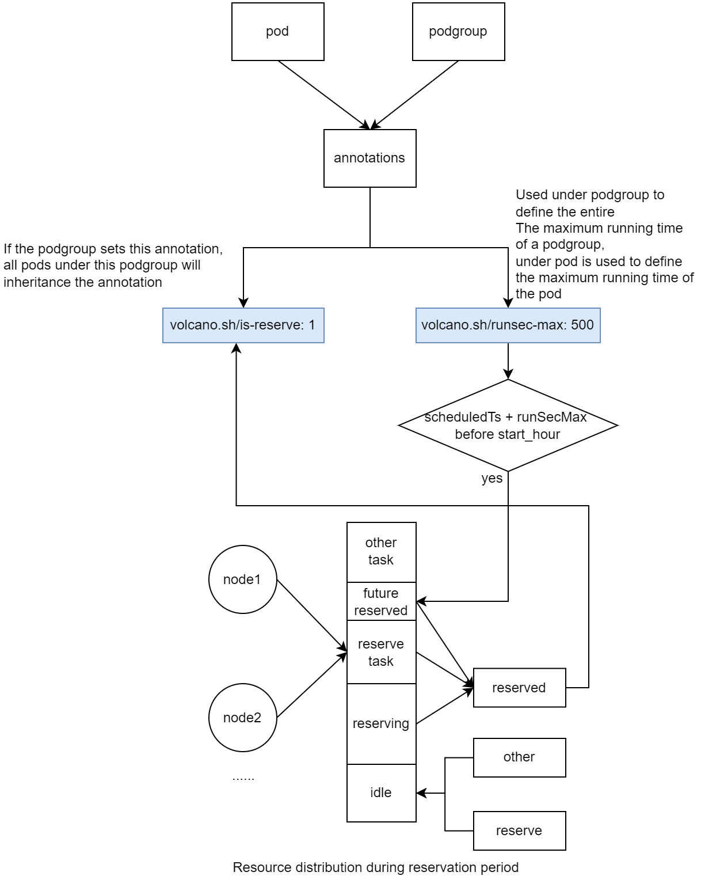
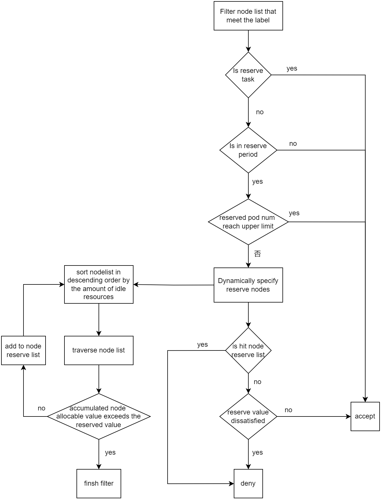

# Volcano node resource reservation
## background
* Consider such situation: there are thounsands of pods to be scheduled every day, in 1 to 2 o'clock 500 low priority pods are created and scheduled which used 99% of cluster resource, in 2 to 3 o'clock 10 pods which need to be reserved are created, however, low priority pods are still running, pods which need to be reserved can not be scheduled due to lack of resource.
* Users want pods which need to be reserved in 2 to 3 o'clock have resource to schedule immediately every day and not preempt low priority pods because some low priority pods have already run many days.
## design
 
### recognize pods which need to be reserved
There are two ways to recognize these pods:
* set annotation volcano.sh/reserveable: true in podgroup 
which means all pods under podgroup are reserve tasks
* set annotation volcano.sh/reserveable: true in pod
which means this pod is reserve task
### recognize pod max running time
* set annotation volcano.sh/maximum-runtime: 500s in podgroup
which means the podgroup will run for a maximum of 500 seconds
* set annotation volcano.sh/maximum-runtime: 500s in pod
which means this pod will run for a maximum of 500 seconds
### reserve plugin
#### configuration
```
- plugins:
   - name: reserve
     arguments:
       reservelabels:
       - nodeSelector:
           business_type: ebook
         resources:
           cpu: "32"
           memory: 64Gi
         startReserveAgo: 2h
         podNumToReserve: 10
         cron: "0 3 - 4 * * *"
```
In the configuration, reservelabels is consisted by nodeSelector which represent a node list, resources represent a list of resource reservation configuration.The overall meaning is that from 3 to 4 o'clock every day, 32 cpu, 64Gi memory need to be reserved and should start reserve 2h ago, if 10 reserve tasks are scheduled during reserve time range, stop reserve. which can save more resources for non-reserved tasks after 10 reserved tasks are scheduled during reserve period.
#### OpenSession
* make cache of ReserveNodesMap which is used to cache forbidden nodes to forbid non-reserved tasks to be scheduled on reserved nodes, the calculation algorithm is as follows: firstly, order the nodes desc by node idle. Node idle is consisted of node resource unused and the resource will be released in the future before reserve start time which is taken by the annotation of pod max running time. secondly, traverse the ordered nodes, accumulate the node allocatable resource, if the accumulated resource is less than the resource to be reserved, add the node to ReserveNodesMap which means the system will have the trend to reserve big resource other than many small resources.
* make cache of reservedTaskPendingResource which is used to cache the accumulated resource of pending tasks
* make cache of reservedTaskAllocatedResource which is used to cache the accumulated resource of allocated tasks
* make cache of resourceIdle which is used to accumulate the node futureidle resource.
* register plugin function PredicateFn
* register event handler AllocateFunc and DeallocateFunc to dynamically update the cache of reservedTaskPendingResource, reservedTaskAllocatedResource and resourceIdle
#### PredicateFn
Predicate is used to restrict other pods to be scheduled on reserved nodes. Reserved nodes are filtered out from the list of nodes and will change dynamically. 
* check if the task is a reserve task, if yes, permit the task to be scheduled on this node.
* check if the current time is within the reserved time range, if no, permit the non-reserved task to be scheduled on this node.
* check if the number of reserve pods which have been scheduled is larger than the max pod number configured, if yes, permit the non-reserved task to be scheduled on this node.
* check if the node is in reserve node list(from ReserveNodesMap cache), if yes, deny the non-reserved task to be scheduled on this node.
* check if the node idle resource(from resourceIdle cache) is larger than the reserve requirements(max(reservedTaskAllocatedResource + reservedTaskPendingResource, reserveResourcesConfig)), if yes, permit the non-reserved task to be scheduled on this node.

