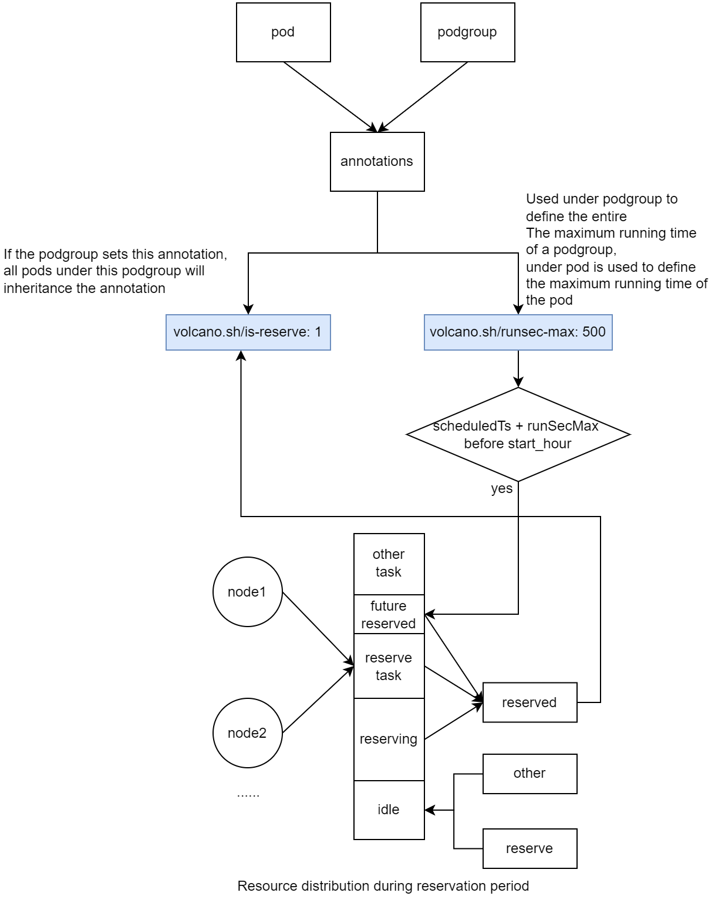
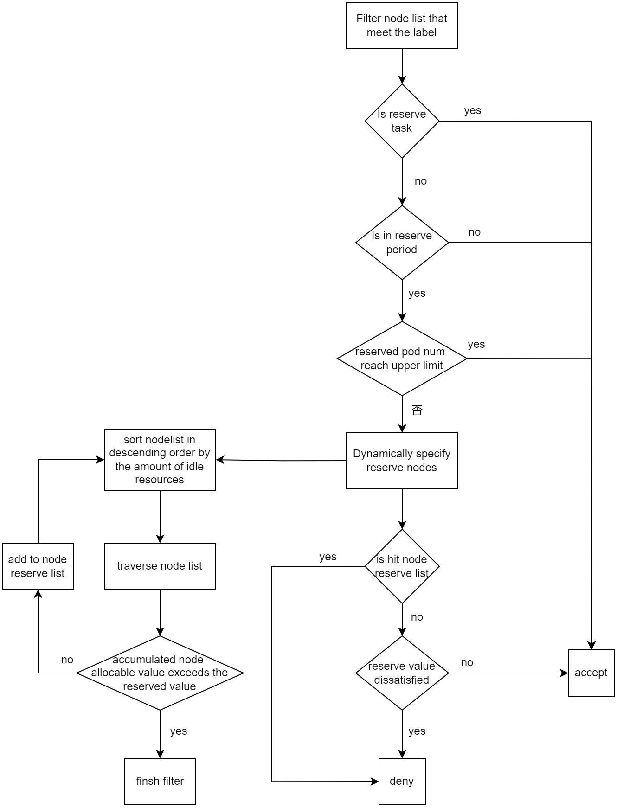

# Volcano node resource reservation
## background
* Consider such situation: there are thounsands of pods to scheduler a day, in the first hour 500 low priority pods are created and schedulered which used 99% of cluster resource, in the second hour 10 high priority pods are created, however, low priority pods are still running, high priority pods can not be scheduled due to lack of resource.
* The user want the high priority task in the second hour to have resource to schedule immediately every day and high priority task better not preempt low priority pods because some pod may have already run many days.
## design
 
### recognize high priority pods
There are two ways to recognize high priority pods:
* set annotation volcano.sh/is-reserve: 1 in podgroup 
which means all pods under podgroup are reserve tasks
* set annotation volcano.sh/is-reserve: 1 in pod
which means this pod is reserve task
### recognize pod max running time
* set annotation volcano.sh/runsec-max: 500 in podgroup
which means all pods under podgroup will run 500 seconds max
* set annotation volcano.sh/runsec-max: 500 in pod
which means this pod will run 500 seconds max
### reserve plugin
#### configuration
```
- plugins:
   - name: reserve
     arguments:
       reserve.nodeLabel: label1,label2
       reserve.define.label1: {"business_type": "ebook"}
       reserve.resources.label1: [{"start_hour": 3, "end_hour": 4, "cpu": 32, "memory": 64, "start_reserve_ago": "2h", "pod_num": 10, "cron": "daily"}]
       reserve.define.label2: {"business_type": "computer"}
       reserve.resources.label2: [{"start_hour": 7, "end_hour": 9, "cpu": 24, "memory": 96, "start_reserve_ago": "30m", "pod_num": 15, "cron": "weekly 1,2,5"}]
```
In the configuration, nodeLabel represent a node list which nodeselector satisfy the nodeLabel, resources represent a list of resource reservation configuration, for example, reserve.resources.label1 means in hour 3 to 4 everyday, 32 cpu, 64 memory need to be reserved for label1, and start to reserve 2h ago, if 10 reserve pods are scheduled or after hour 4, stop reserve.
#### PredicateFn
Predicate is used to restrict other pods to be scheduled on reserved nodes. Reserved nodes are filtered out from the list of nodes and will change dynamically. 
* check if the task is a reserve task, if yes, permit the task to be scheduled on this node.
* check if the time is in the reserved time range, if no, permit the task to be scheduled on this node.
* check if the number of reserve pods which is scheduled is larger than the max pod number configured, if yes, permit the task to be scheduled on this node.
* order the nodes desc by node idle. Node idle is consisted of node resource unused and the resource will be released in the future before reserve start time. The node resource to be released in the future is calculated by the annotation of pod max running time. 
* traverse the ordered nodes, accumulate the node allocatable resource, if the accumulated resource is less than the resource to be reserved, add the node to reserve node list which means the system will have the trend to reserve big resource other than many small resource.
* check if the node is in reserve node list, if yes, deny the task to be scheduled on this node.
* calculate whether the node idle resource is enough to satisfy the reserve requirements, if yes, permit the task to be scheduled on this node.

 
#### JobStarvingFn
JobStarving is used in preempt action which is an expand of reserve because sometimes reserve node resource may not be completely accurate. If podgroup or pod is set the annotation of reserve, the job is starving and can preempt other possible pods.
#### PreemptableFn 
PreemptableFn is used to cooperate JobStarvingFn to filter the victims to be preempted. In reserve situation, the preemptor can preempt the task which have the same node label and the create time of preemptee is later than the preemptor which means to preempt the task which should not be scheduled before and the occupancy rate of the cluster is not effected.