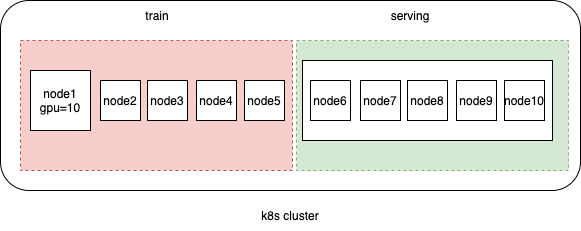

## Introduction

This feature allows volcano to schedule workloads based on the Nodes with specific label(not all nodes of k8s cluster). 

In my case, k8s cluster has 10 nodes (10 gpu per node), 5 for training, 5 for serving, I want to use volcano schedule training job(tfjob/pytorchjob/vcjob) on training nodes. use default-scheduler schedule online pod on serving nodes. 



it is work by setting nodeSelector or nodeAffinity to pod, but it is not properly when considering volcano queue mechanism, because volcano think it can work on 10 node (and use all resources of 10 nodes), it has 100 gpu. but in fact, it only can work on 5 nodes for training, it has 50 gpu. 

if there are two queue: queue1 and queue2

||weight|reclaimable|deserved gpu|
|---|---|---|---|
|queue1|1|true|50|
|queue2|1|true|50|

if queue1 already used 45 gpu, then i submit a training job of queue2 using 10 gpu, the job will pending because are none resources on training nodes, and queue1 is not overused in volcano's view, so it will not reclaim job of queue1 to release resource.   

so it is necessary to tell volcano scheduler that it can only work on training nodes(not all nodes in cluster), queue1 only can use 25 gpu, it is overused for queue1 to use 45 gpu.

so I add nodeSelector for volcano scheduler.

## Usage

in following example, volcano can only work on the node which has `node-role:training` or `node-role:dev` or `gpu-model: tesla` label. you can use any label name you like.

```yaml
    actions: "enqueue, allocate,reclaim, backfill"
    tiers:
    - plugins:
      - name: priority
      - name: gang
      - name: conformance
    - plugins:
      - name: overcommit
      - name: drf
      - name: predicates
      - name: proportion
      - name: nodeorder
      - name: binpack
    nodeSelector:
      node-role: training,dev
      gpu-model: tesla
```

## Design

volcano use nodeInformer to get all node list in k8s cluster. so we can filter the node list by nodeSelector label and adding the nodes into `SchedulerCache.NodeList`

