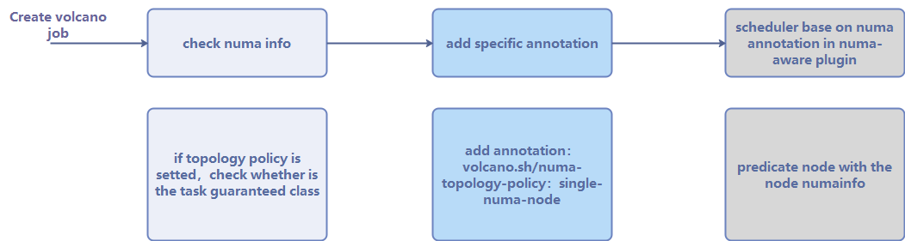

# NUMA Aware Plugin

## Backgrounds

When the node runs many CPU-bound pods, the workload can move to different CPU cores depending on whether the pod is throttled and which CPU cores are available at scheduling time.  Many workloads are not sensitive to this migration and thus work fine without any intervention. However, in workloads where CPU cache affinity and scheduling latency significantly affect workload performance, the kubelet allows alternative CPU management policies to determine some placement preferences on the node.

The CPU Manager and the Topology Manager are all Kubelet components, However There is the following limitation:
  
  - The scheduler is not topology-aware. so it is possible to be scheduled on a node and then fail on the node due to the Topology Manager. this is unacceptable for Tensorflow job. If any worker or ps failed on node, the job will fail.
  - The managers are node-level that results in an inability to match the best node for NUMA topology in the whole cluster.

## Motivation

We target to resolve the limitation to make scheduler NUMA topology aware so as to achieve the following:
    
   - Don't schedule pods to the nodes which NUMA topology don't match. 
   - Schedule pods to the best node for NUMA topology.
## Goals
 - Support cpu resource topology scheduling
 - Support pod-level topology policies

## Non-Goals
 - Support other resources topology schedule, such as GPU.
 

## Design Action

### Node numa information

The kubelet has no interface about the cpu topology information externally, so we need to report it to volcano scheduler by ourselves. <br> So a new CRD is created to do it.
It is consistent of the following parts:
````
1. the topology policy on kubelet config
2. the cpu topology information
3. the cpu allocatable sets
4. the reserved cpu resource
````
For details, refer to [numatopo_types](https://github.com/volcano-sh/apis/blob/master/pkg/apis/nodeinfo/v1alpha1/numatopo_types.go)


### Pod scheduling process

 


### Pod-level topology
In the volcano job, it sets the different policies config for the specific task.
```
task:
  - replicas: 1
    name: "test-1"
    topologyPolicy: single-numa-node
    ...
  - replicas: 1
    name: "test-2"
    topologyPolicy: best-effort
    ...
```
There are the topology policies as same as the [Topology Manager](https://kubernetes.io/docs/tasks/administer-cluster/topology-manager/):
```
  1. single-numa-node
  2. best-effort
  3. restricted
  4. none
```

### Predicate function

for the pods with the topology policy, we need to predicate the matched node list.

| policy | action |
| :----   | :---- |
| none   | 1. no filter action |
| best-effort | 1. filter out the node with the topology policy “best-effort”|
| restricted | 1.	filter out the node with the topology policy “restricted” <br> 2.	filter out the node that the cpu topology meets the cpu requirements for "restricted" | 
| single-numa-node | 1.	filter out the node with the topology policy “single-numa-node”;  <br> 2. filter out the node that the cpu topology meets the cpu requirements for "single-numa-node" |

### Priority function

Regardless of the topology policy, pod is hoped to be scheduled to the optimal node. <br>
So we select the best node by scoring all filtered nodes.
```
calculation formula:
     score = weight * (100 - 100 * numaNodeNum / maxNumaNodeNum)
     Arguments: 
         weight: the weight of the NUMA Aware Plugin, default is 1
         numaNodeNum: the member of required NUMA node in the calculated node for meeting the request resources
         maxNumaNodeNum: the maximum NUMA node number in all filtered nodes
```

For example:

```
There are three nodes to meet the cpu topology of the pod:

the numa node layout:
   1. Node-A : need one numa node (0)
   2. Node-B : need two numa node (0, 1)
   3. Node-C : need four numa node (0, 1, 2, 3)

calculate the score 
   maxNumaNodeNum = 4
   1. Node-A : 10 * (100 - 100 * 1 / 4) = 750
   2. Node-B : 10 * (100 - 100 * 2 / 4) = 500
   3. Node-C : 10 * (100 - 100 * 4 / 4) = 0
so the best node is Node-A.

``` 

For the usage details, please refer to the [NUMA Aware guide](../user-guide/how_to_use_numa_aware.md)
## Drawbacks

Kubelet processes pods based on the creation time sequence of pods, but volcano uses a series of plugins to determine the scheduling order of pods, not just the creation time. This results in different resource NUMA allocations between kubelet and scheduler, even if the same algorithm is used with kubelet.


 

