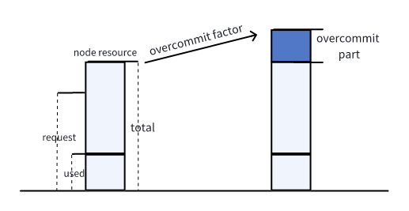

# overcommit-plugin

[@googs1025](https://github.com/googs1025); Jul. 29, 2024

### Background: 
The overcommit-plugin is used to amplify node resources to achieve resource allocation.
### Objective: 
Use different amplification factors based on different resource types.


## Introduction
Currently, the overcommit-plugin enhances the Allocatable resources of a node to achieve the functionality of AddJobEnqueuedFn. However, different resources should have different factors, so using the same overcommit-factor is not appropriate.

- For example:

The Binpack plugin assigns different weights to different resources as well.


```yaml
actions: "enqueue, reclaim, allocate, backfill, preempt"
tiers:
- plugins:
  - name: binpack
    arguments:
      binpack.weight: 10
      binpack.cpu: 5
      binpack.memory: 1
      binpack.resources: nvidia.com/gpu, example.com/foo
      binpack.resources.nvidia.com/gpu: 2
      binpack.resources.example.com/foo: 3
```

## Solution
We can further break down the overcommit-factor into more granular components: `overcommit-factor.<resource name>`.

For example: `overcommit-factor.cpu` `overcommit-factor.memory` `overcommit-factor.pods` `overcommit-factor.ephemeral-storage` `overcommit-factor.nvidia.com/gpu`

To maintain compatibility with the existing approach, we will retain the original overcommit-factor field and we will keep the original overcommit-factor field and introduce an optional field of `overcommit-factor.<resource name>`.


The priority of these fields will be from low to high:

`defaultOverCommitFactor -> overcommit-factor -> overcommit-factor.<resorce name>`


- overcommitPlugin struct

```go
// overcommitFactors defines the resource overCommit factors
type overcommitFactors struct {
	// factorMaps defines the resource overCommit factors
    // key: resource, example: "cpu", "memory", "ephemeral-storage", "nvidia.com/gpu"
    // value: overCommit factors
    factorMaps map[string]float64
}

type overcommitPlugin struct {
    // Arguments given for the plugin
    pluginArguments  framework.Arguments
    totalResource    *api.Resource
    idleResource     *api.Resource
    inqueueResource  *api.Resource
    // overCommitFactor is the different resource overCommit factors
    overCommitFactors *overcommitFactors
}
```

#### Example

Example 1:
Explicitly specify all the overcommit factors
```yaml
actions: "enqueue, allocate, backfill"
tiers:
- plugins:
  - name: overcommit
    arguments:
    overcommit-factor.cpu: 1.2
    overcommit-factor.memory: 1.0
    overcommit-factor.ephemeral-storage: 1.2
    overcommit-factor.pods: 1.2
    overcommit-factor.nvidia.com/gpu: 1.2
```

Example 2:
Specifying only the overcommit-factor implies that all factors are the same.
```yaml
actions: "enqueue, allocate, backfill"
tiers:
- plugins:
  - name: overcommit
    arguments:
    overcommit-factor: 1.3
```

Example 3:
Specifying overcommit-factor.cpu, overcommit-factor.nvidia.com/gpu are set, along with specifying overcommit-factor: indicates that the resource uses a specific value, while other values use the overcommit-factor field.
```yaml
actions: "enqueue, allocate, backfill"
tiers:
- plugins:
  - name: overcommit
    arguments:
    overcommit-factor.cpu: 1.2
    overcommit-factor.nvidia.com/gpu: 1.3
    overcommit-factor: 1.0
```
Example 4:
Specifying any one of overcommit-factor.cpu is set: indicates that the resource uses a specific value, while other values use the defaultOverCommitFactor default value.
```yaml
actions: "enqueue, allocate, backfill"
tiers:
- plugins:
  - name: overcommit
    arguments:
    overcommit-factor.cpu: 1.2
```
Example 5:
Not specifying will default to the defaultOverCommitFactor value.
```yaml
actions: "enqueue, allocate, backfill"
tiers:
- plugins:
  - name: overcommit
    arguments:
```
