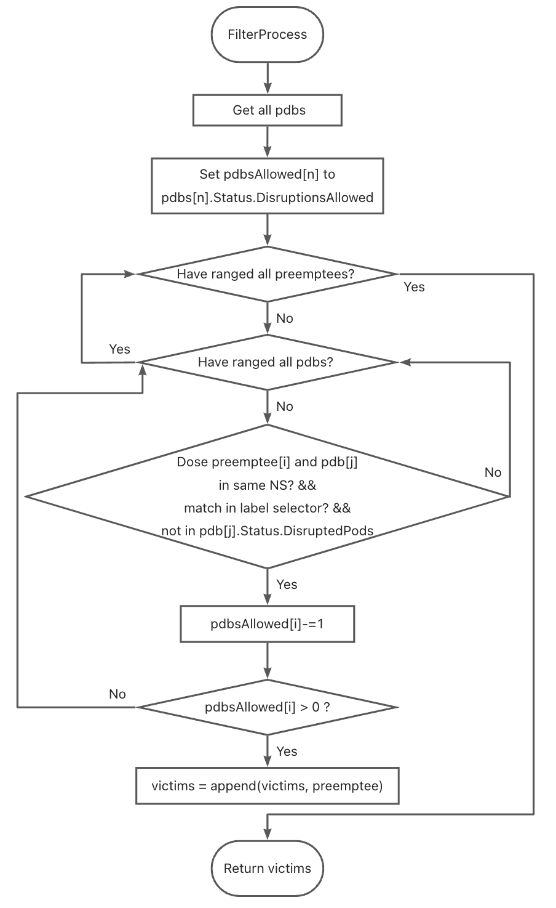

# Pod Disruption Budget (PDB) Plugin

## Introduction

When users apply jobs to volcano, they may limit the number of Pod copies that are destroyed at the same time. This restriction is often limited by the [PDB resources](https://kubernetes.io/docs/tasks/run-application/configure-pdb/) created by the user. So PDB plugin is provided to meet the PBD constraints set by the user during the Volcano scheduling process.

## Usage
1. Firstly, please ensure that your k8s version is at least 1.21 and that you have created the PDB resource.
2. Secondly, user can open `PDB Plugin` via `volcano-scheduler-configmap` in following format:

      ```yaml
        actions: "reclaim, preempt, shuffle"
        tiers:
        - plugins:
          - name: pdb
      ```
*PDB Plugin can be used in any one action of reclaim, preempt, shuffle*

## Solution
The plugin register , `ReclaimableFn`, `PreemptableFn` and `VictimTasksFn` in `Reclaim`, `Preempt` and `Shuffle` action to filter out tasks that violate the PDB constraint.

The execution flow chart of filter process of `pdb` plugin is shown as below:



*`DisruptedPods` contains information about pods whose eviction was processed by the API server eviction subresource handler but has not yet been observed by the PodDisruptionBudget controller.*

### About the Cache
The PDB plugin first registers `informerFactory.Policy().V1().PodDisruptionBudgets()` in `newSchedulerCache()` function.

Then the plugin adds `v1.PodDisruptionBudgetLister` variable to type definition and inits it with `informerFactory.Policy().V1().PodDisruptionBudgets().Lister()` in `New()` function.

Finally the plugin uses this `Lister` to list the PDBs from the informer cache.
## Feature Interaction

1. By now we only need 1 argument `sla-waiting-time`, so I add it into annotations for simplicity and invocation, but when `sla` plugin is extended with more arguments, a better way to invoke this plugin may be job plugin like `svc` and `ssh`.

