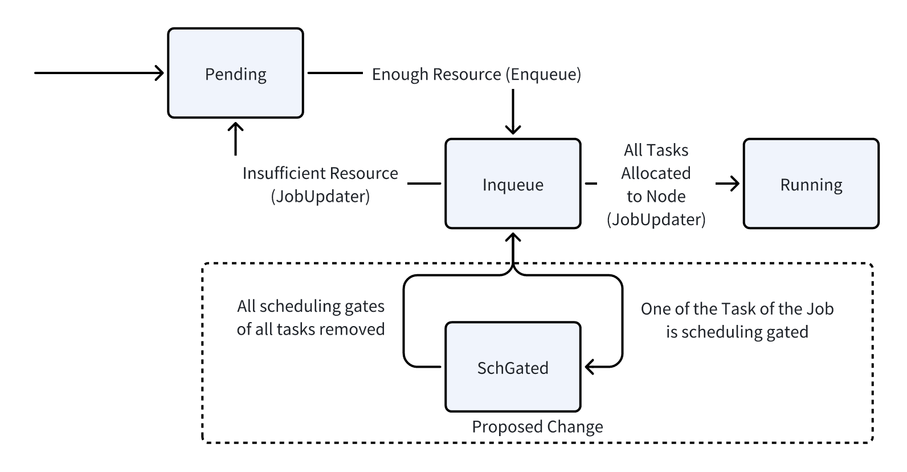

# Pod Scheduling Readiness
## Motivation

Pod Scheduling Readiness is a beta feature in Kubernetes v1.27. Users expect Volcano to be aware of it. By specifying/removing a Pod's `.spec.schedulingGates`, which is an array of strings, users can control when a Pod is ready to be considered for scheduling. For Pods with none-empty `schedulingGates`, it will only be removed by kube-scheduler once all the gates are removed.

The following example illustrates why support for Scheduling Readiness is needed in Volcano. Suppose we have implemented an external quota manager responsible for reviewing all incoming pod requests for capacity/quota requirements. Only once these requests receive approval from the quota manager are they considered eligible for scheduling. The pods schedulingGates feature can be handy when implementing this funtionality
## Function Detail
To support Pod Scheduling Readiness, the modifications mainly happen in `scheduler/actions`. In each action, we want to skip jobs with pods that are scheduling gated. To achieve this, we propose adding a new state `PodGroupSchGated`. The diagram below shows how this new state is used: The transition to this state happens when a Job is in `Inqueue` state. When a Job is in `Inqueue` state, the Tasks (Pods) of this job have been created and we can judge whether the job is scheduling gated based on tasks. If one of the tasks is gated, then the Job is transitioned to `SchGated` state and will no longer be allocated to a node in the allocate action. In other actions (preempt/reclaim), we will also skip Jobs that are scheduling gated.


## Feature Interactions
1. **API:** The state of a PodGroup, `PodGroupPhase` is defined in a separate api repo. Before making changes to the main repo, we need to first modify the api repo.
```
const (
//...

// PodGroupSchGated means the spec.SchedulingGates of at least one of the Pods of the job is not empty.
// PodGroupSchGated is transitioned from Inqueue and back to Inqueue once spec.SchedulingGates is empty.
PodGroupSchGated PodGroupPhase = "SchGated"

//...
)

```
2. **Plugins**: Scheduler Plugins such as proportion  will register functions to determine whether a PodGroup is enqueueable or allocatable. These functions calculate the resources already used in the cluster based on states of each PodGroup. For example, the proportion plugin determines whether a task is enqueuable when `sum(Inqueue)+sum(Running)+cur_job<TotalResource+elastic`. Since the scheduling gated jobs do not occupy resources in the cluster, by having the scheduling gated job in `SchGated` rather than `Inqueue`, they will not be summed up when calculating total used resources, which reflects the actual situation.
3. **Actions**: Transition to `SchGated` happens to and from `Inqueue` first in the allocation action. Then, other actions will skip the gated pods.
4. **Controllers**: One alternative design of state transition is to directly transition from `Pending` to `SchGated`. However, this is not possible because Controllers only create Pods for a job once it is inqueued (see [delayed-pod-creation](./delay-pod-creation.md)). We can only know a Pod is scheduling gated in the Inqueue state. Therefore, we need to transition to SchGated from Inqueue.
## Granularity of Pod Scheduling Readiness
Pod scheduling readiness is a field of the spec of a pod. However, Volcano schedules Jobs, which consists of many tasks, each corresponding to a Pod. It is possible that some of these pods are scheduling gated while others are not. To align the granularity of the Pod Scheduling Readiness and Job, we see scheduling gates as a property of a Job: as long as there is one gated pod, the job is scheduling gated. This is consistent with the workload of Volcano: most Volcano Jobs need to run as a whole and cannot be partially run.