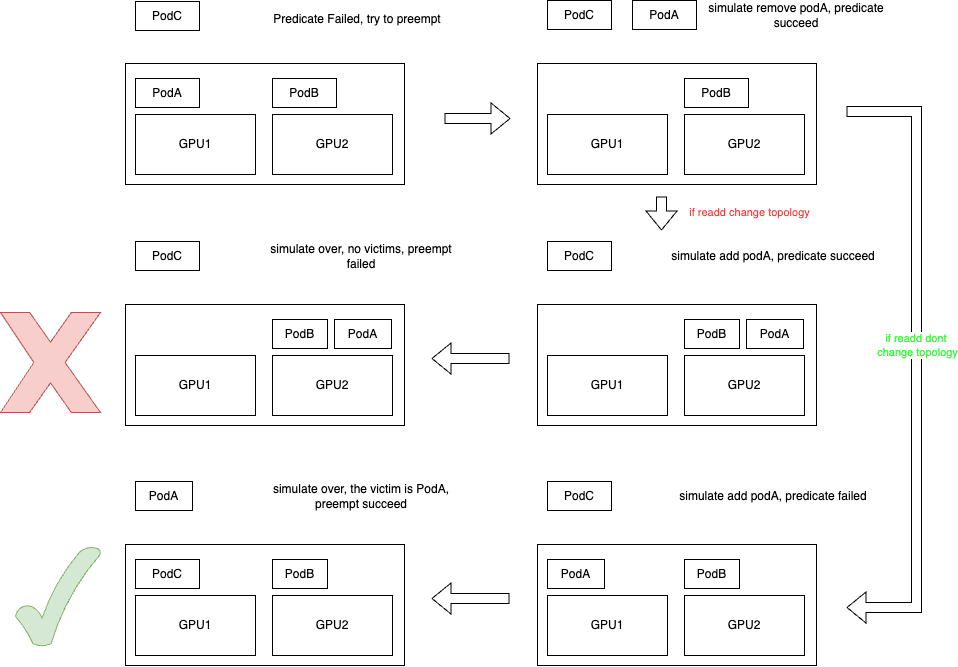

# Preempt Action Support Topology

## Motivation

In cloud-native task scheduling scenarios, preemption is a key feature to ensure timely scheduling of high-priority tasks. Compared to the K8s scheduler, Volcano's current preemption implementation is relatively simple, especially in handling affinity judgments. To improve the accuracy and efficiency of the preemption mechanism, the existing implementation needs to be optimized, particularly in supporting topology awareness.

## In Scope

- Optimize Volcano's preemption mechanism to support affinity judgments
- Improve single Pod preemption process
- Implement simulation scheduling interface to ensure simulated addition and removal of pods won't cause topology changes

## Out of Scope

- Gang scheduling preemption scenario optimization

## User Stories

### Story 1

As a cluster administrator, I want the system to accurately judge Pod affinity constraints during preemption scheduling to avoid scheduling failures caused by topology changes.

### Story 2

As a user, I expect high-priority Pod preemption to minimize impact on existing Pods while maintaining consistency of affinity rules.

### Story 3

When topology-sensitive resources like GPUs exist, the preemption process needs to consider resource topology relationships to ensure resource allocation after preemption still satisfies original topology constraints.

For example, if a node has 2 GPUs (8GB each), Pod A and Pod B each use 4GB, and Pod C needs 8GB. Direct scheduling of Pod C will fail, triggering preemption. After removing Pod A, Pod C can be scheduled, but when re-adding Pod A, topology changes might occur due to binpack strategy. At this point, Pod C can still be scheduled, ultimately leading to preemption failure due to no pods being evicted.



## Design Detail

### Preemption Process


1. Execute Predicate on all nodes that are not UnschedulableAndUnresolvable to obtain candidate node list, and perform parallel simulation scheduling on all candidate nodes.

2. The simulation scheduling process for each node is as follows:
   1. First consider Pods with lower priority as potential victims on the node
   2. Sort the victim list (lower priority and non-PDB-violating victims come first)
   3. Remove victims in order, add each removed one to eviction candidates, and observe if the verification function passes
   4. Verification function: Try to add pods (pipelined) with higher priority targeting the current node, observe if they can pass predicate; then remove them and observe if they can pass predicate
   5. If passed, try to add back the previous eviction candidates in PDB and priority order (to minimize impact), calling verification function after each addition; if verification fails, add to final eviction list
   6. If final eviction list is not empty, return it

3. Sort filtered nodes using PreemptNodeOrderFn

4. Schedule Pod to the top-ranked node, evict victims list, and cancel nominatedNodeName of lower priority pods that had nominated this node, moving them from pipeline to pending schedule

### Key Function Modifications

- `GetBestNodeByPreemptCost`: A function that finds the best node for preemption by calculating and comparing preemption costs. It takes a list of candidate nodes and their corresponding victim pods, iterates through them to compute the cost of preempting victims on each node using the provided cost function, and returns the node with the minimum preemption cost. This helps select the most suitable node that minimizes the impact of preemption.
  
  ```go
  func GetBestNodeByPreemptCost(nodes []*api.NodeInfo, victims map[string][]*api.TaskInfo, costFn PreemptCostNodeOrderFn) (*api.NodeInfo, error) {
      // Initialize minimum cost and corresponding node
      var minCostNode *api.NodeInfo  
      minCost := math.MaxFloat64
      
      // Iterate through all candidate nodes
      for _, node := range nodes {
          // Get victim pods list for current node
          nodeVictims := victims[node.Name]
          
          // Calculate preemption cost for this node
          cost, err := costFn(nodeVictims, node)
          if err != nil {
              return nil, err
          }
          
          // Update node with minimum cost
          if cost < minCost {
              minCost = cost
              minCostNode = node
          }
      }
      
      return minCostNode, nil
  }
  ```

  - `PreemptCostNodeOrderFn`: Calculate the cost of evicting the victims list from a Node, used to sort qualified candidates based on cost and select the node with minimum cost later
- `SimulateRemovePodFn`: Simulate the removal of a pod from a node, plugins implement this function to ensure the removal action does not cause topology changes

  ```go
  type SimulateRemovePodFn func(pod *api.TaskInfo, node *api.NodeInfo) error
  ```

- `SimulateAddPodFn`: Simulate the addition of a pod to a node, plugins implement this function to ensure the addition action does not cause topology changes

  ```go
  type SimulateAddPodFn func(pod *api.TaskInfo, node *api.NodeInfo) error
  ```

### Limitations

- Current design focuses on single pod preemption scenarios. Does not handle complex topology changes in gang scheduling
- For complex combinations of affinity rules, multiple attempts may be needed to find the optimal solution. Performance impact of simulation scheduling needs to be evaluated in large-scale clusters
