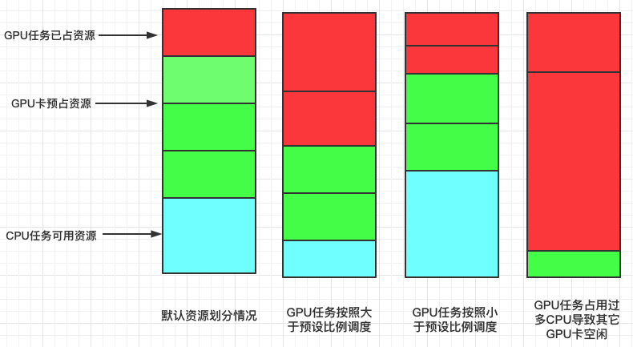

## Background

Volcano scheduler handles jobs requiring different types of resources, such as GPU, CPU, memory. Under particular circumstances, we may specify a 'primary' resource(e.g., GPU in deep learning), and preserve the amount of associated 'secondary' resources by a pre-set proportion. This plugin works in the phase of predicates, dedicates to ensure the node's idle resource is enough for the proportion after jobs requiring secondary resources are scheduled.

## Scenario of default scheduler

Considering we have a node with 74CPUs, 8GPUs, 128G memory. As no job is submitted, resource NodeAllocatable is equal to NodeIdle.

Node | NodeAllocatable | NodeIdle
---|---|---
nodeC0-0 | cpu 74, memory 128G, nvidia.com/gpu 8 | cpu 74, memory 128G, nvidia.com/gpu 8 |

Then two jobs requiring 8CPUs, 8G memory are submitted, and scheduled to the node; the resource status is as below:

Job | Pod | Resource | Node | NodeAllocatable | NodeIdle
---|---|---|---|---|---
default/single-1000-0 | single-1000-0 | cpu 8, memory 8G, nvidia.com/gpu 0 | nodeC0-0 | cpu 74, memory 128G, nvidia.com/gpu 8 | cpu 66, memory 120G, nvidia.com/gpu 8 |
default/single-1000-1 | single-1000-1 | cpu 8, memory 8G, nvidia.com/gpu 0 | nodeC0-0 | cpu 66, memory 120G, nvidia.com/gpu 8 | cpu 58, memory 112G, nvidia.com/gpu 8 |

If we take GPU as primary resource and want to use 1GPU 'binded' with 8CPUs, the left 58 CPUs are insufficent for 8 GPUs; the proportion plugin is designed to solve this problem.

## with proportion plugin



Firstly set the proportion binding in volcano-scheduler.conf:

```yaml
actions: "enqueue, allocate, backfill"
tiers:
- plugins:
  - name: predicates
    arguments:
      predicate.ProportionalEnable: true
      predicate.resources: nvidia.com/gpu,nvidia.com/v100-sxm2-16gb
      predicate.resources.nvidia.com/gpu.cpu: 8
      predicate.resources.nvidia.com/gpu.memory: 8
      predicate.resources.nvidia.com/v100-sxm2-16gb.cpu: 16
      predicate.resources.nvidia.com/v100-sxm2-16gb.memory: 16
```

The proportion is GPU:CPU:MEMORY=1:8:8, and let the test scenario just as above:

Node | NodeAllocatable | NodeIdle
---|---|---
nodeC0-0 | cpu 74, memory 128G, nvidia.com/gpu 8 | cpu 74, memory 128G, nvidia.com/gpu 8 |

Job | Pod | Resource | Node | NodeAllocatable | NodeIdle
---|---|---|---|---|---
default/single-1000-0 | single-1000-0 | cpu 8, memory 8G, nvidia.com/gpu 0 | nodeC0-0 | cpu 74, memory 128G, nvidia.com/gpu 8 | cpu 66, memory 120G, nvidia.com/gpu 8 |
default/single-1000-1 | single-1000-1 | cpu 8, memory 8G, nvidia.com/gpu 0 | - | - | - |

After job single-1000-0 is scheduled, the Idel resouce is 8GPUs, 66CPUs, 120G memory. During the predicate phase, this plugin caculates the resource left if job single-1000-1 is scheduled`(node.Idel.CPU - task.Resreq.CPU < node.Idel.GPU * cpuRatio ||
node.Idel.Memory - task.Resreq.Memory < node.Idel.GPU * memoryRatio)`; the result is 8GPUs, 58CPUs, 112G memory, that unsatisfies the 1:8:8 proportion. Therefore nodeC0-0 is removed from the predicateNodes, and NodeIdle remains 8GPUs, 66CPUs, 120G memory. 


