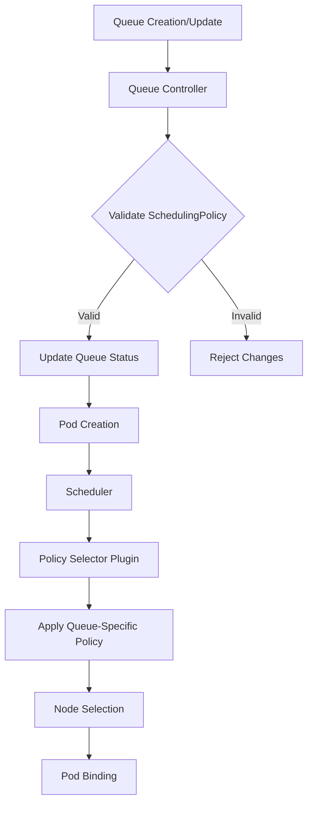

Queue Level Scheduling Policy
---

by [@mahdikhashan](http://github.com/mahdikhashan); 18 Feb, 2025.

## Motivation

The current global scheduling policy in Volcano is pretty rigid, applying the same rules to all queues. This doesn't cut it for the diverse needs of modern workloads, especially in multi-tenant setups. Different jobs, like online services that need quick responses and offline batch tasks that focus on resource efficiency, require their own scheduling strategies. By introducing queue-level scheduling policies, we can allow admins to tailor behaviors for each queue, leading to better resource use and support for different teams.

This change opens up some exciting possibilities. For instance, in a multi-tenant data science platform, research teams could use FairShare policies for fair resource distribution while production ML jobs could benefit from BinPacking strategies. Cloud providers could optimize mixed workloads with FIFO policies for batch processing and GPU-aware policies for machine learning tasks. Finally, this enhancement would boost performance and user experience.

## User Stories

TODO

## Design

### Spec Changes

To support queue-level scheduling policies, I propose the following changes to the Queue Spec:

```go
type QueueSpec struct {
    // ... existing fields ...

    // SchedulingPolicy defines the policy to be used for scheduling jobs in this queue
    // +optional
    SchedulingPolicy *SchedulingPolicy `json:"schedulingPolicy,omitempty" protobuf:"bytes,11,opt,name=schedulingPolicy"`
}

type SchedulingPolicy struct {
    // Type defines the type of scheduling policy to be used
    Type string `json:"type" protobuf:"bytes,1,opt,name=type"`

    // Parameters are the configuration parameters for the scheduling policy
    // +optional
    Parameters map[string]string `json:"parameters,omitempty" protobuf:"bytes,2,opt,name=parameters"`
}
```

This change introduces a new `SchedulingPolicy` field in the `QueueSpec`. The `SchedulingPolicy` struct includes:
- A `Type` field to specify the policy name
- A `Parameters` map for any policy-specific configurations

### Example API

and the following changes to the Queue Custom Resource Definition (CRD):

```yaml
apiVersion: scheduling.volcano.sh/v1beta1
kind: Queue
metadata:
  name: data-science-queue
spec:
  weight: 10
  priority: 100
  schedulingPolicy:
    type: "FairShare"
    parameters:
      param1: "value1"
      param2: "value2"
```

In this example:

- A new `schedulingPolicy` field is added to the Queue spec.
- The `type` subfield specifies the name of the scheduling policy (e.g., "FairShare").
- The `parameters` subfield allows for policy-specific configurations.

## Implementation

This section outlines the proposed changes to implement queue-level scheduling policies in Volcano.

### Required Changes

1. Queue Controller (pkg/controllers/queue):
   - Update the Queue CRD to include the new SchedulingPolicy field
   - Modify the queue controller to handle the new SchedulingPolicy field
   - Implement validation logic for the SchedulingPolicy

2. Scheduler Package (pkg/scheduler):
   - Create a new policy selector plugin (pkg/scheduler/plugins/policy_selector)
   - Modify the scheduler framework to incorporate the policy selector plugin
   - Update existing scheduling plugins to consider queue-specific policies

### Process Flow

The following flowchart illustrates the basic process of how queue-level scheduling policies would be implemented and applied in the Volcano scheduling process:



Above flowchart demonstrates how the Queue Controller handles the creation and updating of queues with their specific policies, while the Scheduler uses the Policy Selector Plugin to apply the appropriate policy during the pod scheduling process.

## Considerations

These are the challenges that need to be addressed when implementing queue-level scheduling policies.

### Policy Definition

We should create a flexible and extensible system for defining scheduling policies. This includes implementing predefined policies (e.g., FairShare, FIFO, Priority), and allowing policy configuration with specific parameters.

### Policy Conflicts

Managing potential conflicts between queue-level and global policies is essential. We need to establish a clear policy application hierarchy, implement a conflict resolution mechanism, and create a validation webhook to prevent conflicting policies.

### Default Policy

For queues without explicitly specified policies, we should define a cluster-wide default policy. Additionally, providing configurable default policy options will enhance flexibility.
