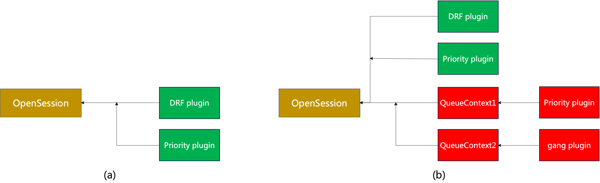

>  Volcano supports unified scheduling of online and offline workloads, provides a wealth of scheduling plugins and algorithms, and can distinguish different tenants through queue distinction. The current scheduling policy is a global configuration, and all jobs in the queue use the same scheduling policy, but in actual scenarios, different tenants may need to use different scheduling policies due to different usage scenarios. Therefore, volcano needs to support setting and using different scheduling policies at the queue level instead of using a globally unified scheduling policy.

Currently, Volcano’s scheduling strategy relies on global scheduler configurations, and the relevant functions in Action are at the Session level rather than the plugin level, so significant changes need to be made. This specifically involves two aspects: the definition of CRD and the scheduling logic.

# 1、Changes to the CRD

## 1.1、Extend the queue CRD

Add the **schedulingPolicy** field in the Queue custom resource, allowing the queue to define its own scheduling policy configuration. An example for users is as follows:

```yaml
apiVersion: scheduling.volcano.sh/v1beta1
kind: Queue
metadata:
  name: newQueue
spec:
  weight: 10
  schedulingPolicy:
    plugins:
      - name: priority  
        args:
          weight: 20    
      - name: gang     
        args:
          minAvailable: 5
      - name: nodeorder 
```

## 1.2、Add the QueueContext structure

Add the **QueueContext** structure to store the queue-specific plugin configuration. To avoid major changes, directly introduce the relevant functions from the session structure.

```go
type QueueContext struct {
	Plugins         []Plugin      

	jobOrderFns         map[string]api.CompareFn
	queueOrderFns       map[string]api.CompareFn
	victimQueueOrderFns map[string]api.VictimCompareFn
	taskOrderFns        map[string]api.CompareFn
	clusterOrderFns     map[string]api.CompareFn
	predicateFns        map[string]api.PredicateFn
	prePredicateFns     map[string]api.PrePredicateFn
	bestNodeFns         map[string]api.BestNodeFn
	nodeOrderFns        map[string]api.NodeOrderFn
	batchNodeOrderFns   map[string]api.BatchNodeOrderFn
	nodeMapFns          map[string]api.NodeMapFn
	nodeReduceFns       map[string]api.NodeReduceFn
	preemptableFns      map[string]api.EvictableFn
	reclaimableFns      map[string]api.EvictableFn
	overusedFns         map[string]api.ValidateFn

	preemptiveFns     map[string]api.ValidateWithCandidateFn
	allocatableFns    map[string]api.AllocatableFn
	jobReadyFns       map[string]api.ValidateFn
	jobPipelinedFns   map[string]api.VoteFn
	jobValidFns       map[string]api.ValidateExFn
	jobEnqueueableFns map[string]api.VoteFn
	jobEnqueuedFns    map[string]api.JobEnqueuedFn
	targetJobFns      map[string]api.TargetJobFn
	reservedNodesFns  map[string]api.ReservedNodesFn
	victimTasksFns    map[string][]api.VictimTasksFn
	jobStarvingFns    map[string]api.ValidateFn
}
```

## 1.3、Extend the Session structure

Add a **QueueContexts** field in the **Session** structure, allowing the corresponding QueueContext to be found by QueueID. The purpose of this is that the Session, as the start of a scheduling cycle, needs to store the information of the existing queues and the queue-specific plugin configurations.

```go
type Session struct {
	...
    Queues         map[api.QueueID]*api.QueueInfo
  
  // Add: QueueContext
	QueueContexts  map[api.QueueID]*QueueContext   
}
```

## 1.4、Extend the Cache structure

After the start of a new scheduling cycle, the construction of the Session object depends on the Cache, so **QueueContexts** also need to be introduced into the **Cache**.

```go
type SchedulerCache struct {
	...
	Queues          map[schedulingapi.QueueID]*schedulingapi.QueueInfo
    QueueContexts  	map[schedulingapi.QueueID]*QueueContext
	...
}
```

# 2、Changes to the scheduler

Currently, the scheduler relies on global configurations, and both `action.Execute()` and `plugin.OnSessionOpen()` are at the session level, so significant changes are required in this part.


## 2.1、OpenSession

In the new scheduling cycle, the process first enters the OpenSession phase, where the plugin registration takes place. However, the current plugins are global, so the related plugin functions will be registered at the session level.

```go
// Currently, the OpenSession
func OpenSession(cache cache.Cache, tiers []conf.Tier, configurations []conf.Configuration) *Session {
	ssn := openSession(cache)
	ssn.Tiers = tiers
	ssn.Configurations = configurations
	ssn.NodeMap = GenerateNodeMapAndSlice(ssn.Nodes)
	ssn.PodLister = NewPodLister(ssn)

	for _, tier := range tiers {
		for _, plugin := range tier.Plugins {
			if pb, found := GetPluginBuilder(plugin.Name); !found {
				klog.Errorf("Failed to get plugin %s.", plugin.Name)
			} else {
				plugin := pb(plugin.Arguments)
				ssn.plugins[plugin.Name()] = plugin
				onSessionOpenStart := time.Now()
				plugin.OnSessionOpen(ssn)
				metrics.UpdatePluginDuration(plugin.Name(), metrics.OnSessionOpen, metrics.Duration(onSessionOpenStart))
			}
		}
	}
	return ssn
}
```

```go
// Modified OpenSession
func OpenSession(cache cache.Cache, tiers []conf.Tier, configurations []conf.Configuration) *Session {
  
  // Session-level plugin functions are retained
   ...
  
  // Add queue-level plugin configuration
    for _, queue := range cache.GetQueues() {
        queueCtx := &QueueContext{
            Plugins: make(map[string]framework.Plugin),
            JobOrderFns: []CompareFn{},
            // Initialize other function mappings
          	...
        }

        // Retrieve the scheduling policy from the queue’s CRD configuration
        queuePolicy := queue.Spec.SchedulingPolicy
        for _, tier := range queuePolicy.Tiers {
            for _, pluginConf := range tier.Plugins {
                if pb, found := GetPluginBuilder(pluginConf.Name); found {
                    // Create independent plugin instances for the queue
                    plugin := pb(pluginConf.Arguments)
                    queueCtx.Plugins[plugin.Name()] = plugin
                  	// New queue-level plugin registration method
                    plugin.OnQueueOpen(queueCtx) 
                }
            }
        }

        ssn.QueueContexts[queue.UID] = queueCtx
    }
}
```

The queue-level plugin registration method requires adding the `OnQueueOpen` method to the Plugin interface.

```go
type Plugin interface {
	// The unique name of Plugin.
	Name() string

	OnSessionOpen(ssn *Session)
	OnSessionClose(ssn *Session)
  
  // Add OnQueueOpen, with the purpose of registering the plugin-related functions into the QueueContext of the queue that has this plugin enabled.
  OnQueueOpen(queueCtx *QueueContext)
}
```

`OnQueueOpen(queueCtx *QueueContext)` is similar to `OnSessionOpen(ssn *Session)`, but the function to be called is no longer `func (ssn *Session) AddxxxFn(name string, vf api.ValidateFn)`, but rather `func (queueCtx *QueueContext) AddxxxFn(name string, vf api.ValidateFn)`.

## 2.2、action

Currently, the functions registered during the OpenSession phase are triggered in the action, but these functions are globally configured.

Taking the action enqueue as an example:

```go
// Current action.Execute()
func (enqueue *Action) Execute(ssn *framework.Session) {
	klog.V(5).Infof("Enter Enqueue ...")
	defer klog.V(5).Infof("Leaving Enqueue ...")

	queues := util.NewPriorityQueue(ssn.QueueOrderFn)
	queueSet := sets.NewString()
	jobsMap := map[api.QueueID]*util.PriorityQueue{}

	for _, job := range ssn.Jobs {
		if job.ScheduleStartTimestamp.IsZero() {
			ssn.Jobs[job.UID].ScheduleStartTimestamp = metav1.Time{
				Time: time.Now(),
			}
		}
		if queue, found := ssn.Queues[job.Queue]; !found {
			klog.Errorf("Failed to find Queue <%s> for Job <%s/%s>",
				job.Queue, job.Namespace, job.Name)
			continue
		} else if !queueSet.Has(string(queue.UID)) {
			klog.V(5).Infof("Added Queue <%s> for Job <%s/%s>",
				queue.Name, job.Namespace, job.Name)

			queueSet.Insert(string(queue.UID))
			queues.Push(queue)
		}

		if job.IsPending() {
			if _, found := jobsMap[job.Queue]; !found {
				jobsMap[job.Queue] = util.NewPriorityQueue(ssn.JobOrderFn)
			}
			klog.V(5).Infof("Added Job <%s/%s> into Queue <%s>", job.Namespace, job.Name, job.Queue)
			jobsMap[job.Queue].Push(job)
		}
	}

	klog.V(3).Infof("Try to enqueue PodGroup to %d Queues", len(jobsMap))

	for {
		if queues.Empty() {
			break
		}

		queue := queues.Pop().(*api.QueueInfo)

		// skip the Queue that has no pending job
		jobs, found := jobsMap[queue.UID]
		if !found || jobs.Empty() {
			continue
		}
		job := jobs.Pop().(*api.JobInfo)

		if job.PodGroup.Spec.MinResources == nil || ssn.JobEnqueueable(job) {
			ssn.JobEnqueued(job)
			job.PodGroup.Status.Phase = scheduling.PodGroupInqueue
			ssn.Jobs[job.UID] = job
		}

		// Added Queue back until no job in Queue.
		queues.Push(queue)
	}
}
```

In `action.Execute()`, there are functions that were registered earlier, and these functions can be categorized into queue-level and job-level.

- **Queue-level**: For example, `NewPriorityQueue(ssn.QueueOrderFn)`, this function is responsible for maintaining the relationship between multiple queues and can use global configurations without the need for modification.

- **Job-level**: For example, `NewPriorityQueue(ssn.JobOrderFn)`, this function uses the `JobOrderFn` function registered in the session. Each queue can have a different `JobOrderFn`, and the job-level functions are influenced by the different plugins of the queue.

The purpose of these changes is to achieve the following effects:

- **Queue A**: Uses the priority plugin to sort jobs by priority.
- **Queue B**: Uses the fifo plugin to sort jobs by submission time.

In summary, we may need to modify all the action and plugin functions.The overall architecture design will change from picture a to picture b.

