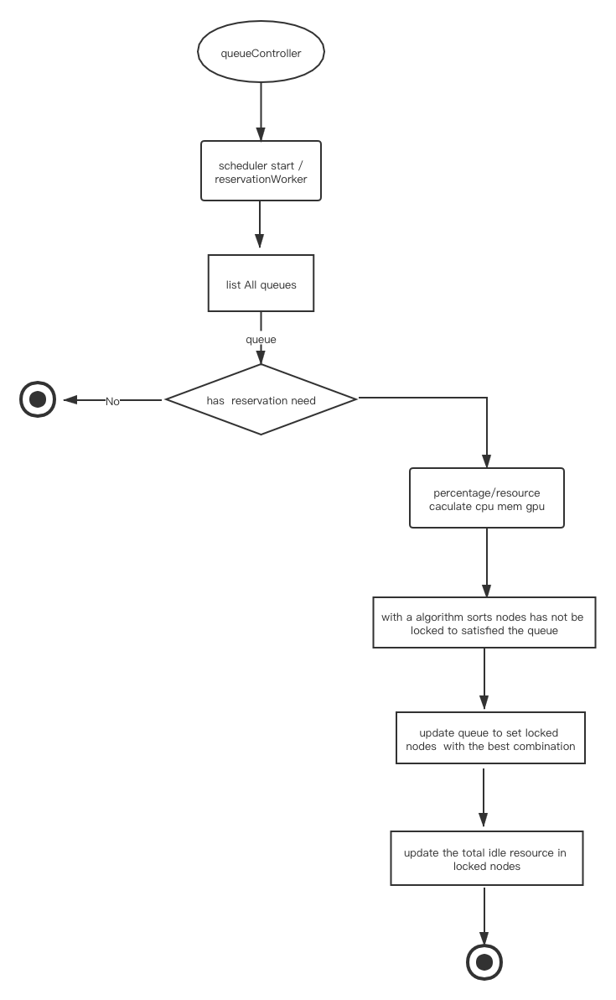
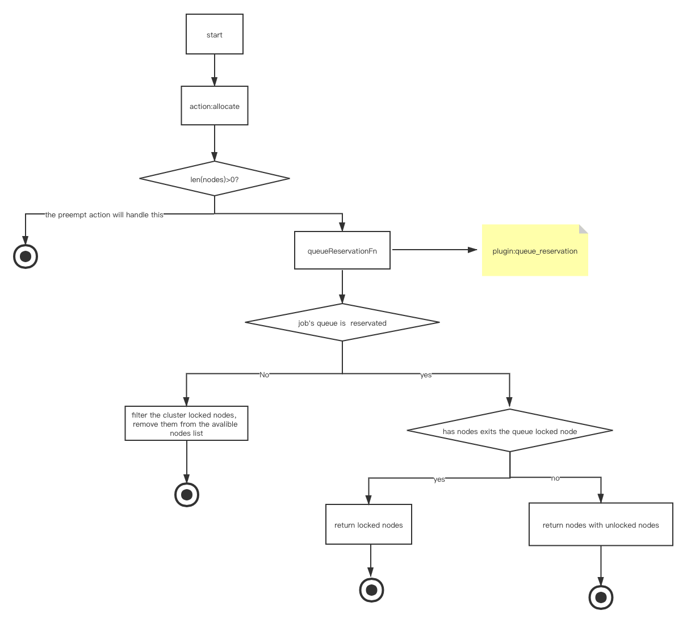

# Volcano Resource Reservation For Queue

@[Thor-wl](https://github.com/Thor-wl); Nov 3rd, 2020

## Motivation
As [issue 1101](https://github.com/volcano-sh/volcano/issues/1101) mentioned, Volcano should support resource reservation
for specified queue. Requirement detail as follows:
* Support reserving specified resources for specified queue
* We only Consider non-preemption reservation. 
* Support enable and disable resource reservation for specified queue dynamically without restarting Volcano.
* Support hard reservation resource specified and percentage reservation resource specified.

## Consideration
### Resource Request
* The request cannot be more than the total resource amount of cluster at all dimensions.
* If `capability` is set, request must be no more than it at all dimensions.
* The resource amount reserved must be no less than request at all dimensions but should not exceed too much. An algorithm 
ensuring the reserved amount to the point is necessary.
* Support total node resource percentage of cluster as request. If reservation resource amount is also specified, it's
important to decide which configuration is adopted. This feature is more useful on condition that resource specification
of all nodes are almost the same.

### Reservation Algorithm
* reservation needs gentle treatment to balance scheduling and reserving performance.
* Nodes locked by target job cannot be chosen as locked node.
* Nodes locked by another queue cannot be chosen as locked node.
* Try to lock nodes, whose total resource and nodes numbers is as less as possible on base of satisfying requirement, to avoid dramatic 
scheduling performance degradation.


### Safety
* Malicious application for large amount of resource reservation will cause jobs in other queue to block.

## Design
### API
```
apiVersion: scheduling.volcano.sh/v1beta1
kind: Queue
metadata:
  name: q1
spec:
  reclaimable: true
  weight: 1
  guarantee:             // reservation key word
    policy: Best-Effort  // preemption reservation or non-preemption reservation
    percentage:          // locked nodes resource percentage in cluster
      dimensions: ["cpu", "memory, "gpu", "other-scalable-resource-type"...]  
      value: 0.2
    resource:            // specified reserving resource
      cpu: 2c
      memory: 4G

status:
  state: Open

  reservation:          // reservation status key word
    nodes: [n1, n2]     // locked nodes list
    resource:           // total idle resource in locked nodes
      cpu: 1C
      memory: 2G 
```
### Detail
#### Fields
##### policy
Option Field, options are "Best-Effort" and "Guaranteed" and "Best-Effort" by default. If "Best-Effort" is set, scheduler
will reserve resource without evicting running workloads, while "Guaranteed" is opposite.
#### percentage
Option Field if `resource` not specified, legal value range is [0, 1]. Locked node number will be as follows: 
```
math.Floor(clusterNodeNumber * percentage)
```
It should be noted that nodes will be locked randomly util reaching the percentage. If `resource` is also specified, choose
the one with more reserved resources as the final result.
#### guarantee.resource
Option Field if `percentage` not specified. List of reserving resource categories and amount. 
#### nodes
List of locked nodes.
#### status.resource
Total idle resource of locked nodes. You can judge whether reservation has met demand by watching this field.

#### Algorithm

Sort all nodes combination which satisfy the queue request resource in all dimensions.

and these situations will effect the order of the nodes  combination.

* sum(nodes's resource)

the sum of the combination nodes's resource is lower,the priority is higher. and the weight is 0.4

* queue already used

the more resources are used on the nodes that belong to the queue,the priority is higher. and the weight is 0.35

* sum(nodes's number)

the nums of the combination nodes is lower,the priority is higher. and the weight is 0.15

* sum(nodes's idle resource)

the more idle resources on the nodes,the priority is higher. and the weight is 0.1

#### Complete formula 

##### Explanation of terms
* sum :    the sum of the combination nodes's resource.
* target:  the target queue's request resource.  
* used  :  the sum of used resources on the nodes.
* n     :  the nums of the combination nodes.
* idle  :  the sum idle of resources on the nodes.

* We hope the value of (sum-target) is as less as possible to avoid wasting of the cluster resources. and this should have the hightest weight. 
* We condider the element 'used' will effect the locking nodes's efficiency and stable. 
* When the above two conditions's score are almost close. we preffer the The least number of combination nodes as the best choice,cause the fewer nodes
lokced,The smaller the impact on the cluster.
* The least important condition is the idle of the nodes,the more idle the nodes are, the more efficient it is to lock on.
```
0.4*1/(sum-target)/[(sum-target)+used+n+idle] + 0.35*used/[(sum-target)+used+n+idle] + 0.15*1/n/[(sum-target)+used+n+idle] + 0.1*idle/[(sum-target)+used+n+idle]
```

##### Lock Strategy
* schedule relock

for every 5s or 10s. the worker in the  queueController  will find the best combination nodes for a queue.
and update the queue's locked nodes,and caculate the idle resources on the locked nodes.


## Implementation
### Controller
Add a new worker in the queue_controller:  reserveWorker. reserveWorker aims to take care of the queue which has the requirement 
of reservation ,including finding and updating the node details for the queue to lock, updating the queue reservation status.



###  Plugin
Add new Plugin node_reservation to implement algorithm detail above.


