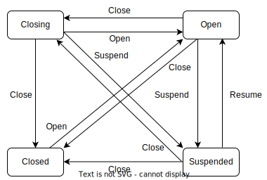

## Motivation

Volcano's queues offer a range of resource management capabilities. Users can open or close queues to manage their lifecycle, which currently includes three states: Open, Closing, and Closed. For detailed design, please refer to [queue state management](https://github.com/volcano-sh/volcano/blob/master/docs/design/queue/queue-state-management.md). When a user performs the action of closing a queue, it usually indicates that the user wants to end the life cycle of the queue. Once all jobs within the queue have completed execution, the queue will transition to the Closed state. At this point, users can safely perform operations on the queue, such as deleting it. Additionally, during the queue's termination process and afterward, no new jobs can be submitted to the queue. This is a stringent constraint primarily used in scenarios where users intend to delete the queue.

However, in real-world production environments, there are instances where users merely wish to modify certain attributes of the queue, such as its quota, preemption policy, or weight, rather than deleting the queue. In such cases, users desire to temporarily suspend the queue's scheduling function to safely make these attribute changes, thereby preventing any unintended behaviors. During this suspension period, jobs can still be submitted to the queue, but no resources will be allocated to them. This approach is less restrictive than closing the queue, which prevents job scheduling altogether. Suspending queue scheduling is a more lenient action compared to closing the queue.

## In scope

Support a new capability to suspend queue scheduling, allowing users to modify queue attributes and perform maintenance operations when queue is suspended. New jobs can still be submitted to the queue, but no resources will be allocated. Once the modifications are complete, scheduling for the queue can be resumed, and the new submitted jobs can then be scheduled.

## Proposal


Currently the queue has several states Open, Closing, Closed, Unknown, we need to add a `Suspended` state for the queue, in this state, the user can submit jobs to the queue, but will not allocate resources for the job, once the queue maintenance is completed, the queue can change to the `Open` state  from `Suspended` state .

Users can pause/resume the scheduling of the suspended queue through `vcctl`, or specify `Suspend`/`Resume` action to pause/resume the scheduling of the queue by creating a `bus command`.

## User Stories

### Story 1

As a cluster administrator, I need to dynamically adjust key attributes such as quotas, weights, and priorities of queues based on cluster resources. Given the sensitive nature of these operations, they may affect the scheduling priority and outcome of the current job. Therefore, when performing queue operations, I would like to be able to pause the allocation of queue resources to create a safe window for changes. During this period, I can safely modify the queue properties to ensure that the scheduling results of all jobs being submitted are not disturbed, thus effectively avoiding any unexpected scheduling results. 

### Story 2

As a user, I hope that when the cluster administrator performs operation and maintenance operations to the queue, I can continue to submit jobs, and there should be no restrictions on job submissions.

### Story 3

As a cluster administrator, after the operation and maintenance of the queue is completed, I hope that the scheduling of the queue can be restored. The jobs submitted during the queue operation and maintenance can be resumed and the newly submitted jobs can also be scheduled.

## Implementation

We need to modify the following parts of volcano to support the queue's pause/resume scheduling capabilities.

### API Change

Add a new status `Suspend` to the queue in the `pkg/apis/scheduling/v1beta1/types.go`, indicating that the queue is suspended.

```go
// QueueStateOpen indicate `Open` state of queue
QueueStateOpen QueueState = "Open"
// QueueStateClosed indicate `Closed` state of queue
QueueStateClosed QueueState = "Closed"
// QueueStateClosing indicate `Closing` state of queue
QueueStateClosing QueueState = "Closing"
// QueueStateUnknown indicate `Unknown` state of queue
QueueStateUnknown QueueState = "Unknown"
// QueueStateSuspended indicate `Suspended` state of queue
QueueStateSuspended QueueState = "Suspended" // New added
```

Add two new actions in the `pkg/apis/bus/v1alpha1/actions.go`, `Suspend` and `Resume`, which represent the actions of suspending the queue and resuming queue scheduling respectively.

```go
// OpenQueueAction is the action to open queue
OpenQueueAction Action = "OpenQueue"

// CloseQueueAction is the action to close queue
CloseQueueAction Action = "CloseQueue"

// SuspendQueueAction is the action to suspend queue
SuspendQueueAction Action = "SuspendQueue"

// ResumeQueueAction is the action to resume queue
ResumeQueueAction Action = "ResumeQueue"
```


### Volcano components

#### Volcano controller

Add a suspended file in `pkg/controllers/queue/state` to handle `Open`, `Resume`, and `Close` actions, and update the queue to the corresponding state according to the action type.

When the queue is in the `Open`, `Closing`, or `Unknown` state, the Suspend and Resume actions are processed.

- When the queue is in the `Open`, `Closing` or `Unknown` state, and the `Suspend` action is received, the queue is updated to the `Suspended` state. When the `Resume` action is received, no processing is performed.

- When the queue is in the `Closed` state, there are some differences from the previous states. When the `Suspend` and `Resume` actions are received, no processing is performed, because the queue in the Closed state indicates that the life cycle of the queue has ended. If the `Suspend` action were to update the queue to the `Suspended` state, the queue would be able to submit jobs, which is inconsistent with the job submission behavior in the `Closed` state. Therefore, the queue in the `Closed` state can only be changed by the `Open` action. This is also consistent with the design of `Open` and `Close` as a pair of operations.

When the hierarchical queue function is implemented, see [PR](https://github.com/volcano-sh/volcano/pull/3743), when the user suspend/resume the scheduling of the queue, the same operation needs to be performed on the sub-queues at the same time, and update the sub-queues to the corresponding state.

<div align="center"></div>

#### Volcano scheduler

Modify allocate, backfill, preempt, and reclaim. When the queue suspends scheduling, the job of the current queue will be skipped and will not be scheduled. At the same time, modify the `job.FitError` logic to record the event that the job was not scheduled successfully due to queue suspension.

#### Volcano admission


Modify the logic of `validateQueue` in `pkg/webhooks/admission/queues/validate/validate_queue.go` to allow users to create queues in the `Suspended` state.

Modify the logic of `validateJobCreate` in `pkg/webhooks/admission/jobs/validate/admit_job.go` to allow users to submit jobs to the queue in the `Suspended` state.

Modify the logic of `validatePod` in `pkg/webhooks/admission/pods/validate/admit_pod.go` to allow users to submit Pods to the queue in the `Suspended` state.
