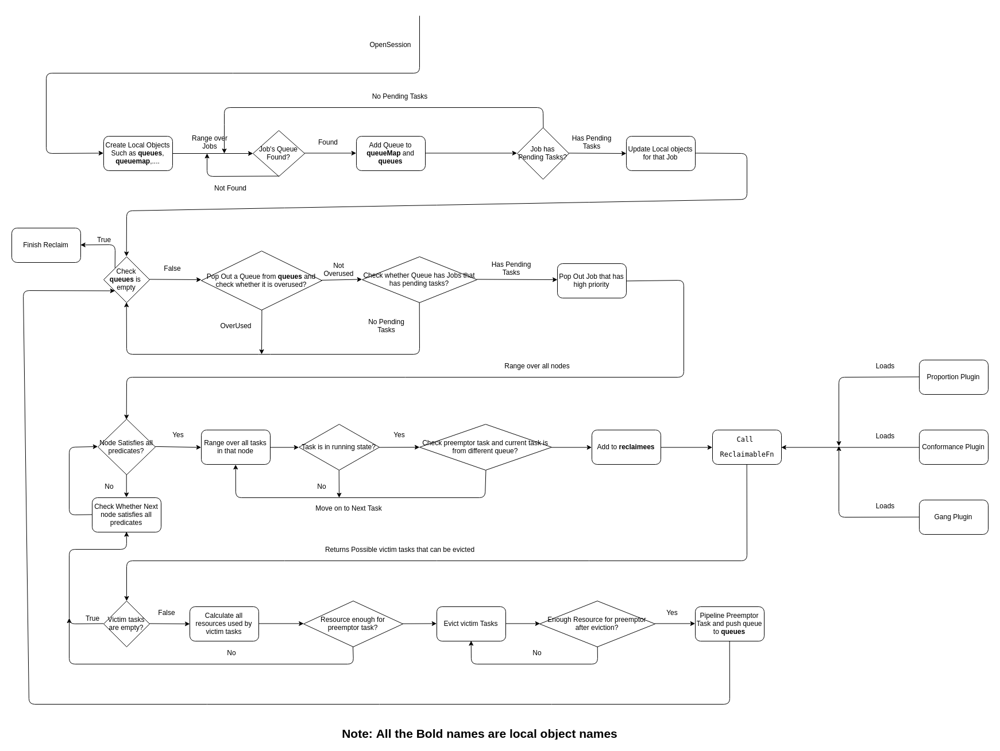

## Execution flow for Reclaim action

Reclaim runs in each session and the workflow of the session is explained below with the help of diagram.

1. In every session, local copies of objects(**queues**, **queueMap**, **preemptorsMap**, **preemptorTasks**) are created.
2. Range over all Jobs
    1. If Job's Queue is not found, move on to next job
    2. If found, add queue to **queueMap** and **queues** local object.
    3. Check for Job's Pending tasks,
        1. If no pending tasks, move on to next job
        2. If Job has pending tasks, update local objects.
3. Check whether **queues** object is empty
    1. If **queues** object is not empty
        1. Pop out queue from **queues** object
            1. If queue is overused, move on to next queue from queues object
            2. If queue is not overused, check for for jobs which has pending tasks within that queue and select preemptor task
4.  Range over all nodes and run predicateFn for preemptor task
    1. If predicates are not satisfied, move on to next node
    2. If all the predicates are satisfied
        1.  Range over all tasks running that node but from different queue other than preemptor task's queue and find all **reclaimees** tasks
        2. Send preemptor task and set of **reclaimees** task to ReclaimableFn which has been loaded by following plugins such as conformance, gang and proportion
5. ReclaimableFn returns all possible victim tasks that can be evicted
6. If number or victim tasks is zero or resource requirement of preemptor task is greater than total resource of all victim tasks, then move on to next node
7. If resouce requirement of preemptor task is satisfied, then evict tasks from victim tasks one by one until preemptor task can be pipelined
8. Run this until **queues** object is empty

