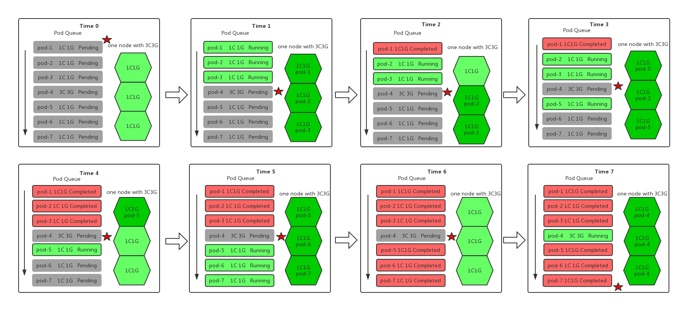
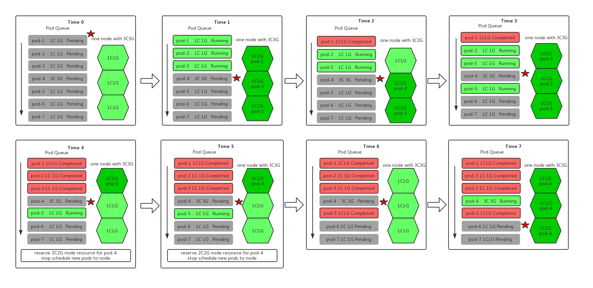
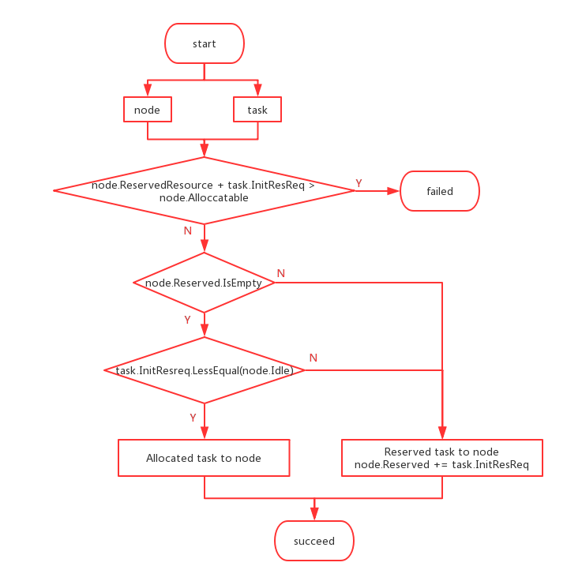
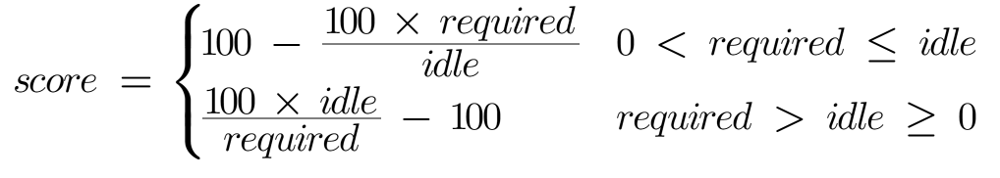
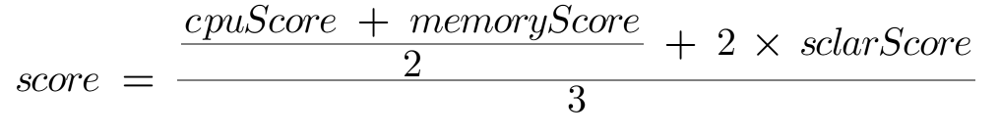
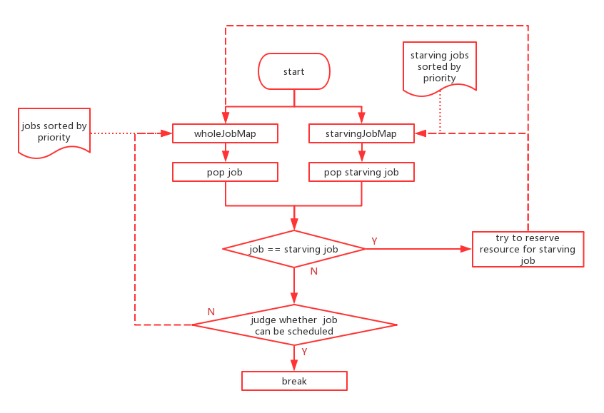
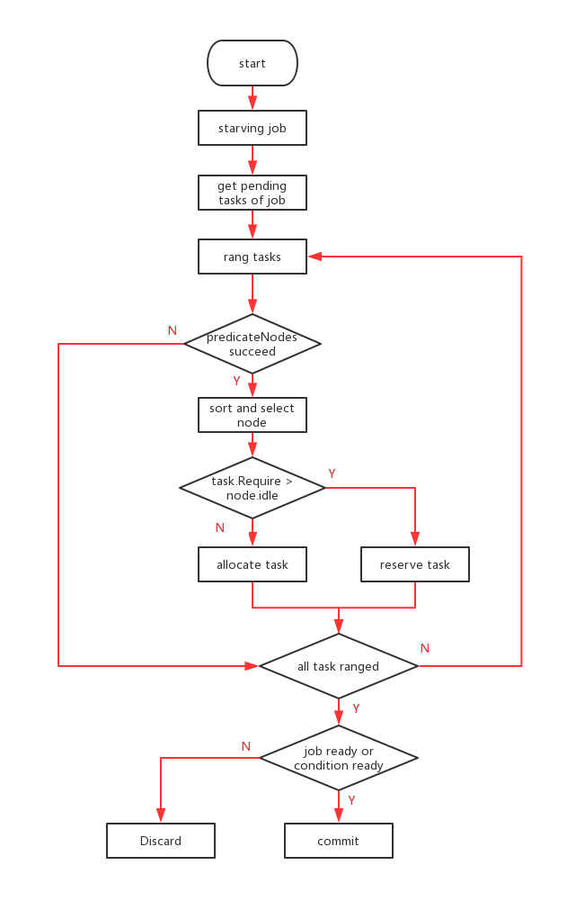

# Reserve Action

[@sivanzcw](https://github.com/sivanzcw); July 13, 2019

## Table of Contents

- [Reserve Action](#reserve-action)
  * [Table of Contents](#table-of-contents)
  * [Objectives](#objectives)
  * [Introduction](#introduction)
  * [Motivation](#motivation)
  * [Function Detail](#function-detail)
    + [Terminology](#terminology)
      - [Job Ready](#job-ready)
      - [Job Condition Ready](#job-condition-ready)
      - [Job starving](#job-starving)
      - [Reserved](#reserved)
    + [Node resource reservation rule](#node-resource-reservation-rule)
      - [Node reserve logic](#node-reserve-logic)
      - [Nodes who have reserved resources will no longer scheduler new non-BestEffort tasks](#nodes-who-have-reserved-resources-will-no-longer-scheduler-new-non-besteffort-tasks)
      - [The proportion of nodes participating in reserve action](#the-proportion-of-nodes-participating-in-reserve-action)
      - [Node selection strategy to participate in reserve](#node-selection-strategy-to-participate-in-reserve)
      - [Node calculating score logic](#node-calculating-score-logic)
    + [Reserve logic](#reserve-logic)
  * [Data Model](#data-model)
  * [References](#references)

## Objectives

- Define the concept of `reserve` in volcano
- Define what kind of task needs to be reserved resources
- Define how task priority and other factors affect `reservation`
- Define node resource reservation logic
- Describe the impact of the `reserve` action on the entire scheduling process

## Introduction

The `reserve` action is to solve the problem that the task can not be scheduled for a long time due to insufficient resource.
The job who can not be scheduled for a long time due to insufficient resource is called starving job. Starving job is 
very common is on-perm clusters where number of node in cluster is fixed, but it may also happen in the cloud, because cloud
customers may choose to run too many tasks to save money. The `reserve` action will try to reserve some node resources 
for the tasks under the starving job. Nodes who have reserved resources for starving job will no longer schedule new 
non-BestEffort tasks. When the existing pods on the node are completed and exited, the node resources they occupy will be 
released. If the idle resource of the current node meets the scheduling requirement of task who apply for reserved resources 
on this node, task under the starving job will be scheduled on this node. The `reserve` action can not solve the scenario 
in which tasks can not be scheduled due to affinity or anti-affinity can not be satisfied. The problem that higher priority 
task can not be scheduled due to affinity or anti-affinity condition can not be met may be solved in `preempt` action.

## Motivation

When the node resources in the cluster are insufficient, the tasks with large resource requirements will be at risk of 
starvation. The so-called starvation means that the task can not be scheduled for a long time due to insufficient resource.

There are many reasons why a task can not be scheduled. From the perspective of task resource requirement and cluster 
allocatable resources, if resources required by the task are larger than the allocatable resources of any node in the 
cluster, the task can not be scheduled. The node under the cluster needs to be expanded vertically to increase the node 
resources. The `reserve` action does not solve scheduling problem of tasks that cannot be scheduled because the required 
resources are larger than the allocated resources of any node in cluster.

If the allocated resources of node in cluster can meet the resource requirements of the task, but because of that some of the 
node resources are occupied by lower priority pods with relatively small resource requirements for a long time, the remaining 
resources of the node can not satisfy the scheduling condition of this task, thereby, the task that apply for large resources 
can not be scheduled due to insufficient resources. In extreme cases, task with large resource requirement can only be scheduled 
when all the small resource application pods are completed. This situation needs to be avoided as much as possible. When a 
task cannot be scheduled for a long time, a special scheduling mechanism need to be provided for it to ensure that the task 
can be scheduled as soon as possible.



In `Time0`, there were seven pods to be scheduled with one node whose allocated resources were `3C3G` in cluster. The `pod-0` 
has the highest priority in the unscheduled pod queue and will be prioritized to be schedule. In `Time1`, `pod-1` `pod-2` 
`pod-3` were bound to the node and began to run. The `pod-4` has the highest priority in the unscheduled pod queue and will 
be prioritized to be schedule. In `Time2`, `pod-1` was completed, and `1C1G` resource was released from node. The scheduler
try to schedule `pod-4`, but idle resource of node can not satisfy pod's requirement. The `pod-4` can not be scheduled and 
was skipped. The scheduler try to schedule `pod-5` and succeed in `Time3`. In `Time4`, `pod-2` and `pod-3` were `completed`
and `2C2G` were released from node. Because of that the idle resource of node can not satisfy requirement of pod `pod-4`, 
`pod-4` was skipped. The `pod-6` and `pod-7` were bound to node and began to run. In `Time6` all pods except pod `pod-4` 
were completed and all resources of node were released. The scheduling condition of pod `pod-4` was satisfied, `pod-4` was 
bound to node and began to run. In the above scenario, the `pod-4` can not be scheduled in time because a large number of 
small resource requirement pods occupied the node resources.
 
In order to solve such problems, the `reserve` action is introduced into the scheduling policy. The `reserve` action can 
prevents the large resource requirement task from being starved by reserving node resources for it and not allowing the other 
tasks to be scheduled on the node.



Different from the original scheduling logic, in `Time4`, although there were `2C2G` idle resources on the node, it did not
schedule new tasks to the nodes, but reserved these resources for `pod-4`. In `Time5`, `pod-6` and `pod-7` remain `Pending`. 
In `Time 6`, `pod-5` completed and all resources on node were released. The scheduling condition of `pod-4` was satisfied, 
`pod-4` was bound to the node and started `Running`.

## Function Detail 

### Terminology

#### Job Ready

If the allocatable resources of the cluster meet the resource requirements of some tasks under the job, some or all tasks 
under the job can be successfully scheduled and schedule condition of tasks satisfies the scheduling constraints of the 
job to subordinate tasks, then the job is in the `Job Ready` state. After scheduling, tasks under the job with `Job Ready` 
state can be bound to node and start running. The state of the job changes to `Job Running` state. The scheduling constraints 
of a job may include restrictions such as `gang-scheduler` and so on. If a job contains a `gang-scheduler` scheduling 
constraint, the task is allowed to be scheduled only if the number of tasks that can be scheduled under the job is not less 
than the minimum number of `Running` pod set by the job.

#### Job Condition Ready

If the above running condition of a job is satisfied under certain conditions, then the state of the job can be called 
`Conditional Running`. On the premise that node reserves resources for the job, it can reach the `Job ready` condition, 
then the state of the job can be called `Condition Ready`.

```go
// ConditionReady returns whether job is ready considering reserved task
func (ji *JobInfo) ConditionReady() bool {
	return ji.ReadyTaskNum()+ji.ReservedNum() >= ji.MinAvailable
}
```

#### Job starving

The starving job means that the job can not be scheduled for a long time, the system will try to reserve resources for 
starving job. For a starving job, it needs to meet the following conditions

* The creation time of job is greater than the set starving job threshold time
* Job state is not `Job Ready`
* Job state is not `Job Condition Ready`

Job starving threshold time is configured by arguments of `reserve` action, the unit of starving job time threshold is seconds. 

```yaml
actions:
...

- name: reserve
  arguments:
    starvingJobTimeThreshold: 172800
    ...

...
```

Define a new function `isJobStarving` to judge if job is starving.

```go
// isJobStarving return whether the job is going to be starved
// if job is ready, do not think it might be starved
// if the task under the job has been reserved resources, and under this premise
// the job can be ready, the job will not be starved
// if the pending time of job is greater that the threshold, the job is considered to be starved
func isJobStarving(ssn *framework.Session, job *api.JobInfo, starvingJobTimeThreshold int) bool {
	if ssn.JobReady(job) {
		return false
	}

	if ssn.JobConditionReady(job) {
		return false
	}

	if time.Since(job.CreationTimestamp.Time) > time.Duration(starvingJobTimeThreshold)*time.Second {
		return true
	}

	return false
}
```

If a job has been created for a long time, but it is still not `running`, it is at risk of starving. If the job is in 
`Job ready` condition, tasks under the job can be scheduled after scheduling, therefore, the job does not have the risk 
of being starved. If the job is in `Job Condition Ready`, indicating that the system has reserved resources for the starving 
job. If nodes under the cluster
have reserved resource for the starving job, then there is no need to reserve resources for it again.

#### Reserved

`Reserved` indicates that the task wants the node to reserve resources for it, but it does not occupy resources of node.
If the idle resource of the node is smaller than the requirement of task, but the allocated resources of the node is larger than
the requirement of task, the task can be allocated to this node with `Reserved` state. When a node reserves resources for the 
task, the state of the task will be set to `Reserved`.

### Node resource reservation rule

#### Node reserve logic

If the allocatable resources of node is larger than the resource requirement of the task, then the node satisfies the 
scheduled requirement of the task now or later. This node can reserve resources for this task. If the idle resource of 
the current node has met the scheduling condition of the task, resources will be `allocated` to this task, and the task 
will be directly assigned to the node with `Allocated` state. If the idle resource of the node can not meet the resource 
requirement of the task, the node will reserve resources for this task, the task will be allocated to this node with 
`Reserved` state. Once a node reserve resources for a task, no other non-BestEffort tasks will be scheduled to this node. 



A node may reserve resources only for one task, or may reserve resources for multiple tasks, depending on the size of the 
allocatable resources of node.

#### Nodes who have reserved resources will no longer scheduler new non-BestEffort tasks

When a node reserves resources for some task, the `Reserved` resource of the node will be updated. when the `Reserved` resource 
of node is not null, the node will no longer schedule other non-BestEffort tasks.

Add new unschedule info `NodeResourceReserved` to describe the scenario that nodes who have reserved resources can not 
scheduler new tasks

```go
const (
	...
	
	// NodeResourceReserved means node resource has been reserved for some task and can not schedule new tasks
	NodeResourceReserved = "node(s) resource was(were) reserved"

    ...
)
```

Change `predicateFn` function of `allocate` action with the following constraints, if node's `Reserved` resource is not 
empty, the node can not schedule new non-BestEffort task.

```go
	predicateFn := func(task *api.TaskInfo, node *api.NodeInfo) error {
        ...

		if !node.Reserved.IsEmpty() {
			return api.NewFitError(task, node, api.NodeResourceReserved)
		}

        ...
	}
```
Modify `PredicateNodes` function of `preempt` action to extend the `predicateFn` function

```go
	predicateNodes, _ := util.PredicateNodes(preemptor, allNodes, predicateFn)

	predicateFn := func(task *api.TaskInfo, node *api.NodeInfo) error {
		...

		if !node.Reserved.IsEmpty() {
			return api.NewFitError(task, node, api.NodeResourceReserved)
		}

		return ssn.PredicateFn(task, node)
		...
	}
```

Modify node select logic of `reclaim` action

```go
	for _, n := range ssn.Nodes {
		// If predicates failed, next node.
		if !node.Reserved.IsEmpty() {
			continue
		}

		if err := ssn.PredicateFn(task, n); err != nil {
			continue
		}

		...
	}
```
#### The proportion of nodes participating in reserve action

Because of that some of node resources was reserved for tasks and will not be used by other tasks, the resources 
reservation will affect the task scheduling process of the entire cluster. In theory, the more nodes that participate in
resource reservation, the better it is to solve the problem of the task being starved to death. However, the fewer nodes 
participating in regular scheduling, and the greater the impact on regular cluster scheduling. Therefore, the number of 
nodes participating in resource reservation is configurable. `reservedNodePercent` indicates the percentage of nodes 
participating in resource reservation.

```yaml
actions:
...

- name: reserve
  arguments:
    reservedNodePercent: 50
    ...

...
```

#### Node selection strategy to participate in reserve
 
How to choose which node will be selected as candidate nodes for starving job scheduling. The process of selecting a 
reserved node will include the following steps.

1. Get all nodes in cluster
2. PredicateNodes for task
3. Calculating node score by idle resource and resource requirement of task
4. Sort node by node score
5. Re-define node score by threshold of the number of reserved nodes

#### Node calculating score logic

The process of calculating node scores includes two processes of `map` and `reduce`. In the `map` process, all nodes 
calculated a score according to the idle resources of the node and resource requirement of task, and then all nodes are 
sorted in descending order of rank.

In the process of calculating node scores based on node idle resource, there will be `cpu` `memory` and `scalar resources` 
participating in the score calculation. The formula for calculating score for a single resource is  



The formula for calculating the node score based on the above three resources is



In the process of `reduce`, the node score will be re-adjusted to ten points or zero points according to the threshold of 
the number of reserved nodes.

The above arithmetic logic will be embedded in `nodeOrderOnResourceFn` function in `nodeorder` plugin
```go
...

nodeOrderOnResourceFn := func(task *api.TaskInfo, nodes []*api.NodeInfo) (map[string]float64, error) {
	calculateNode := func(i int) {
		cpuScore, memScore, scalarScore = calculateResourceScore(task, node)
		nodeScore := ((cpuScore+memScore)/2 + 2*scalarScore) / 3
	}
}
ssn.AddNodeOrderOnResourceFn(pp.Name(), nodeOrderOnResourceFn)

...
```

### Reserve logic

Even if the `reserve` action is added, it is still necessary to ensure that the jobs with higher priority have priority to 
be scheduled and get resources in the cluster. When attempting to `reserve` resources for a starving job, it is necessary 
to ensure that in the case of resource situation of current cluster, any job in the job queue who has a higher priority 
than the starving job cannot be scheduled. If a job with a higher priority than the starving job can be scheduled successfully
in this round, the starving job need to wait until the high-priority job is scheduled. It need to wait for the next schedule
round to try to reserve resources on nodes. 



`Reserve` will succeed only if the job can reach `ready` or `condition ready`



## Data Model

Introduce `Reserved` resource in `NodeInfo`, used to indicate the size of resources reserved on the node. The size 
of the reserved resource on the node is the sum of the resource requirement of all the tasks reserved on the node. The 
reserved resources should be smaller than the allocatable resources.
```go
// NodeInfo is node level aggregated information.
type NodeInfo struct {
	...

	// Reserved is reserved resources for starving task
	Reserved *Resource

	...
}
```

Introduce `Reserved` task status. The `Reeserved` status indicates that although the task is added to the node, it does not 
actually occupy the resources of the node, it just wants the node to reserve resources for it. 

```go
const (
    ...
	
	// Reserved means a task/pod is allocated to the node but not occupy node resource
	Reserved

    ...
)
```

Change `AddTask` function to process tasks with `Reserved` state

```go
// AddTask is used to add a task in nodeInfo object
func (ni *NodeInfo) AddTask(task *TaskInfo) error {

    ...

	if ni.Node != nil {
		switch ti.Status {
		...
		
		case Reserved:
			ni.Reserve.Add(ti.Resreq)
		
		...
		}

		if ti.Status != Reserved {
			ni.Used.Add(ti.Resreq)
		}
	}

	...
}
```

Add and register `nodeOrderOnResourceFn` in Session to get node order function for `reserve` action 

```go
// Session information for the current session
// ResourceNodeOrderFn is the func declaration used to get node score for a particular task based on node resource and 
// task requirement resource.
type NodeOrderOnResourceFn func(*TaskInfo, []*NodeInfo) (map[string]float64, error)

type Session struct {
    ...
    nodeOrderOnResourceFns map[string]api.NodeOrderOnResourceFn
}

// NodeOrderOnResourceFn invoke node order function of the plugins
func (ssn *Session) NodeOrderOnResourceFn(task *api.TaskInfo, nodes []*api.NodeInfo) (map[string]float64, error) {
	score := make(map[string]float64, len(nodes))
	for _, tier := range ssn.Tiers {
		for _, plugin := range tier.Plugins {
			if !isEnabled(plugin.EnabledResourceNodeOrder) {
				continue
			}
			pfn, found := ssn.nodeOrderOnResourceFn[plugin.Name]
			if !found {
				continue
			}
			score, err := pfn(task, nodes)
			if err != nil {
				return nil, err
			}
			for nodeName, score := range score {
				score[nodeName] += score
			}
		}
	}
	return score, nil
}
```

## References

* [Configure Quality of Service for Pods](https://kubernetes.io/docs/tasks/configure-pod-container/quality-service-pod/)
