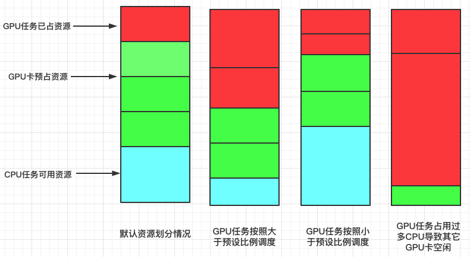

# ResourceStrategyFit Plugin

## Summary

At present, there are few scheduling strategies for resource types. When users want to schedule according to resource types in some special scenarios, there is a lack of refined strategies to choose from. This plugin attempts to improve this part of the strategy to cover more application scenarios for users.

## Motivation

- **resourceStrategyFit**: The native k8s NodeResourcesFit plug-in can only adopt one type of strategy for all resources, such as MostRequestedPriority and LeastRequestedPriority. However, in industrial practice, this design is not applicable in some scenarios. For example: in AI scenarios, we usually disperse CPU tasks in CPU machine groups to reduce hot spots. GPU tasks are gathered in GPU machine groups to reduce GPU fragmentation. Therefore, we need to expand a scheduling strategy to meet the needs of this scenario.

- **sra**: In a cluster where GPU nodes and CPU nodes are deployed together, there is a risk that a task submitted to the cluster, which does not require GPU resources, may be scheduled to a GPU node. This can lead to inefficient resource utilization, as a job requiring both CPU and GPU resources might be pending due to insufficient CPU resources on the GPU node. This scenario is not ideal, as it can result in under utilization of resources and potential delays in job execution. Therefore, sra is proposed to avoid nodes with critical resources (such as GPUs) for certain CPU jobs and to improve overall resource utilization.

- **proportional**: In a cluster where CPU tasks and GPU tasks are mixed, sometimes some CPU tasks are scheduled to GPU nodes, resulting in some GPU tasks being in a long-term Pending state due to lack of CPU resources. In this regard, we may specify a 'primary' resource(e.g., GPU in deep learning), and preserve the amount of associated 'secondary' resources by a pre-set proportion. This policy will play a role in the predicate stage, and is committed to ensuring that the idle resources of the node will meet the secondary resources required by the scare resources of the node according to the proportion.

### Goals

- Different types of resources can be configured with different strategies to prioritize them in the form of weights.

- Different resources can be configured with different weights, which are used to indicate the scarcity of resources.

- Different resources can set the proportion of secondary resources to ensure that the idle secondary resources on the node are sufficient.

### Non-Goals

- None.

## Proposal

Extend one plugin (ResourceStrategyFit) to meet the above needs
- **ResourceStrategyFit**: Provide users with **MostAllocated** and **LeastAllocated** these two ways to facilitate the user to decide whether the task should be distributed or aggregated according to the different needs of the task.

- **sra**: Provide users the way of weight to avoid common task being scheduled to the presence of scare resource nodes, thereby improving the utilization of scare resources.

- **proportional**: Provide users with the way of proportion to avoid common task being scheduled to the presence of scare resource nodes, thereby improving the utilization of scare resources.

## User Story

### Story1
- Users expect different resource allocation strategies to be applied based on resource types. For example, in PyTorch jobs, the master pod (which uses CPU) should be distributed to avoid node hotspots, while worker pods (which use GPU) should be aggregated to minimize resource fragmentation.

### Story2
- Users expect that there should be no ordinary tasks on scarce resource nodes. For example, in a cluster where CPU tasks and GPU tasks are mixed, CPU tasks should be avoided being scheduled to GPU nodes.

### Story3
- Users expect to ensure that the idle secondary resources on the nodes are sufficient after setting the proportion of secondary resources for scare resources.

## Design Details

### ResourceStrategyFit

config：
```yaml
  actions: "enqueue, allocate, backfill, reclaim, preempt"
  tiers:
  - plugins:
    - name: resource-strategy-fit
      arguments:
        resourceStrategyFitWeight: 10
        resources:
          nvidia.com/gpu:
            type: MostAllocated
            weight: 2
          cpu:
            type: LeastAllocated
            weight: 1
```
config description：

<table>
	<tr>
	    <th>strategy</th>
	    <th>calculation method</th>
	    <th>effect</th>  
	</tr>
	<tr>
	    <td>MostAllocated</td>
	    <td>requested/allocable</td>
	    <td>Aggregated</td>
	</tr>
	<tr>
	    <td>LeastAllocated</td>
	    <td>(allocable-requested)/allocable</td>
	    <td>Dispersed</td>
	</tr>
</table>

node score:
```
finalScoreNode = [(weight1 * resource1) + (weight2 * resource2) + … + (weightN* resourceN)] /(weight1+weight2+ … +weightN)
```
### Scarce Resource Avoidance (SRA)
#### Policy Description
- `sra`: Give each scarce resource a weight. Higher weight means more scarce. Jobs that don’t need the scarce resource will try to stay off nodes that have it, so the scarce resource can be retained.
> **Notes**: The `sra` policy is different from the `proportional` policy, because the `proportional` policy is a "**hard**" policy by setting the proportion of secondary resources to prevent task scheduling to nodes that do not meet the proportion of resources, while the `sra` policy is a "**soft**" policy by setting weights to important resources to try to guide task scheduling to nodes that do not have scare resources.

#### Solution
1. In sra policy, arguments `sra.resources` is provided to configure important resources in the cluster.
2. Based on the significance of different resources, `sra.resourceWeight.[ResourceName]` can assign varying weights for resource allocation. A higher weight signifies greater importance, and tasks that do not require this resource will, to the extent possible, be scheduled away from nodes with such resources
3. For all tasks, user can set `sra.resources` and `sra.resourceWeight.[ResourceName]` field in `resource-strategy-fit` arguments via `volcano-scheduler-configmap` in following format:

```yaml
  actions: "enqueue, reclaim, allocate, backfill, preempt"
  tiers:
  - plugins:
    - name: resource-strategy-fit
      arguments:
        sra:
          enable: true
          resources: nvidia.com/t4, nvidia.com/a10
          weight: 2
          resourceWeight:
            nvidia.com/t4: 1
            nvidia.com/a10: 1
```

4. `sra` policy will affect the score result of node order. The higher the node score is, the higher the priority is. The score result of sra policy is calculated as follows :
```
node resources items don't meet task request, sraScore = 0
node resources items meet task request,       sraScore = MaxNodeScore * sraWeight * (weight_1 + weight_2 + ··· + weight_n) / weightSum
```
> `sraScore`: the node score of sra policy. \
> `MaxNodeScore`: the maximum score of node. default is 100. \
> `sraWeight`: the weight of sra policy. \
> `weightSum`: the sum of all sra resources weights. \
> `weight_x`: the weight of the xth sra resource that does not exist on the node.

   1. Now, we have tasks:

      | Task Name  | Task request resource                                        |
      |------------|--------------------------------------------------------------|
      | cpu-task-0 | `{cpu: 2, memory: 4Gi}`                                      |
      | gpu-task-0 | `{cpu: 2, memory: 4Gi, nvidia.com/t4: 2}`                    |
      | gpu-task-1 | `{cpu: 2, memory: 4Gi, nvidia.com/t4: 1, nvidia.com/a10: 2}` | 
   
   2. Suppose there are 3 nodes available in cluster:

      | Node Name | Resource capacity on node                                       |
      |-----------|-----------------------------------------------------------------|
      | node1     | `{cpu: 32, memory: 64Gi}`                                       | 
      | node2     | `{cpu: 16, memory: 32Gi, nvidia.com/t4: 10}`                    | 
      | node3     | `{cpu: 16, memory: 32Gi, nvidia.com/t4: 5, nvidia.com/a10: 10}` |

   3. Through the sra policy we will get the following results:
   
      | Task       | Node  | Score result (sra) | Notes                                                        |
      |------------|-------|--------------------|--------------------------------------------------------------|
      | cpu-task-0 | node1 | 200                | node resources meet the task request and no scarce resources |
      | cpu-task-0 | node2 | 100                | node resources meet the task request but have t4             |
      | cpu-task-0 | node3 | 0                  | node resources meet the task request but have t4, a10        |
      | gpu-task-0 | node1 | 0                  | node resources don't meet the task request                   |
      | gpu-task-0 | node2 | 100                | node resources meet the task request and have t4             |
      | gpu-task-0 | node3 | 0                  | node resources meet the task request but have a10            |
      | gpu-task-1 | node1 | 0                  | node resources don't meet the task request                   |
      | gpu-task-1 | node2 | 0                  | node resources don't meet the task request                   |
      | gpu-task-1 | node3 | 0                  | node resources meet the task request and have t4, a10        |

### proportional
#### Policy Description
- `proportional`: By specifying 'primary' scarce resources (e.g. GPU in deep learning) and preserve the amount of associated 'secondary' resources by a pre-set proportion.


#### Solution
Firstly set the proportion binding in `volcano-scheduler.conf`:

```yaml
  actions: "enqueue, reclaim, allocate, backfill, preempt"
  tiers:
  - plugins:
    - name: resource-strategy-fit
      arguments:
        proportional:
          enable: true
          resources: nvidia.com/gpu,nvidia.com/v100-sxm2-16gb
          resourceProportion:
            nvidia.com/gpu.cpu: 8
            nvidia.com/gpu.memory: 8
            nvidia.com/v100-sxm2-16gb.cpu: 16
            nvidia.com/v100-sxm2-16gb.memory: 16
```

The proportion is GPU:CPU:MEMORY=1:8:8, and let the test scenario just as above:

| Node     | NodeAllocatable                       | NodeIdle                              |
|----------|---------------------------------------|---------------------------------------|
| nodeC0-0 | cpu 74, memory 128G, nvidia.com/gpu 8 | cpu 74, memory 128G, nvidia.com/gpu 8 |

| Job                   | Pod           | Resource                           | Node     | NodeAllocatable                       | NodeIdle                              |
|-----------------------|---------------|------------------------------------|----------|---------------------------------------|---------------------------------------|
| default/single-1000-0 | single-1000-0 | cpu 8, memory 8G, nvidia.com/gpu 0 | nodeC0-0 | cpu 74, memory 128G, nvidia.com/gpu 8 | cpu 66, memory 120G, nvidia.com/gpu 8 |
| default/single-1000-1 | single-1000-1 | cpu 8, memory 8G, nvidia.com/gpu 0 | -        | -                                     | -                                     |

After job single-1000-0 is scheduled, the Idle resource is 8GPUs, 66CPUs, 120G memory. During the predicate phase, this plugin calculates the resource left if job single-1000-1 is scheduled`(node.Idle.CPU - task.Resreq.CPU < node.Idle.GPU * cpuRatio ||
node.Idle.Memory - task.Resreq.Memory < node.Idle.GPU * memoryRatio)`; the result is 8GPUs, 58CPUs, 112G memory, that unsatisfied the 1:8:8 proportion. Therefore, nodeC0-0 is removed from the predicateNodes, and NodeIdle remains 8GPUs, 66CPUs, 120G memory.

For more details, please refer to: [proportional design](./proportional.md)

## Alternatives

### Binpack VS ResourceStrategyFit
If you want to use the clustering strategy for all resource types, you can choose the Binpack plugin. If you need to configure different clustering or scattering strategies for different resource types, you can choose the ResourceStrategyFit plugin. ResourceStrategyFit can also achieve the same results as Binpack by adjusting configuration parameters.

## Best Practices
### AI scenario
In some AI scenarios, CPU tasks are usually dispersed into CPU machine groups to reduce hot spots. GPU tasks are gathered in the GPU machine group to reduce GPU fragmentation. At the same time, it is also necessary to avoid the situation that CPU tasks are assigned to GPU nodes, resulting in long-term waiting of GPU tasks due to insufficient CPU or MEM resources of nodes. In this scenario, we can combine **resourceStrategyFit** and **sra policy** to deal with this scenario. The corresponding example configuration is as follows:

```yaml
  actions: "enqueue, allocate, backfill, reclaim, preempt"
  tiers:
    - plugins:
      - name: resource-strategy-fit
        arguments:
          resourceStrategyFitWeight: 10
          resources:
            nvidia.com/gpu:
              type: MostAllocated
              weight: 2
            cpu:
              type: LeastAllocated
              weight: 1
          sra:
            enable: true
            resources: nvidia.com/gpu
            weight: 10
            resourceWeight:
              nvidia.com/gpu: 1
```