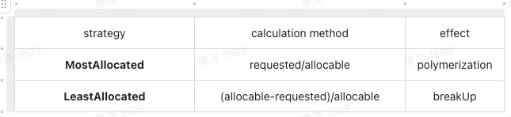

# Enhanced ResourceStrategyFit Plugin

## Summary

The native k8s ResourceStrategyFit plug-in can only adopt one type of strategy for all resources, such as MostRequestedPriority and LeastRequestedPriority. However, in industrial practice, this design is not applicable in some scenarios. For example: in AI scenarios, we usually disperse CPU tasks in CPU machine groups to reduce hot spots. GPU tasks are gathered in GPU machine groups to reduce GPU fragmentation. Therefore, we need to expand a scheduling strategy to meet the needs of this scenario.

## Motivation

- Different resource types can be configured with different aggregation or dispersion strategies, and weights can be used to distinguish priorities

## Design Consideration

- The solution is more versatile, not limited to AI clusters or CPU clusters, and not limited to common CPU resources or extended GPU resources.

- Different resource policies can be configured for different cluster types and prioritized in the form of weights.

- Easy to expand

### Goals

- Different types of resources can be configured with different strategies to prioritize them in the form of weights

### Non-Goals

- None.

## Proposal

Extend two plug-ins to meet the above needs

- ResourceStrategyFit

## User Story

### Story1
- Users hope that different resource strategies can be adopted for different resource types. For example, in AI scenarios, they hope that pods that apply for GPU resources will occupy as many machines as possible, while pods that only apply for CPU resources will be evenly distributed to different machines.

## Design Details

### ResourceStrategyFit

config：
```
actions: "enqueue, reclaim, allocate, backfill, preempt"
tiers:
- plugins:
 - name: resource-strategy-fit
    arguments:
      resourceStrategyFitWeight: 10
      resources:
        cpu:
          type: MostAllocated
          weight: 1
        memory:
          type: LeastAllocated
          weight: 2
```
config description：



node score:
```
finalScoreNode = [(weight1 * resource1) + (weight2 * resource2) + … + (weightN* resourceN)] /(weight1+weight2+ … +weightN)
```

## Alternatives

### Binpack VS ResourceStrategyFit
If you want to use the clustering strategy for all resource types, you can choose the Binpack plugin. If you need to configure different clustering or scattering strategies for different resource types, you can choose the ResourceStrategyFit plugin. ResourceStrategyFit can also achieve the same results as Binpack by adjusting configuration parameters.