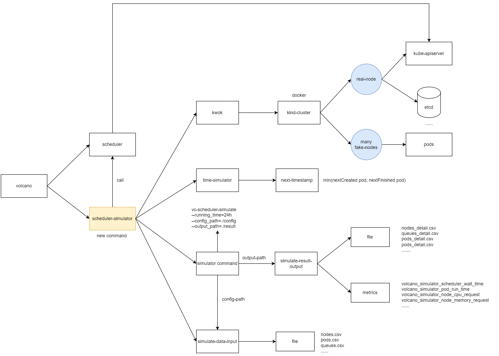

# Volcano scheduler simulate
## background
* Consider such situation: users changed the parameter of nodeorder plugin and need to know the effect to the production enviroment. For example, after change the mostrequested.weight, if the average wait time of big task is shorter than before, etc.
* Currently, users must use real cluster to verify the effect, which is very time consuming and need a lot of node resources.
* Scheduler simulate is an effect solution of the problem above. It runs fast and needs much lesser resources than real cluster.
## design
* The simulator includes simulator command, simulate-data-input, simulate-result-output, time simulator, kwok
 
### simulator command
* scheduler-simulate can be runned by command: vc-scheduler-simulate --running_time=24h --config_path=./config --output_path=./result
### simulate-data-input
* Simulate data includes nodes.csv, pods.csv, queues.csv. These files can be put in config_path directory.
* nodes.csv includes cpu_allocatable, memory_allocatable, label, maxPodNum, etc...
* pods.csv includes cpu_request, memory_request, runsec, cron, createtime, nodeSelector, priority, queueName, etc...
* queues.csv includes queueName, quota, etc...
#### pod
#### queue
### simulate-result-output
#### file
* output file includes nodes_detail.csv, queues_detail.csv, pods_detail.csv, pods_detail.csv. These files will be put in output_path directory.
* nodes_detail.csv includes ts, nodeName, cpuRequest, memoryRequest
* queues_detail.csv includes ts, queueName, cpuRequest, memoryRequest
* pods_detail.csv includes podName, createTs, scheduleTs, finishTs
#### metrics
* output metrics includes volcano_simulator_scheduler_wait_time, volcano_simulator_pod_run_time, volcano_simulator_node_cpu_request, volcano_simulator_node_memory_request which will help user to monitor the schduler simulate by prometheus.
### time simulator
* Time simulator is helpful to shorten simulate time because it will not get the time of real world, it will always get next timestamp of the min value between the create time of next pod and the finish time of next pod.
* The time related parameter should get from time simulator like pod create time, pod finish time, current time, etc...
### kwok
* kwok is used to create kind cluster which includes one real node and many fake nodes
* The real node is used to deploy volcano components like volcano-scheduler, volcano-controller and volcano-admission.
* The pods created by user will be scheduled in many fake nodes. The fake nodes number will be calculated by nodes_detail.csv.