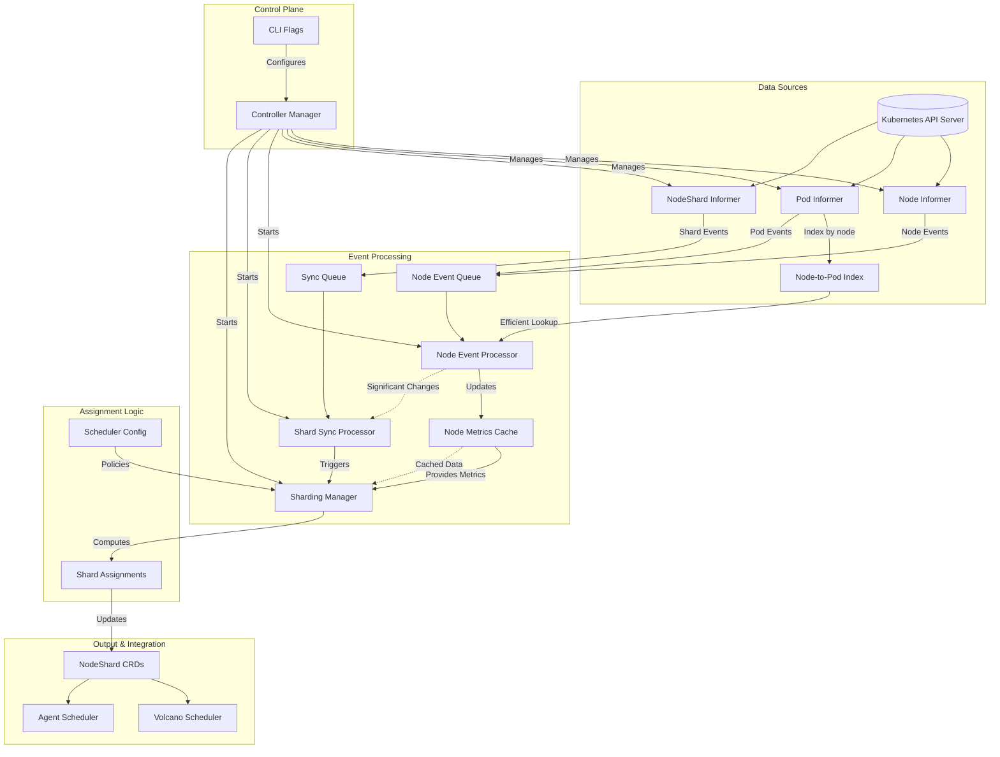
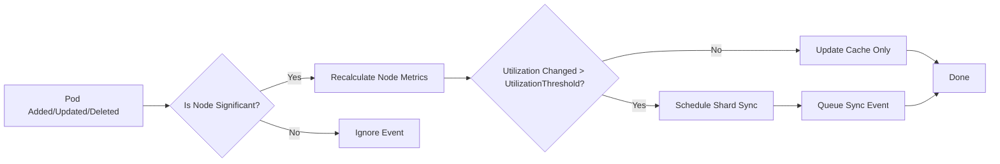

# Sharding Controller Design Document

## 1. Introduction

### 1.1 Problem Statement
As Volcano evolves to support diverse scheduling workloads, particularly Agentic AI workloads with dynamic, short-lived tasks, the existing single scheduler architecture faces significant challenges:
- **Resource Fragmentation**: Agentic AI workloads can utilize fragmented resources that traditional batch workloads cannot
- **Specialized Scheduling Requirements**: Agentic AI workloads require low-latency scheduling decisions with stateful context
- **Scheduler Contention**: Single scheduler becomes a bottleneck for mixed workload types
- **Resource Utilization**: Static resource allocation leads to inefficient cluster utilization

### 1.2 Motivation
The Sharding Controller addresses these challenges by:
- **Specialized Scheduling**: Enabling dedicated schedulers for different workload types (Agentic AI vs traditional batch)
- **Resource Optimization**: Dynamically partitioning cluster resources based on utilization patterns
- **Scalability**: Eliminating the single scheduler bottleneck for large clusters
- **Workload Isolation**: Preventing resource contention between different workload types

## 2. Design Goals

1. **Resource-Aware Partitioning**: Dynamically partition nodes based on real-time resource utilization
2. **Minimal API Server Load**: Use informer caches instead of direct API calls
3. **Event-Driven Updates**: React to cluster state changes efficiently
4. **Scalability**: Support clusters with 1000+ nodes with sub-second latency
5. **Resilience**: Recover gracefully from failures and restarts
6. **Configurability**: Allow runtime configuration of scheduling policies
7. **Backward Compatibility**: Work with existing Volcano deployment without disruption

## 3. Architecture Overview



The Sharding Controller follows a **controller pattern** with these key components:

1. **Informer System**: Watches nodes, pods, and NodeShard CRDs
2. **Node Metrics Calculator**: Computes resource utilization from pod requests
3. **Sharding Manager**: Implements node assignment algorithms
4. **Event Processor**: Handles cluster state changes efficiently
5. **CRD Synchronizer**: Maintains NodeShard CRDs reflecting current assignments

## 4. Core Components

### 4.1 Informer System
- **Node Informer**: Watches node additions, updates, and deletions
- **Pod Informer**: Watches pod events to calculate node utilization
- **NodeShard Informer**: Watches NodeShard CRDs for current assignments
- **Indexers**: Optimized indexes for node-to-pod lookups

```go
// Node index function for efficient pod lookups
func nodeIndexFunc(obj interface{}) ([]string, error) {
    pod, ok := obj.(*corev1.Pod)
    if !ok || pod.Spec.NodeName == "" {
        return []string{}, nil
    }
    return []string{pod.Spec.NodeName}, nil
}
```

### 4.2 Node Metrics Calculation
Instead of relying on external metrics, the controller calculates utilization directly from pod resource requests:

```go
type NodeMetrics struct {
    CPUUtilization    float64
    MemoryUtilization float64
    IsWarmupNode      bool
    PodCount          int
    LastUpdated       time.Time
}
```

**Calculation Logic**:
1. List all active pods on the node
2. Sum CPU and memory requests from pod containers
3. Divide by node capacity to get utilization percentages
4. Factor in warmup node preference for Agentic AI workloads

**Node Event Processing Flow**



### 4.3 Sharding Manager
The core logic that implements node assignment strategies:

```go
type SchedulerConfig struct {
    Name          string
    Type          string // "volcano" or "agent"
    ShardStrategy ShardStrategy
}

type ShardStrategy struct {
    CPUUtilizationRange struct {
        Min float64
        Max float64
    }
    PreferWarmupNodes bool
    MinNodes          int
    MaxNodes          int
}
```

**Assignment Algorithm**:
1. **Filtering**: For each scheduler, filter nodes matching CPU utilization range
2. **Scoring**: Score nodes based on warmup preference and utilization
3. **Selection**: Select top nodes within min/max constraints
4. **Mutual Exclusivity**: Ensure no node is assigned to multiple schedulers

### 4.4 Event Processing System
A two-queue system for efficient event handling:

1. **Main Queue**: Processes NodeShard updates and sync events
2. **Node Event Queue**: Handles node and pod events for metrics updates

```go
// Event processing workflow
func (sc *ShardingController) nodeEventWorker() {
    for sc.processNodeEvent() {
        // Process node events with rate limiting
    }
}

func (sc *ShardingController) worker() {
    for sc.processNextItem() {
        // Process shard sync events
    }
}
```

## 5. Event Flow

### 5.1 Node/Pod Events
1. Pod added/updated/deleted on a node
2. Controller detects event and updates node metrics
3. If utilization changes significantly (>10%), trigger shard sync
4. Sharding Manager recalculates assignments
5. NodeShard CRDs are updated with new assignments

### 5.2 Periodic Sync
1. Controller triggers periodic sync (default: 60s)
2. Sharding Manager recalculates assignments for all nodes
3. Only update NodeShard CRDs if assignments change significantly
4. Minimize unnecessary updates to reduce API server load

### 5.3 Initial Startup
1. Start informers and wait for cache sync
2. Initialize node metrics for all nodes
3. Calculate initial assignments
4. Create NodeShard CRDs for each scheduler

## 6. Node Metrics Calculation

### 6.1 Data Sources
Instead of external metrics servers, we use:
- **Pod Resource Requests**: From pod specifications
- **Node Capacity**: From node status
- **Node Labels**: For warmup node identification

### 6.2 Calculation Method
```go
// Calculate CPU utilization
totalCPURequest := sum(pod.spec.containers.resources.requests.cpu)
nodeCPUCapacity := node.status.capacity.cpu
cpuUtilization := totalCPURequest / nodeCPUCapacity
```

### 6.3 Update Strategy
- **Event-Driven**: Update metrics when pod events occur
- **Periodic Refresh**: Full metrics refresh every 30 seconds
- **Significant Change Detection**: Only trigger shard sync when utilization changes >10%

## 7. Shard Assignment Algorithm

### 7.1 Hard Filtering Approach
Unlike complex scoring systems, we use hard filtering:
1. For each scheduler, define:
   - CPU utilization range [Min, Max]
   - Warmup node preference
   - Min/Max node constraints
2. Filter nodes matching criteria
3. Prioritize warmup nodes when preferred
4. Select nodes within constraints

### 7.2 Example Configuration
```yaml
scheduler-configs:
- name: agent-scheduler
  type: agent
  cpu-utilization-min: 0.7
  cpu-utilization-max: 1.0
  prefer-warmup-nodes: true
  min-nodes: 1
  max-nodes: 100
- name: volcano-scheduler
  type: volcano
  cpu-utilization-min: 0.0
  cpu-utilization-max: 0.69
  prefer-warmup-nodes: false
  min-nodes: 1
  max-nodes: 100
```

### 7.3 Assignment Workflow
1. **Initialization**: Calculate all node metrics
2. **Filtering**: For each scheduler, filter eligible nodes
3. **Prioritization**: Sort nodes by warmup status and utilization
4. **Selection**: Select top nodes within constraints
5. **Validation**: Ensure no node is assigned to multiple schedulers

## 8. Performance Optimization

### 8.1 Cache-Based Architecture
- **Informer Caches**: All data sourced from informer caches
- **Metrics Cache**: Store calculated metrics to avoid recalculation
- **Indexers**: Node-to-pod index for efficient lookups

### 8.2 Batch Processing for Large Clusters
For clusters with a huge number of nodes:
- Process nodes in batches of fixed size (default: 50)
- Add small delays between batches to prevent resource starvation
- Use incremental updates instead of full recalculation when possible

### 8.3 Queue Management
- **Rate Limiting**: Prevent event storms from overwhelming the controller
- **De-duplication**: Merge multiple events for the same node
- **Prioritization**: Process sync events before metrics updates

## 9. Recovery and Resilience

### 9.1 State Recovery
On controller restart:
1. Recover node metrics from cache
2. Rebuild assignment cache from NodeShard CRDs
3. Validate current assignments and reconcile if needed

### 9.2 Error Handling
- **Retry Logic**: Failed operations are retried with exponential backoff
- **Graceful Degradation**: Continue operating with partial state if needed
- **Circuit Breakers**: Pause processing if error rate exceeds threshold

### 9.3 Consistency Guarantees
- **Eventual Consistency**: System converges to correct state over time
- **Idempotent Operations**: Operations can be safely retried
- **Version Checks**: Prevent stale updates using resource versions

## 10. Testing Strategy

### 10.1 Unit Tests
- Controller initialization and configuration
- Event processing logic
- Metrics calculation accuracy
- Assignment algorithm correctness

### 10.2 Integration Tests
- End-to-end workflow with fake clients
- Node and pod events triggering updates
- Multiple scheduler configurations

### 10.3 Performance Tests
- 100-node cluster sync time (<200 ms)
- 100 events per second handling

### 10.4 Failure Recovery Tests
- Controller restart with existing state
- API server unavailability scenarios
- Informer cache desync scenarios

## 11. Future Work

### 11.1 Short-Term Improvements
- **Memory Utilization**: Add memory utilization to shard strategy
- **Custom Metrics**: Support custom node metrics beyond CPU/memory
- **Dynamic Configuration**: Update scheduler configs without restart

### 11.2 Medium-Term Improvements
- **Machine Learning**: Predict node utilization patterns for proactive assignment
- **Multi-dimensional Scheduling**: Consider GPU, network, and other resources
- **Hierarchical Sharding**: Multi-level sharding for very large clusters

### 11.3 Long-Term Vision
- **Cross-Cluster Sharding**: Assign nodes across multiple clusters
- **Workload-Aware Sharding**: Base assignments on actual workload patterns
- **Integration with Kubernetes Scheduling Framework**: Contribute sharding logic upstream

## 12. Conclusion

The Sharding Controller provides a scalable, efficient solution for partitioning Kubernetes clusters between different scheduler types. By dynamically assigning nodes based on resource utilization and warmup status, it enables Volcano to effectively support both traditional batch workloads and emerging Agentic AI workloads. The design emphasizes performance, resilience, and configurability while maintaining compatibility with existing Volcano architecture.

This controller represents a significant step toward Volcano's vision of becoming the unified scheduling platform for all AI/ML workloads, from training jobs to inference serving to autonomous agent orchestration.

## TODO
* add configmap to support online modification of scheduler configurations for sharding controller.

## 13. References
1. [Volcano Architecture](https://github.com/volcano-sh/volcano)
2. [Kubernetes Controller Pattern](https://kubernetes.io/docs/concepts/architecture/controller/)
3. [Client-go Informer Pattern](https://github.com/kubernetes/client-go/tree/master/tools/cache)
4. [CRD Design Best Practices](https://kubernetes.io/docs/concepts/extend-kubernetes/api-extension/custom-resources/)