# Service Level Agreement (SLA) Plugin

## Introduction

When users apply jobs to volcano, they may need adding some particular constraints to job, for example, longest Pending time aiming to prevent job from starving. And these constraints can be regarded as Service Level Agreement (SLA) which are agreed between volcano and user. So sla plugin is provided to receive and realize SLA settings for both individual job and whole cluster.

## Solution

1. In sla plugin, arguments `sla-waiting-time` is provided to realize job resource reservation: `sla-waiting-time` is maximum time one job should stay `Pending` or `inqueue` status and not be allocated. When `sla-waiting-time` is over, `sla` plugin sets the job to be `inqueue` in `enqueue` action immediately. Then `sla` plugin locks idle resources pre-allocated to pods of this job in `allocate` action, even if the job has not been `Ready` yet. In this way, `sla` plugin realizes large job election and resource reservation, thus replaces `elect` & `reserve` action in v1.1.0.

2. Arguments `sla-waiting-time` can be set for one job, and for all jobs in cluster.
   1. For one job, user can set them in job annotations in following format:

      ```yaml
      apiVersion: batch.volcano.sh/v1alpha1
      kind: Job
      metadata:
        annotations:
          sla-waiting-time: 1h2m3s
      ```

   2. For all jobs, user can set `sla-waiting-time` field in `sla` plugin arguments via `volcano-scheduler-configmap` in following format:

      ```yaml
        actions: "enqueue, allocate, backfill"
        tiers:
        - plugins:
          - name: priority
          - name: gang
          - name: sla
            arguments:
              sla-waiting-time: 1h2m3s
      ```

3. `sla` plugin return 3 callback functions: `JobEnqueueableFn`, `JobPipelinedFn`, and `JobOrderFn`:

   1. `JobEnqueueableFn` returns `Permit` when job waiting time in `Pending` status is longer than  `sla-waiting-time`, and job will go through `enqueue` action and be `inqueue` instantly, regardless of other plugins returning `Reject` or `Abstain` to reject this job from being `inqueue`.

   2. `JobPipelinedFn` returns `Permit` when job waiting time in `inqueue` status is longer than `sla-waiting-time`, and job will be `Pipelined` status instantly, regardless of other plugins returning `Reject` or `Abstain` to reject this job from being `Pipelined`. In this way `allocate` action reserves resources for pods of the job even if the job is not Ready yet.

   3. `JobOrderFn` adjusts the order of this job in waiting queues of `enqueue` & `allocate` action. The more close to  `sla-waiting-time` that job waiting time is, the higher scored of this job in `JobOrderFn` of `sla` plugin, so that job would have larger probability to be front int priority queue, which means that it can touch more idle resources and have higher priority to be `inqueue` and allocated.

4. the execution flow chart of `sla` plugin is shown as below:
  

## Feature Interaction

1. By now we only need 1 argument `sla-waiting-time`, so I add it into annotations for simplicity and invocation, but when `sla` plugin is extended with more arguments, a better way to invoke this plugin may be job plugin like `svc` and `ssh`.
