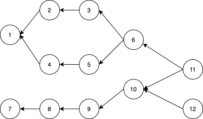
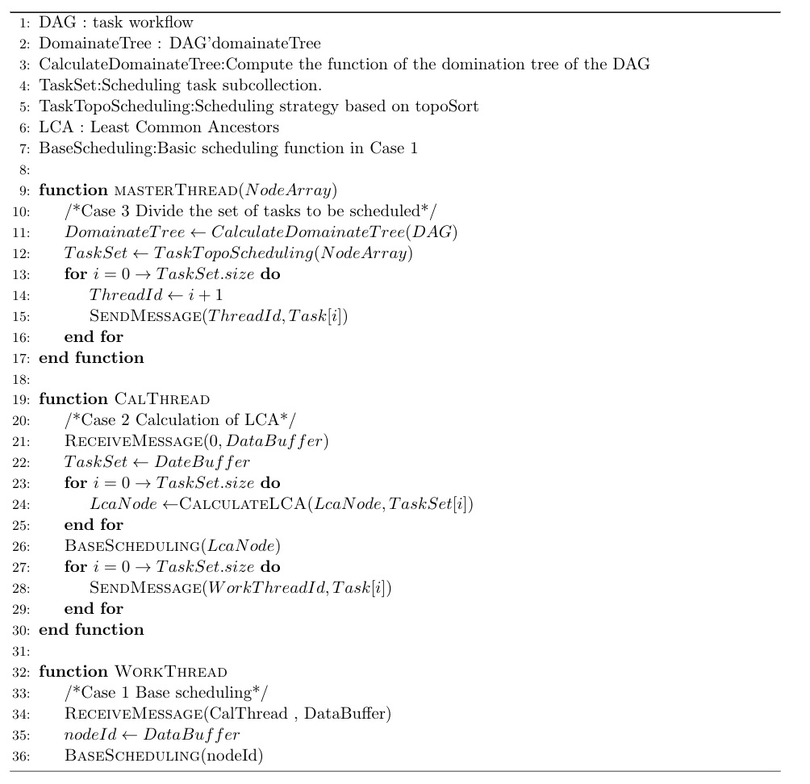

## task-DAG plugin

## Motivation

In some HPC scenarios, a job is divided into several tasks. There are dependencies between several tasks that can be used for the build workflow using DAG. In a high-concurrency environment, scheduling tasks on a workflow using a simple **FIFO** can cause performance bottlenecks.Therefore, it is considered to design a workflow scheduling strategy on DAG to make the scheduling as parallel as possible.

## Design

#### Basic concept

**DAG**: A workflow that represents dependencies between tasks.

**Node**: Task unit in workflow.

**Dependency**: node 2 points to node 1, indicating that node 2 must be executed before node 1.

**Dependent node set**: all dependent nodes of a node form a dependent node set. For example, the dependency set of node 6 is {1,2,3,4,5}.

**Public dependent node**: If node k exists in the set of dependent nodes u and v at the same time, node k is the public dependent node of u and v. For example, the public dependent nodes of nodes 3 and 5 are 6 and 11.

**Nearest public dependent node**: Among all dependent nodes of nodes u and v, the node closest to u and v is called the nearest public dependent node.

**Scheduling constraints**: the scheduling of a task node must first ensure that its dependent node set is scheduled once.

#### Scheduling algorithm

The problem is essentially parallel scheduling on DAG. In order to achieve good performance improvement, the scheduling policy should reduce the repeated scheduling of dependent nodes as much as possible. Hence the importance of the concept of common dependency nodes. For nodes u and v waiting for scheduling in workflow, if you quickly find the common dependent nodes of u and v and prioritize the common parts of workflow, parallelism can be well explored and the problem of repeated scheduling of dependent nodes can be solved. To calculate the common dependent nodes u and v of the Workflow nodes, the following scheduling algorithm is used:

- Calculate the secondary data structure Dominator tree for the DAG.
- Solve the nearest common ancestor (LCA) node k of nodes u and v on Dominator Tree.
- Due to the nature of the Dominator tree itself, node K is the nearest public dependent node of u and v on the DAG.

#### Scheduling policy

- **Case1**  There is a node u in workflow that needs to be scheduled. This case is the base case for later complex cases. Based on the method of DFS, all dependent nodes of node u in DAG are traversed for scheduling. And then at the scheduling node u.
- **Case2**: Two nodes u and v in workflow need to be scheduled.
  - **Case2.1**  u and v are in the same branch, so LCA(u, v) = u. This is the case for nodes 1 and 5 in the figure above. In this case, node 5 is preferentially scheduled. The procedure for scheduling node 5 is case1. Node 1 is then scheduled. Reduces the repeated execution of nodes 6 and 11.
  - **Case2.2**   u and v in different branches, that is, LCA(u,v) != u. In the figure above, if nodes 2 and 4 want to be scheduled at the same time, calculate LCA(2,4) = 6. Priority scheduling node 6. Nodes 2 and 4 can then be scheduled in parallel. The repeated scheduling of nodes 6 and 11 is reduced. The execution of nodes 2 and 3 and 4 and 5 can be performed in parallel.
- **Case3**  Workflow has more than three nodes that need to be scheduled. This is a complex situation where the scheduler theoretically needs to divide the nodes that need to be scheduled into several sets and then describe how each set will be converted into **Case2.1** or **Case2.2** . However, how to divide all nodes requires further design.

#### Pseudocode

