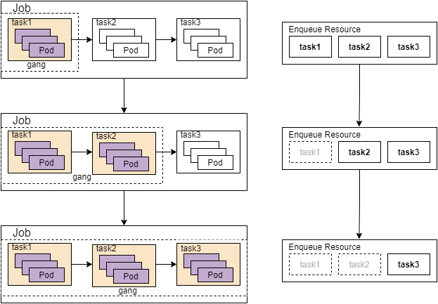

# Enhance  Task Dependency To Compatible With Gang


## Background

Volcano has support Dag for task level, we could use field in `vcjob.spec.task.dependsOn` to customize task startup order. More details can be found in the [documentation](https://github.com/volcano-sh/volcano/blob/master/docs/design/task-launch-order-within-job.md).

For this function, we need to disable the gang plugin when using it because of some conflicts with gang.

1. conflict with the check

   - ValidTaskNum (check the number of tasks that are valid.)

   - CheckTaskValid (check whether each task of job is valid.)
   - CheckTaskReady (check whether each task of job is ready.)
   - CheckTaskPipelined (check whether each task of job is pipelined.)
   - CheckTaskStarving (check whether job has at least one task which is starving)
2. pg cannot keep `Inqueue` status until task Dag finish.
3. enqueue resource should not always be pg.minResource
4. `vcjob.spec.minAvailable`  should be at least greater than `taskMinAvailableTotal`


## Solution

Because of task dependencies, all task pods will not be created together even if resource requirements are met. However, the check of gang is basically for all tasks under the job. So we can skip the check for unstarted tasks,  that is, to treat started tasks as a whole.


```go
// Take CheckTaskReady as an example

// CheckTaskReady return whether each task of job is ready.
func (ji *JobInfo) CheckTaskReady() bool {
	...
	for taskID, minNum := range ji.TaskMinAvailable {
		if occupiedMap[taskID] < minNum {
			return false
		}
	}
	return true
}

// Determine whether the task exists, if not, skip the check
func (ji *JobInfo) CheckTaskReady() bool {
	...
	for taskID, minNum := range ji.TaskMinAvailable {
        
        _, found := occupiedMap[taskID]
		if ji.HasTaskDependencies && !found {
			continue
		}
        
		if occupiedMap[taskID] < minNum {
			return false
		}
	}
	return true
}

// Other checks are handled similarly
```


Let see the process with this handle way:

 