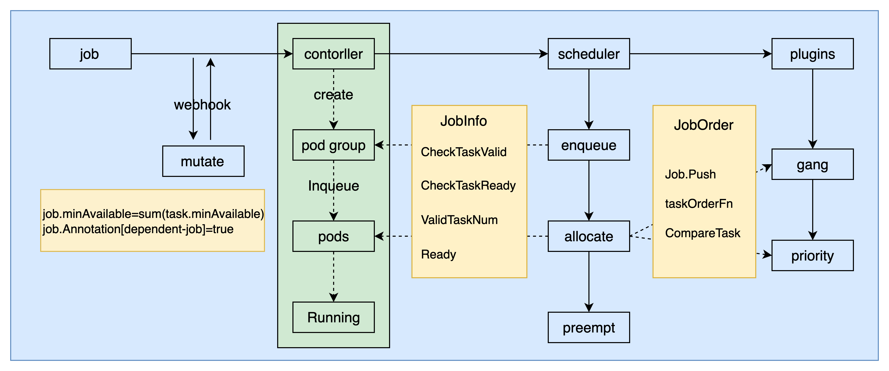
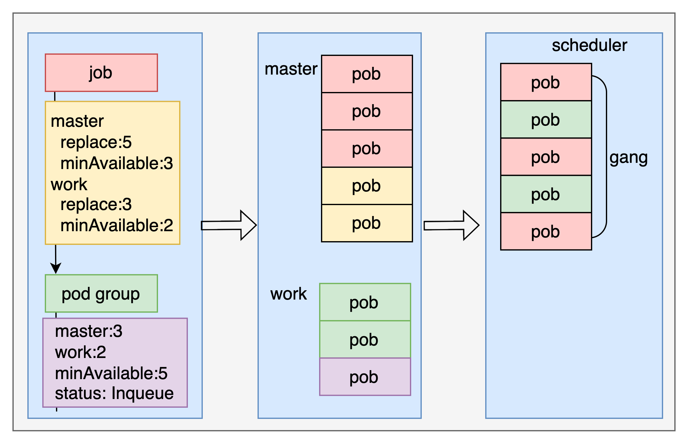
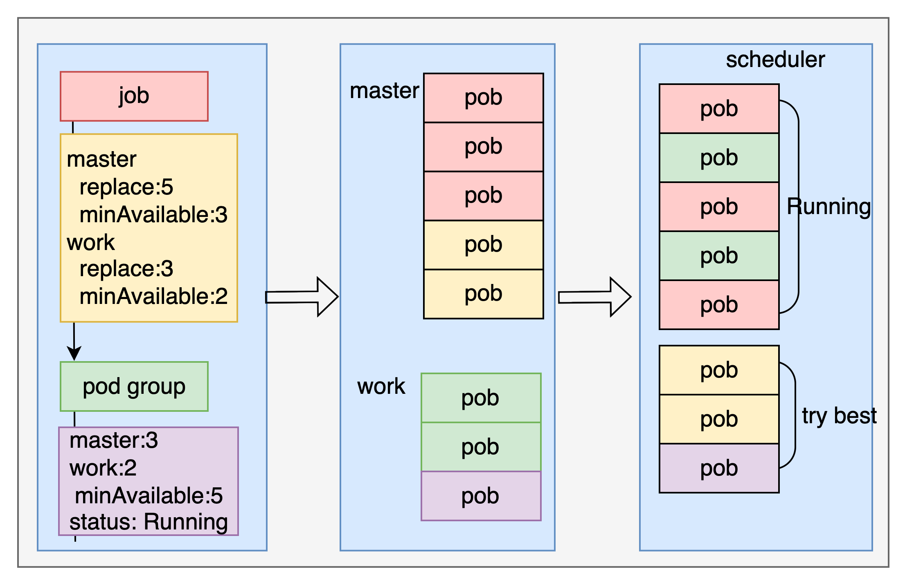
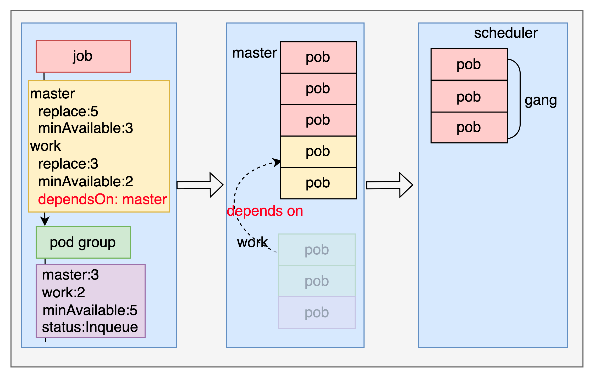
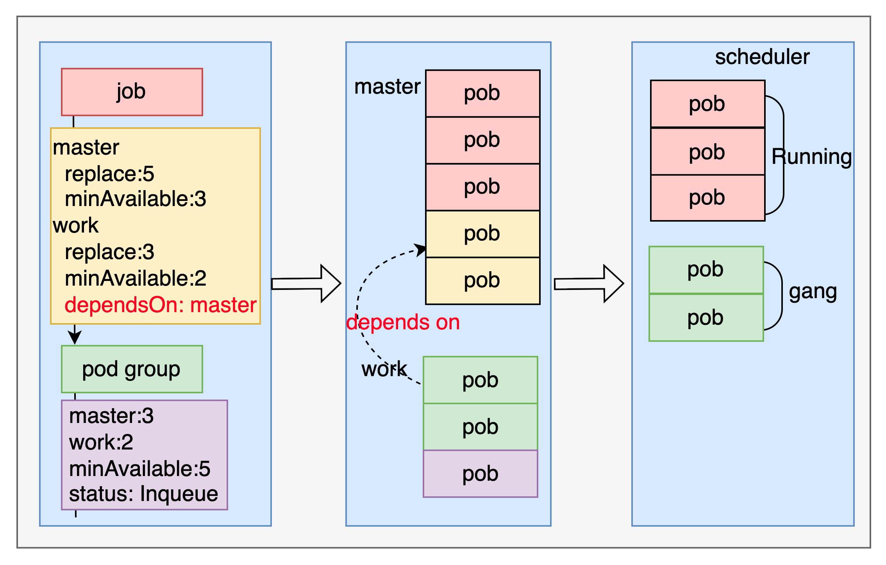
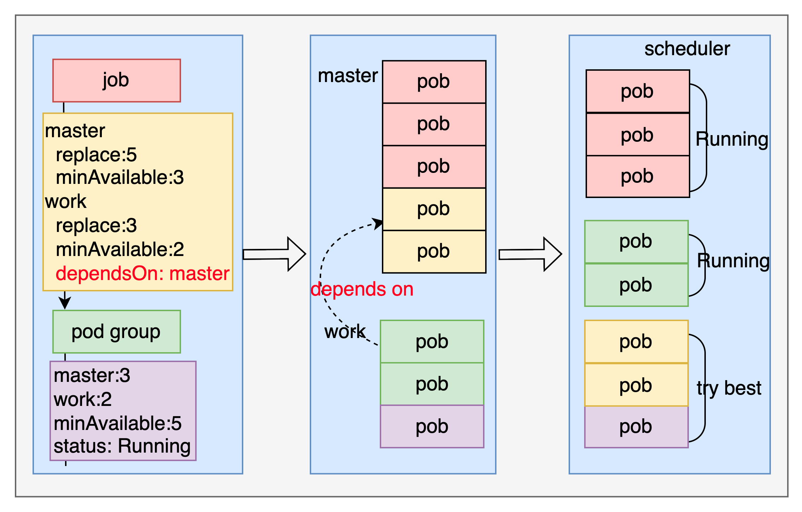

# Task minAvailable and dependsOn design

solution [issue 2895](https://github.com/volcano-sh/volcano/issues/2895) and
[issue 2921](https://github.com/volcano-sh/volcano/issues/2921) and 
[issue 2944](https://github.com/volcano-sh/volcano/issues/2944)

# Abstract
This document mainly focuses on the detailed design of the two features supported by the volcano, 
one is task minAvailable; the other is dependsOn between tasks.

- Check vcjob via webhook, job MinAvailable and task MinAvailable are related as follows：

|                      | task.MinAvailable == 0                                                                                                                      | task.MinAvailable != 0                                             |
|----------------------|---------------------------------------------------------------------------------------------------------------------------------------------|--------------------------------------------------------------------|
| job.MinAvailable ==0 | job.MinAvailable = sum(task.Replacas) (webhook mutate)                                                                                      | job.MinAvailable = sum(task.MinAvailable) (webhook mutate)         |
| job.MinAvailable !=0 | one(task) task.MinAvailable=job.MinAvailable (webhook mutate)  <br/>multiple(task) job.MinAvailable = sum(task.Replacas) (webhook validate) | job.MinAvailable = sum(task.MinAvailable)       (webhook validate) |

- When scheduling dependsOn job to execute gang check or Valid, we need to skip the checks that the task have not yet created pods
  
The modification involving the function is as follows：

<br>

Overall, when a user submits a vcjob, it will go through the following process:

- Volcano webhook execute validate and mutate, find the minimum number of tasks;
  webhook mutate checks vcjob dependsOn, if it depends on job, set annotation `dependent-job=true`.
- The controller of the volcano will count the poggroup according to the `tasks.minAvailable` and `tasks.resources` information.
  When the controller watch poggroup reaches the Inqueue state, all pods are created; when the number of running pod
  reaches the number of `job.minAvailables`, the state of the job is set to Running. 
- Volcano scheduling batch pods, scheduler will check the number of pods and sorting pods; when scheduling pods, 
  it will be scheduled according to the sorted pod `one by one`, when the minimum number requirements are met,
  the scheduling is considered successful, to bind. 
- Skip the dependent job gang check that have not yet created pods.

# user-guide

When the user uses the vcjob minAvailable feature, only should set each `task.minAvailable` value, if not set `task.minAvailable`,
the default `task.minAvailable=task.replaces`.

Under normal circumstances, users do not need to set `job.minAvailable`, if you set `job.minAvailable`,
you need to meet the `job MinAvailable and task MinAvailable table` Webhook validate parts.

⚠️ MinAvailable satisfies gang scheduling, but the number(replaces-minAvailable) of pods does not satisfy gang scheduling. 
If there are many resources,the scheduling will try to allocate resources for them.
If not, this part of the task will be in the pending state.

# webhook

The webhook mutate sets the value of job minAvailable and the detection of dependsOn task. 
If it is a dependent task, mark `dependent-job=true` in the job annotation.


# controller

The controller of the volcano will count the poggroup according to the `tasks.minAvailable` and `tasks.resources` information.
When the controller watch poggroup reaches the Inqueue state, rely on `task.replaces` create all pods; when the number of running pod
reaches the number of `job.minAvailables`, the state of the job is set to Running.

fix 1
```go
//pkg/controllers/job/job_controller_actions.go/782
minReq := v1.ResourceList{}
for _, task := range tasksPriority {
    if task.MinAvailable == nil {
        task.MinAvailable = &task.Replicas
    }
    // only calc minAvailable task
    for i := int32(0); i < *task.MinAvailable; i++ {
        pod := &v1.Pod{
            Spec: task.Template.Spec,
        }
        minReq = quotav1.Add(minReq, *util.GetPodQuotaUsage(pod))
    }
}
```

# scheduler
When the scheduler executes the enqueue action, check the job.minAvailables resource，If met minAvailables resource, The podgroup Inqueue, 
the scheduler waits for the controller to create pods, if the pods that meet the number of `job.minAvailable, tasks.minAvailable`，
start scheduling tasks.When the gang schedules a job, the scheduler does a ready check while scheduling. 
When the minimum number requirements are met, the job is considered successful.

There are differences in the scheduling of minAvailable and dependsOn tasks, which are divided into the following two 
scheduling situations for discussion.

## minAvailable
After the gang scheduling is enabled on the Volcano, the scheduler checks whether the scheduling pods meet `tasks.minAvailable`,
and considers the job ready when it is satisfied.

**Example**: scheduling process of the minAvailable task as follows. The user creates a master and work job, 
`master:replace=5 minAvailable=3`, `work:replace=3 minAvailable=2`; the master runs at least 3, and the work runs at least 2,
then the gang scheduling is considered successful;When the resources are sufficient, the master may run 5, and the work runs 3,
so the part of the gang scheduling is `master:3 work:2`, and the scheduling is divided into the following two processes:

### 1、job gang
Scheduling is scheduled according to the sorted tasks one by one. In order to ensure that the scheduled tasks meet 
the minAvailable of each task, minAvailable should be considered in the sorting process, 
and minAvailable pods should be ranked first. The schematic diagram is as follows:

<br>


### 2、try best
For the pods that exceed the minAvailable part, we only try our best to schedule them. The schematic diagram is as follows:

<br>

fix 1
```markdown
 If one party satisfies the task minAvailable, the other party has a higher priority:
                                        ｜pp.taskMinAvailable[lv.TemplateUID]<=0｜pp.taskMinAvailable[lv.TemplateUID]>0
 ---------------------------------------｜--------------------------------------｜-----------------------------
 pp.taskMinAvailable[rv.TemplateUID]<=0 ｜            priority compare          ｜        l prior to r
 ---------------------------------------｜--------------------------------------｜-----------------------------
 pp.taskMinAvailable[rv.TemplateUID]>0  ｜             r prior to l             ｜        priority compare

for example:
master:
    PriorityClassName: high-priority
    Replaces: 5
    MinAvailable: 3
    Pods: master-0、master-1、master-2、master-3、master-4
work:
    PriorityClassName: low-priority
    Replaces: 3
    MinAvailable: 2
    Pods: work-0、work-1、work-2

the right pods order should be:
    master-0、master-1、master-2、work-0、work-1、master-3、master-4、work-2、work-3
   ｜-----------------MinAvailable-------------｜
```
code：pkg/scheduler/plugins/priority
```go
taskOrderFn := func(l interface{}, r interface{}) int {
		lv := l.(*api.TaskInfo)
		rv := r.(*api.TaskInfo)

		klog.V(4).Infof("Priority TaskOrder: <%v/%v> priority is %v, <%v/%v> priority is %v",
			lv.Namespace, lv.Name, lv.Priority, rv.Namespace, rv.Name, rv.Priority)
		if pp.taskMinAvailable[lv.TemplateUID] <= 0 && pp.taskMinAvailable[rv.TemplateUID] > 0 {
			pp.taskMinAvailable[rv.TemplateUID]--
			return 1
		}
		if pp.taskMinAvailable[rv.TemplateUID] <= 0 && pp.taskMinAvailable[lv.TemplateUID] > 0 {
			pp.taskMinAvailable[lv.TemplateUID]--
			return -1
		}
		if lv.Priority == rv.Priority {
			return 0
		}

		if lv.Priority > rv.Priority {
			pp.taskMinAvailable[lv.TemplateUID]--
			return -1
		}
		pp.taskMinAvailable[rv.TemplateUID]--
		return 1
	}
```
fix 2
```markdown
If one party satisfies the task minAvailable, the other party has a higher priority:

                              ｜ lIndex+1 <= lv.MinAvailable ｜ lIndex+1 > lv.MinAvailable
  ----------------------------｜-----------------------------｜-----------------------------
  rIndex+1 <= rv.MinAvailable ｜      index compare          ｜        r prior to l
  ----------------------------｜-----------------------------｜-----------------------------
  rIndex+1 > rv.MinAvailable  ｜      l prior to r           ｜        index compare

for example:
master:
    Replaces: 5
    MinAvailable: 3
    Pods: master-0、master-1、master-2、master-3、master-4
work:
    Replaces: 3
    MinAvailable: 2
    Pods: work-0、work-1、work-2

the right pods order should be:
    master-0、work-0、master-1、work-1、master-2、work-2、master-3、work-3、master-4
   ｜-----------------MinAvailable-------------｜
```
code:pkg/controllers/job/helpers/helpers.go
```go
func CompareTask(lv, rv *api.TaskInfo) bool {
	lStr := GetPodIndexUnderTask(lv.Pod)
	rStr := GetPodIndexUnderTask(rv.Pod)
	lIndex, lErr := strconv.Atoi(lStr)
	rIndex, rErr := strconv.Atoi(rStr)
	if lErr != nil || rErr != nil {
		return lv.Pod.CreationTimestamp.Before(&rv.Pod.CreationTimestamp)
	}
	if lIndex+1 > lv.MinAvailable && rIndex+1 <= rv.MinAvailable {
		return false
	}
	if rIndex+1 > lv.MinAvailable && lIndex+1 <= rv.MinAvailable {
		return true
	}

	if lIndex == rIndex {
		return lv.Pod.CreationTimestamp.Before(&rv.Pod.CreationTimestamp)
	}
	if lIndex > rIndex {
		return false
	}
	return true
}
```

## dependsOn
The dependsOn task is created multiple times, and the scheduling process is also multiple times. 
It does not meet the job-level gang scheduling, but only the task-level gang scheduling. The schematic diagram is as follows:


### 1、master gang scheduler
The work depends on the master, the master is created, the work is not created, 
and the gang scheduling is performed according to the master `task.minAvailable`.

<br>

### 2、work gang scheduler
After the work depends on the master Running, the work pod is created, and the task is prioritized when sorting the work minAvailable,
and the work is ranked first, and the gang scheduling is performed according to the work `task.minAvailable`.
<br>

### 3、try best
For the pods that exceed the minAvailable part, we only try our best to schedule them. The schematic diagram is as follows:

<br>

fix 1：
The tasks of DependentJob are not put back into the job scheduling queue to 
prevent the resources of other minAvailable pods from being used.
```go
// pkg/scheduler/actions/allocate/allocate.go
func (alloc *Action) Execute(ssn *framework.Session) {
      for !tasks.Empty() {
		  ...
          if ssn.JobReady(job) && !tasks.Empty() {
              // skip dependent job push, because dependent job has other pods will be creat
              if !job.DependentJob {
                  jobs.Push(job)
              }
              break
          }
      }
}
```
fix 2：
The logic code of job ready, because some tasks of the dependsOn task have not created pods at all, 
which requires that tasks that have not created pods be ignored when calculating task ready.

pkg/scheduler/api/job_info.go
```go
// CheckTaskReady return whether each task of job is ready.
func (ji *JobInfo) CheckTaskReady() bool {
	...
	for taskID, minNum := range ji.TaskMinAvailable {
		i, found := occupiedMap[taskID]
		if found {
			if i < minNum {
				klog.V(4).Infof("Job %s/%s Task %s occupied %v less than task minAvaliable",
					ji.Namespace, ji.Name, taskID, occupiedMap[taskID])
				return false
			}
		} else {
			if ji.DependentJob {
				klog.V(4).Infof("Dependent job %s/%s Task %s not found", ji.Namespace, ji.Name, taskID)
			} else {
				klog.Errorf("Job %s/%s Task %s not found", ji.Namespace, ji.Name, taskID)
				return false
			}
		}
	}
	return true
}

func (ji *JobInfo) CheckTaskValid() bool {
	...
	for task, minAvailable := range ji.TaskMinAvailable {
		if minAvailable == 0 {
			continue
		}
		act, ok := actual[task]
		if ok {
			if act < minAvailable {
				return false
			}
		} else {
			if ji.DependentJob {
				// Some tasks of dependencies have not been created, skipping checks
				klog.V(4).Infof("Dependent job %s/%s Task %s not found", ji.Namespace, ji.Name, task)
			} else {
				klog.Errorf("Job %s/%s Task %s not found", ji.Namespace, ji.Name, task)
				return false
			}
		}
	}

	return true
}
```
Count how many task tasks have not been created
```go
// WaitCreateTaskNum returns the number of task.minAvailable that waiting to be created
func (ji *JobInfo) WaitCreateTaskNum() int32 {
	occupied := int32(0)
	actual := map[TaskID]int32{}
	for status, tasks := range ji.TaskStatusIndex {
		if AllocatedStatus(status) || status == Succeeded || status == Pipelined || status == Pending {
			for _, task := range tasks {
				actual[getTaskID(task.Pod)]++
			}
		}
	}
	klog.V(4).Infof("job %s/%s actual: %+v, ji.TaskMinAvailable: %+v", ji.Name, ji.Namespace, actual, ji.TaskMinAvailable)
	for task, minAvailable := range ji.TaskMinAvailable {
		if minAvailable == 0 {
			continue
		}
		if _, ok := actual[task]; !ok && ji.DependentJob {
			// Add the minAvailable of the task that has not been created
			occupied = occupied + minAvailable
		}
	}

	return occupied
}
```

# TODO
How to optimize dependsOn job to meet gang scheduling?
- controller watch podgroup Inqueue and create all pods.
- When the scheduler schedules, gang scheduling, the pods group that gang scheduling completes, reserves the resources that should be run and should not be run, and marks the pod as will bind,
  Simply put, when scheduling, gang scheduling, and when binding are multi-step. At the beginning of the next scheduling cycle, check whether the pods that will be bound can be bound, and if so, perform the bind operation first.

There are two major changes here. The first is to add will bind logic, and the second is the logic of scheduling resource calculation, because all resources in the cluster minus the resources used by pods cannot represent all the scheduling available in the scheduling cycle sum of resources,
Resources that will bind need to be cut. You can consider adding logic to the podgroup to record some situations of will bind.
