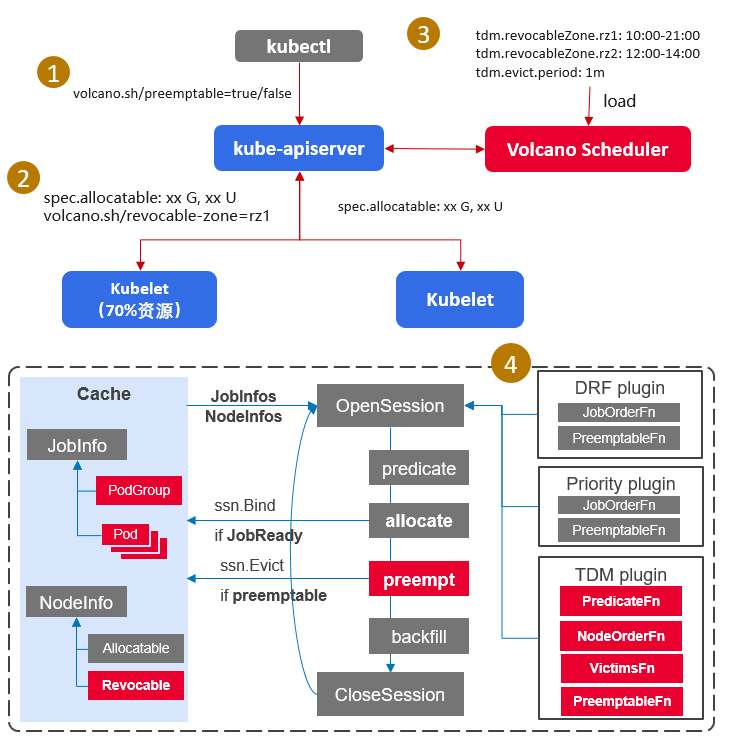

# Time Division Multiplexing (TDM) plugin

## Introduction

In a co-located environment, some nodes are in both Kubernetes cluster and Yarn cluster. For these nodes, Kubernetes and Yarn cluster can use these resource by time-sharing multiplexing.
For example, in 8:00~24:00 the on-line service in kubernetes can use these nodes. And in 0:00~8:00, kubernetes need evict the workload on these nodes, left the resource for Yarn cluster.

## Solution

First, we need mark out these nodes(by add `volcano.sh/revocable-zone` for nodes) which are in both Kubernetes cluster and Yarn cluster. We call these node are `revocable node`. For the kubernetes 
workload, we add `volcano.sh/preemptable: "true"` annotation for pod/podgroup to distinguish which pod can be dispatched to the `revocable node`. We call these pod are `preemptable task`.
TDM plugin enhance the volcano time-sharing multiplexing resource ability. It will try to dispatch `preemptable task` to `revocable node` in node revocable time and evict the `preemptable task` from 
`revocable node` out of revocable time.



1. Add `volcano.sh/preemptable` annotaion for Pod/PodGroup. For volcano job when add this annotaion in job level, Pod/PodGroup will inherit this annotation. The pod with `volcano.sh/preemptable: "true"` annotation can be dispatched to `revocable node`.
Otherwise, the pod can not be dispatched to `revocable node`.
2. Add `tdm` plugin and config for volcano scheduler. `tdm.revocable-zone` is a const prefix(), `rz1` is the revocable zone name and the value is a time frame. 

```
  tiers:
    - plugins:
      - name: tdm
        arguments:
          tdm.revocable-zone.rz1: 1:00-4:00
          tdm.evict.period: 1m

```
3. Add `volcano.sh/revocable-zone: rz1` label for nodes. Nodes which have this label is a `revocable node`. The value indicates in which time period, the node can be used by kubernetes (run pod).
4. Add `VictimTasksFn` for scheduler framework, it returns all the tasks which will be evicted in the scheduler period.
5. TDM plugin:
- PredicateFn: For the `non-preemptable task`, they can not use `revocable nodes`; For the `preemptable task`, they can use `revocable node` in revocable time period, otherwise they also can not use the `revocable node`.
- NodeOrderFn: For the `preemptable task`, they preferred to use `revocable nodes` in revocable time period.
- VictimTasksFn: In 1VictimTasksFn1, the plugin can decide which tasks/pods should be evicted, e.g. based on Job/PodGroup info.
- PreemptableFn: When there is `non-preemptable task` pending, select appropriate `preemptable task` on `non-revocable nodes` to evict.

## Feature interaction

- Preempt action: This TDM plugin need work with preempt action. If does not config preempt action, TDM plugin will miss PreemptableFn.
