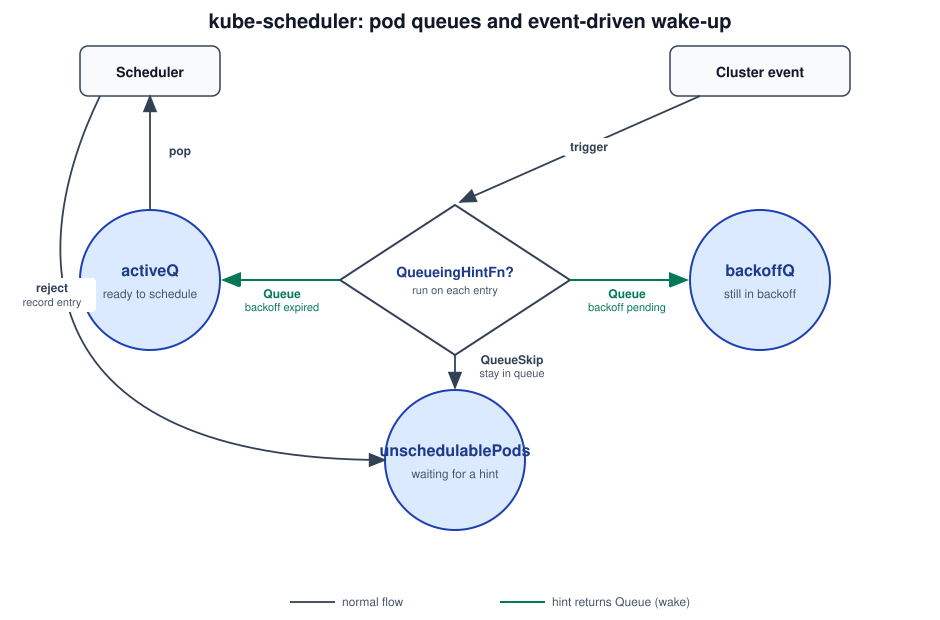
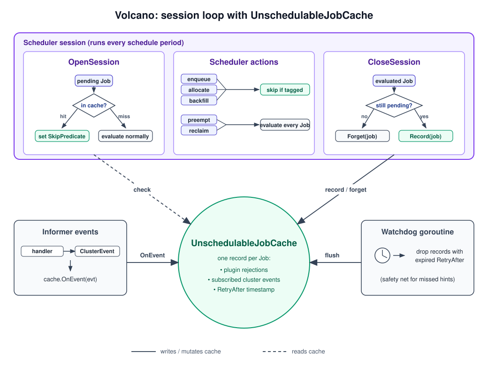
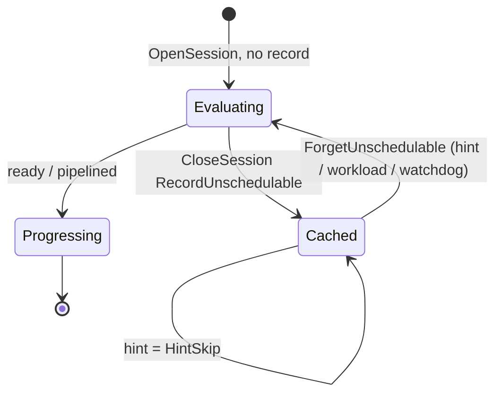
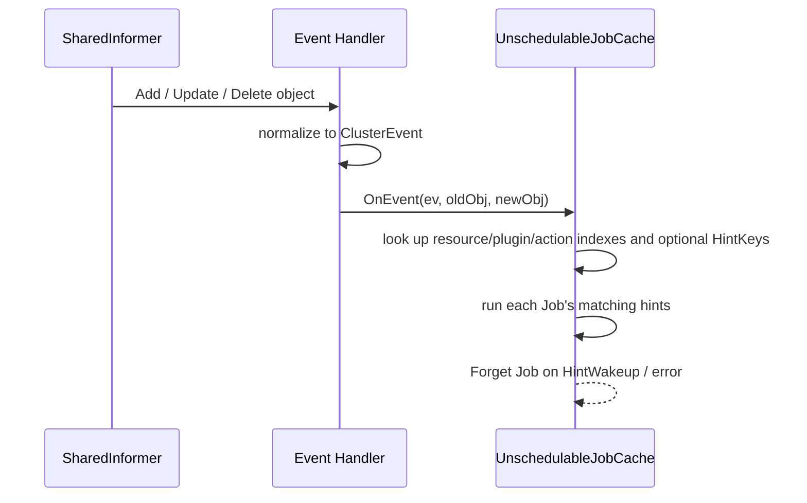
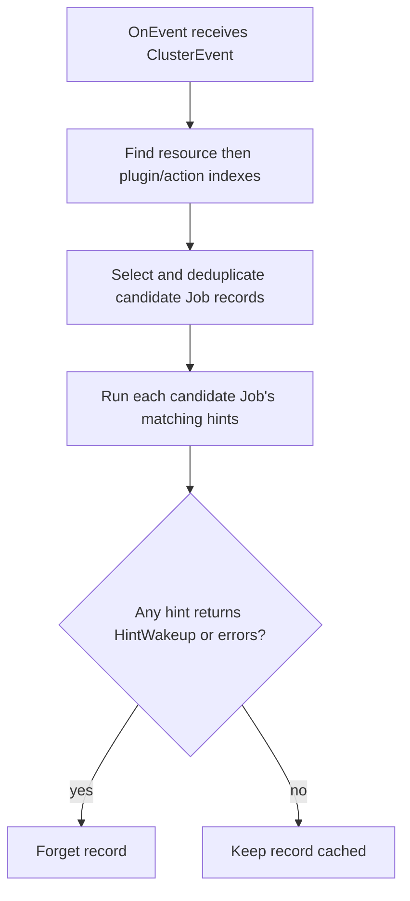
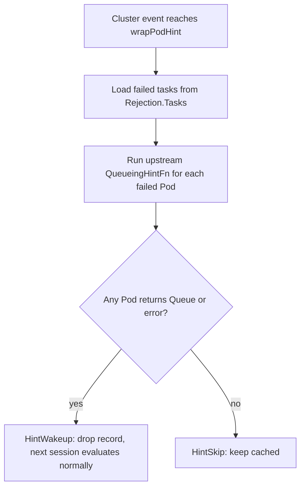

# Unschedulable Job Cache for Volcano Scheduler

<!-- toc -->
- [Summary](#summary)
- [Motivation](#motivation)
  - [Goals](#goals)
  - [Non-Goals](#non-goals)
- [Proposal](#proposal)
  - [User Stories](#user-stories)
  - [Architecture](#architecture)
- [Design Details](#design-details)
  - [1. Plugin Extension Point](#1-plugin-extension-point)
  - [2. Failure Recording](#2-failure-recording)
  - [3. UnschedulableJobCache](#3-unschedulablejobcache)
  - [4. Event Dispatch](#4-event-dispatch)
  - [5. Scheduler Action Changes](#5-scheduler-action-changes)
  - [6. kube-scheduler QueueingHint Adapter](#6-kube-scheduler-queueinghint-adapter)
  - [7. Initial Plugin Coverage](#7-initial-plugin-coverage)
- [Risks and Mitigations](#risks-and-mitigations)
- [Alternatives Considered](#alternatives-considered)
- [Test Plan](#test-plan)
- [Related Issues](#related-issues)
<!-- /toc -->

## Summary

Volcano opens a new scheduling session every second. In each session, it re-runs the
full filter path for every pending Job, even when nothing has changed for that Job
since the previous session. In clusters with thousands of pending Pods, this repeated
work takes up most of the `allocate` action's time and delays newly submitted Jobs.

This proposal adds an event-driven retry mechanism. Each plugin declares which
cluster events could change its previous unschedulable decision. When a Job stays
unschedulable at the end of a session, Volcano records the plugins that rejected it
and later sessions derive enqueue, whole-Job, or task skips from those rejections.
When one of the declared events arrives, the record is dropped and the Job is
evaluated normally in the next session.

The first version caches a Job only when every recorded rejection has a registered
`HintProvider`; otherwise the whole Job follows the normal per-session path.

## Motivation

Volcano's scheduler runs a periodic loop. It opens a new session roughly every second.
Each session takes a snapshot of the cluster, iterates every pending Job, and runs the
enabled actions end-to-end. The failure reasons produced in a session are kept only
for that session and are discarded when the session closes.

As a result, a Job that failed because no node carries the required label is
re-evaluated against every node in the next session, and in every session after that,
until either the Job or the cluster changes. When thousands of Jobs are stuck on
conditions that have not changed, `allocate` spends most of its time producing the
same negative answers it produced a second ago. This increases the `allocate`
action's scheduling latency, and newly submitted Jobs that could be scheduled are
delayed as well.

The session loop itself is not the problem. Two things are missing around it. First,
each session needs a way to know that nothing relevant has changed for a Job, so the
retry can be skipped. Second, Volcano needs a way to notice when something relevant
does change, so the Job can be retried immediately.

### Goals

- Stop re-running the full filter path each session for Jobs whose blocking condition
  has not changed.
- Retry a blocked Job promptly when a cluster change happens that could make it
  schedulable, without waiting for a timeout.
- Give plugins a first-class way to declare which cluster events are relevant to their
  unschedulable decisions, so different rejection causes wake on different signals.
- Preserve fairness and ordering. Only the redundant filter work is skipped; a
  cached Job still counts as pending demand so DRF shares, queue capacity, and gang
  `minAvailable` are computed against the same workload as before.

### Non-Goals

- Persisting unschedulable state across scheduler restarts. Records live in memory and
  are rebuilt from the first post-restart session.
- Providing hint coverage for every plugin in the first release. Plugins without a
  hint fall back to per-session evaluation.

## Proposal

The design adds two pieces around Volcano's session loop. Plugins declare a set of
cluster events that may invalidate their previous rejection. The scheduler cache
keeps a per-Job record of which plugins blocked the Job in the last session, and
later sessions derive enqueue, whole-Job, or task skips until one of the subscribed events arrives.
When such an event arrives, the record is dropped and the Job is evaluated normally
in the next session.

### User Stories

- **Queue is temporarily full.** A queue reaches its resource limit and every Job in
  it fails the `capacity` check. Volcano stops retrying these Jobs each session. They
  wake up when another Job in the queue finishes or an operator raises the limit.

- **Job requires a node that does not exist yet.** A Job needs a GPU node label that
  no current node carries. Today Volcano gets the same negative answer from every
  node in every session. With the unschedulable-job cache, the Job is set aside after
  the first check and woken up when a new node is added or an existing node's labels
  change.

- **Gang Job is waiting for enough capacity.** A gang Job needs `minAvailable` tasks
  to fit at once, but the cluster cannot place enough of them. Volcano stops retrying
  the Job until capacity may have grown: a task from another Job completes, a Pod is
  deleted, or a new node joins. A `PodGroup` spec update wakes it as well.

### Architecture

kube-scheduler already avoids retrying unchanged unschedulable Pods with an
event-driven queueing-hint mechanism, which is a useful reference for this design.
Its scheduling queue keeps three buckets and moves Pods between them:



`activeQ` holds Pods ready to schedule, and the scheduler pops from it. When a Pod
fails its filters, it is moved to `unschedulablePods` together with the names of the
plugins that rejected it. Cluster events trigger the failed plugins' `QueueingHintFn`.
If a hint returns `Queue`, the Pod moves to `backoffQ` if it is still inside its
backoff window, or directly to `activeQ` if the backoff has already expired. If every
subscribed hint returns `QueueSkip`, the Pod stays in `unschedulablePods`. A periodic
watchdog also releases Pods that have been stuck there for too long.

Volcano applies the same idea to its session-based, Job-level scheduling. There are
no per-Pod queue buckets. Instead, a single `UnschedulableJobCache` lives beside the
scheduling loop, and is updated from three sources: the session itself, informer
handlers, and a background watchdog.



The scheduler session drives most of the interaction. `OpenSession` derives
`JobInfo.Skip` from cached rejections. `CloseSession` records unschedulable Jobs and
forgets records for Jobs that are ready or pipelined.

Informer handlers translate cluster changes into `ClusterEvent`s and call `OnEvent`.
The cache then runs each subscribed Job's hints and forgets records whose hint
returns `HintWakeup`. A background watchdog forgets records whose `RetryAfter` has
passed, which prevents a Job from staying cached forever if a hint is ever missed.

## Design Details

### 1. Plugin Extension Point

`HintProvider` is an optional interface that a plugin implements to declare the
cluster events that could invalidate its previous unschedulable decisions. Each
declaration is a `ClusterEventWithHint`. `ClusterEvent` identifies the change to
watch, and `JobHintFn` decides whether one occurrence of that change may make a
previously rejected Job schedulable. If `JobHintFn` is nil, every occurrence of
the declared event wakes Jobs rejected by that plugin.

A declaration may also provide a secondary index: a cache-maintained map from
plugin-defined `HintKey`s to cached Job IDs. Without a secondary index, an event
checks every cached Job rejected by the same plugin for the same resource and
action. The cache represents that classification as a **plugin/action index**
under the event resource. With secondary HintKeys, it selects only Jobs that
share a `HintKey` with the event. A Job selected for the final `JobHintFn`
evaluation is a **candidate Job**. The key match only reduces the candidate set;
it never decides whether a Job wakes. Jobs for which `JobKeysFn` cannot provide
usable keys are stored explicitly in `jobIDsWithoutHintKeys` and remain candidate
Jobs for every matching event.

#### Types

The shared hint, event, rejection, and skip types live in `pkg/scheduler/api`, which
both `framework` and `cache` can import without creating a package cycle.

```go
// ClusterEvent identifies one category of cluster change a plugin subscribes to.
type ClusterEvent struct {
    // Resource is the object type whose change may affect scheduling: Node, Pod,
    // PVC/PV, StorageClass, CSINode, ResourceClaim, ResourceSlice, DeviceClass,
    // PodGroup, Queue, HyperNode, or NumaInfo.
    Resource fwk.EventResource

    // ActionType names the kind of change. Besides generic Add/Update/Delete,
    // node updates are split into label, taint, allocatable and condition
    // variants so a taint-only change does not wake Jobs blocked on labels.
    ActionType fwk.ActionType
}

// HintResult is the decision a JobHintFn returns for one Job on one event.
type HintResult int

const (
    HintSkip   HintResult = iota // event cannot unblock this Job; keep it cached.
    HintWakeup                   // event may unblock this Job; drop the record.
)

// JobHintFn is invoked when a subscribed cluster event fires for a Job that the
// plugin previously rejected. It answers one question: could this particular
// event make the Job schedulable this time?
//
//   @param job       the cached Job under evaluation.
//   @param rejection the plugin's own rejection from the previous session; for
//                    predicate sources it also carries the task IDs that failed
//                    (see §2), which lets per-task hints replay only those tasks.
//   @param oldObj    object state before the change; nil on Add events.
//   @param newObj    object state after the change; nil on Delete events.
//   @return HintResult  HintSkip to keep the record, HintWakeup to drop it and
//                       let the next session evaluate the Job normally.
//   @return error       a non-nil error is treated as HintWakeup by the caller,
//                       so a broken hint cannot keep a Job cached forever.
type JobHintFn func(
    job *JobInfo,
    rejection Rejection,
    oldObj, newObj any,
) (HintResult, error)

// HintKey identifies one scheduling condition that both a rejected Job and a
// later cluster event can name. The plugin that owns the index defines the key
// format and meaning.
type HintKey string

// MaxHintKeysPerPluginEvent bounds the key set returned for one Job or event
// handled by one plugin. Larger Job key sets make that Job use dispatch without
// HintKeys; larger event key sets select every Job in the plugin/action index.
const MaxHintKeysPerPluginEvent = 256

// JobKeysFn returns every HintKey that may be relevant to one rejected Job for
// one event declaration. job is the immutable Job snapshot retained from the
// completed session, and rejection is the declaring plugin's rejection from that
// session. For correctness, any event that can make HintFn return HintWakeup must
// share at least one key with this result.
//
// Returning an error, no keys, or more than MaxHintKeysPerPluginEvent keys
// disables secondary-index selection for this Job and event declaration. The
// cache then evaluates the Job for every matching event.
type JobKeysFn func(job *JobInfo, rejection Rejection) ([]HintKey, error)

// EventKeysFn returns every HintKey affected by one occurrence of a declared
// cluster event. oldObj is nil for Add, and newObj is nil for Delete. For
// correctness, this result must share at least one key with every rejected Job
// that the event can make schedulable.
//
// A zero-length result with a nil error, whether the slice itself is nil or
// non-nil, means that this event affects no indexed Job; the cache still evaluates
// Jobs without HintKeys. A function that cannot determine complete event keys must
// return an error. An error or more than
// MaxHintKeysPerPluginEvent keys makes the cache evaluate every Job in the
// matching plugin/action index.
type EventKeysFn func(oldObj, newObj any) ([]HintKey, error)

// ClusterEventWithHint describes how one plugin reacts to one cluster event.
type ClusterEventWithHint struct {
    // Event identifies the cluster change that can affect the plugin's previous
    // rejection.
    Event ClusterEvent

    // JobKeysFn follows the JobKeysFn contract above. It runs when a Job record
    // is inserted. A nil value records the Job without HintKeys and requires
    // EventKeysFn to be nil too.
    JobKeysFn JobKeysFn

    // EventKeysFn follows the EventKeysFn contract above. It runs once for each
    // matching plugin/action index. A nil value requires JobKeysFn to be nil too.
    EventKeysFn EventKeysFn

    // HintFn follows the JobHintFn contract above and makes the final decision
    // for each candidate Job. A nil value means every matching event wakes the
    // Job, so the declaration cannot use secondary-index selection.
    HintFn JobHintFn
}

// HintProvider lets a plugin declare the events that can change its previous
// unschedulable decisions.
type HintProvider interface {
    // EventsToRegister returns every event declaration owned by this plugin.
    // It is called once per registration; the result is stored verbatim.
    EventsToRegister(ctx context.Context) ([]ClusterEventWithHint, error)
}
```

`JobKeysFn` and `EventKeysFn` are optional and must be provided together. The two
functions must satisfy one rule: if an event can make a rejected Job schedulable,
their results must have at least one key in common. A Job may be omitted from the
candidate set only when `JobKeysFn` returned a complete key set for that Job. If
`JobKeysFn` is absent, returns an error, returns no keys, or returns more than 256
keys, that Job is recorded in `jobIDsWithoutHintKeys` and is evaluated for every matching event. If
`EventKeysFn` errors or returns more than 256 keys, the cache evaluates the full
plugin/action index. A zero-length result with a nil error means the event affects
no indexed Jobs, so the cache evaluates only `jobIDsWithoutHintKeys`. A
declaration with a nil `HintFn` records every Job without HintKeys because every
matching event must wake them.

#### Examples

A `NodeAffinity` hint registered for `Node/UpdateNodeLabel` compares `oldObj` and
`newObj` node labels against the Job's node selector. It returns `HintWakeup`
only when the new labels may satisfy the selector, and `HintSkip` otherwise.

Resource Fit shows how the optional index narrows that final evaluation:

1. A task requests CPU and fails Resource Fit on `node-a`. The rejection records
   the key `pod-release/node-a/cpu`.
2. Deleting a memory-only Pod on `node-a` produces
   `pod-release/node-a/memory`. The keys do not match, so the rejected Job is not
   a candidate for this event.
3. Deleting a CPU-consuming Pod on `node-a` produces
   `pod-release/node-a/cpu`. The key matches, so the cache runs Resource Fit's
   `JobHintFn` for the Job.
4. `JobHintFn`, not the key match, makes the final `HintWakeup` or `HintSkip`
   decision.

#### Registration

Plugins register during `OpenSession`:

```go
// AddHintProvider forwards a session-scoped plugin's HintProvider into the
// cache-scoped HintRegistry so it keeps working after the session tears down.
//
//   @param pluginName plugin identity later matched against Rejection.Plugin at
//                     RecordUnschedulable time; must be stable across sessions.
//   @param p          the HintProvider; typically the plugin itself when it
//                     also implements the interface.
func (ssn *Session) AddHintProvider(pluginName string, p HintProvider)
```

Plugin objects are session-scoped, but the informer handlers and
`UnschedulableJobCache` run at scheduler-cache scope and keep firing after the
session ends. To cross this lifetime gap, `AddHintProvider` copies the plugin's
`ClusterEventWithHint`s into a cache-owned `HintRegistry`. `HintRegistry` is defined
in `pkg/scheduler/cache/hint_registry.go` and owned by `SchedulerCache`:

```go
// pkg/scheduler/cache/hint_registry.go

type HintRegistry struct {
    mu             sync.RWMutex
    eventsByPlugin map[string][]ClusterEventWithHint
}

// Register calls p.EventsToRegister(context.TODO()) once. A successful, non-empty,
// and valid result replaces the plugin entry. An error, an empty result, or
// duplicate declarations for one ClusterEvent remove the plugin entry and log the
// registration failure.
//
//   @param name plugin name used as the map key; must match Rejection.Plugin so
//               RecordUnschedulable can look the hints up by rejecting plugin.
//   @param p    the HintProvider whose events are being registered.
func (r *HintRegistry) Register(name string, p HintProvider) { /* ... */ }
```

Overwriting matches `BinderRegistry`'s replacement behavior. `HintRegistry` and
`BinderRegistry` are kept as separate types instead of merged into one shared
registry, so that each extension point keeps its own registration signature, and the
cache still has a single place to hold every session-to-cache extension.

One plugin may register at most one declaration for the same `ClusterEvent`. If a
registration contains duplicates, the registry logs the error and removes that
plugin's registry entry; already-recorded Jobs keep their copied declarations.
Across later registrations under the same plugin name, `JobKeysFn`, `EventKeysFn`, and the
`HintKey` format for an existing event must keep the same meaning. This
scheduler-lifetime stability rule lets old and new records safely share one event
plugin/action index without a generation identifier. The registry rejects a
re-registration that switches an existing event between indexed and non-indexed
handling. A plugin that needs to change its key meaning must use a new plugin name
or restart the scheduler. `HintFn` may be replaced because each Job record keeps
the version copied when that record was created.

`HintRegistry` is the only bridge from session-scoped plugins to cache-scoped
dispatch. §3 covers how `RecordUnschedulable` reads from it at `CloseSession`, and §4 covers how
informer handlers reach the cache through it.

### 2. Failure Recording

The cache stores one `Rejection` per plugin and extension point that rejected a
Job. Repeated failures merge their task IDs and secondary-index keys. Different
tasks can therefore accumulate different predicate rejections, while
`Allocatable` and `JobEnqueueable` record the first rejecting plugin in their
registered function chain.

```go
// Rejection describes one plugin decision that made a Job unschedulable in a session.
type Rejection struct {
    // Plugin is the registered HintProvider name, for example "NodeAffinity".
    Plugin string

    // Source is the extension point that emitted the rejection.
    Source RejectionSource

    // Tasks contains the rejected task IDs. It is nil only for RejectionEnqueue.
    Tasks []TaskID

    // Queues contains the Job's Queue followed by its known ancestors.
    Queues []QueueID

    // HintKeys contains the complete secondary-index keys collected while this
    // rejection was produced. It is nil when complete keys are unavailable.
    HintKeys []HintKey
}

type RejectionSource string

const (
    RejectionPredicate   RejectionSource = "predicate"   // PredicateFn / PrePredicateFn
    RejectionAllocatable RejectionSource = "allocatable" // Allocatable
    RejectionEnqueue     RejectionSource = "enqueue"     // JobEnqueueable
)
```

The scheduler records `Rejection.HintKeys` at the point where a failure occurs,
because that code still has the rejected task, rejected node, and insufficient
resource dimensions. Repeated rejections for the same `(Plugin, Source)` merge
and deduplicate both `Tasks` and `HintKeys`. The 256-key limit applies after the
merge. If any merged rejection lacks complete keys, or if the merged result
exceeds the limit, `HintKeys` becomes nil. The cache then evaluates this Job for
every event in each matching plugin/action index.

When the cache records the Job, each event declaration runs its `JobKeysFn` to
validate the rejection keys and select only the keys relevant to that event. For
example, the Resource Fit declaration for `Pod/Delete` selects Pod-release keys
and ignores Node-growth keys. `JobKeysFn` cannot make incomplete rejection data
complete; it must return an error or no keys instead.

Both `RejectionPredicate` and `RejectionAllocatable` carry `Tasks`, because
their extension points run per task and can fail for a subset of a Job's tasks.
A large-request task can fail queue capacity while a smaller task of the same
Job passes, and one task can fail predicates on every node while another task
of the same Job fits. Only `RejectionEnqueue` is Job-level: `JobEnqueueable`
returns one decision for the whole `PodGroup`, so no task list is stored.

`Plugin` is used to look up the plugin's registered hints when the record is
built, so the Job only subscribes to events from plugins that actually rejected
it. `Source` is kept on `Rejection` rather than on the Job, because a
`RejectionPredicate` and a `RejectionAllocatable` can both occur in one
`allocate` pass. For example, one task fails predicates on all nodes while
another passes predicates but exceeds queue quota. `RejectionEnqueue` does not
appear together with the others, since a Job that fails `JobEnqueueable` does
not reach `allocate` in that session.

#### Extension point coverage

| Extension point | Source | `Tasks` | Typical plugins |
|---|---|---|---|
| `PredicateFn` / `PrePredicateFn`, and `allocate`'s inline node-fit check | `RejectionPredicate` | yes | wrapped predicate plugin names, `predicates-resource-fit` |
| `Allocatable` | `RejectionAllocatable` | yes | `capacity`, `proportion` |
| `JobEnqueueable` | `RejectionEnqueue` | — | `capacity`, `proportion`, `overcommit` |

`allocate` runs a resource-fit check inline (`task.InitResreq` against
`node.FutureIdle`) before calling `PredicateFn`, so pure capacity shortfalls
never reach a real predicate plugin. Volcano attributes those failures to a
synthetic plugin name `predicates-resource-fit` and records them as
`RejectionPredicate` on the same footing as any other per-task predicate
failure. The synthetic plugin registers hints on capacity-changing events
(`Node/Add`, `Node/UpdateNodeAllocatable`, `Pod/Delete`) so the wake path
works the same way as other predicates. It also records the rejected node and
insufficient resource dimensions as secondary-index keys for every candidate node
that failed Resource Fit in the completed scheduling attempt. Deleting a
CPU-consuming Pod on `node-a` therefore selects every Job whose complete failure
set contains a CPU shortage on `node-a`, including Jobs that also failed on other
nodes. It does not select a Job when its complete Resource Fit failure set contains
no CPU shortage on `node-a`; if the scheduler cannot build that complete set, the
Job is dispatched without HintKeys instead of using precise selection. `Node/Add` uses
resource-dimension keys without an old node name, so a newly added node can still
reach every Job whose requested dimensions it may satisfy.

#### Recording rejections

`AddRejection` records each extension-point failure immediately. `CloseSession`
deduplicates the accumulated rejections and drains them into the cache.

`gang.JobReadyFn` does not produce a rejection. If a gang shortfall is caused
by real per-task failures, those failures already surface as
`RejectionPredicate` or `RejectionAllocatable` on the specific tasks that
could not be placed, and §2's [Skip granularity](#skip-granularity) turns the
shortfall into either a task-subset or a whole-Job skip in the next session.
Gang's role stays session-internal: it decides whether the pipelined tasks
form a viable Job and rolls them back if not.

A Job whose rejection list is empty after this pass is not cached because no
instrumented extension point reported a stable rejection. Rejections from plugins
without hints are still recorded, but `RecordUnschedulable` rejects the complete set
and leaves the Job uncached (see
[Rejections from plugins without hints](#rejections-from-plugins-without-hints)).

#### Skip granularity

Rejections say which tasks failed which plugin; they do not say how much of
the Job should be skipped next session. That decision is derived at
`OpenSession` from the rejections plus the Job's gang topology, and stored on
`JobInfo.Skip`:

```go
// SkipDecision is computed once per pending Job at OpenSession from the
// cached rejections and the Job's gang topology. Each field names the piece
// of work an action should skip for this Job in this session.
type SkipDecision struct {
    // Enqueue skips enqueue's JobEnqueueable re-check for this Job.
    // Set when RejectionEnqueue was cached.
    Enqueue bool

    // Allocate skips the allocate and backfill actions entirely for this
    // Job (no tasks popped, no gang JobReadyFn call). Set when the Job
    // cannot reach its gang criterion after excluding the per-task
    // rejections.
    Allocate bool

    // Tasks lists task IDs that allocate and backfill should treat as
    // unschedulable this session. Consulted only when Allocate is false;
    // nil otherwise.
    Tasks map[TaskID]struct{}
}
```

For the two per-task sources (`RejectionPredicate`, `RejectionAllocatable`),
Volcano picks between two modes:

1. **Task-subset skip.** `Skip.Tasks` is populated from the union of
   `Rejection.Tasks`; `Skip.Allocate` stays false. `allocate` and `backfill`
   still pop the Job's other tasks and evaluate them normally, but any task
   in `Skip.Tasks` is treated as unschedulable this session (predicate and
   allocatable loops are skipped for it). This is the mode used when the Job
   can still reach its gang criterion after excluding the skipped tasks. For
   example, an elastic gang Job whose `minAvailable` is already met by
   running tasks, with only extras cached as failed.

2. **Whole-Job skip.** `Skip.Allocate` is true. No task of the Job is popped
   this session, and gang's `JobReadyFn` is never called. This is the mode
   used when excluding the skipped tasks makes some level of the gang
   hierarchy fall below its own threshold. For example, a gang with
   `minAvailable=8`, five tasks running, three tasks previously rejected on
   capacity, and nothing left to try.

`Skip.Enqueue` is orthogonal: it is set from `RejectionEnqueue` alone, and
since a Job that failed `JobEnqueueable` never reached `allocate` in the
previous session, it cannot coexist with per-task rejections in the same
record.

`ComputeSkip` follows Volcano's current flat gang model. It checks Job
`MinAvailable`, role `TaskMinAvailable` when configured, flat SubJob
`MinAvailable`/`MinSubJobs`, and tasks that have already progressed.

Either way the wake behavior is the same: any `HintWakeup` from the plugins
that produced the cached rejections drops the whole record, and the next
`OpenSession` recomputes `SkipDecision` from scratch. There is no partial
wake that lifts only some cached task-level skips.

#### How actions apply cached rejections

At `OpenSession`, Volcano fetches each pending Job's rejections from the
cache and derives `JobInfo.Skip` from them (see §5). Actions consult `Skip`
only. Each field names the piece of work to skip:

- **`enqueue`** skips its `JobEnqueueable` re-check when `Skip.Enqueue` is
  true. Only the `RejectionEnqueue` source sets this flag.
- **`allocate`** short-circuits the Job when `Skip.Allocate` is true: no task
  is popped and gang's `JobReadyFn` is not called. Otherwise, for each popped
  task, a lookup in `Skip.Tasks` decides whether to skip the predicate and
  allocatable loops for that task. Other tasks of the same Job continue
  normally, so elastic gang Jobs can still push past `minAvailable` when a
  new task becomes placeable.
- **`backfill`** reads `Skip` the same way `allocate` does.
- **`preempt`** and **`reclaim`** ignore `Skip`. They exist to free
  resources for Jobs the other actions could not place, so a cached Job must
  still be a preemption candidate.

#### Rejections from plugins without hints

A rejection is only useful if its plugin has a `HintProvider`. If the rejecting
plugin has no registered hints, there is no cluster event that could wake the
Job for that failure. The cache leaves such Jobs out entirely and lets them go
through the normal filter path every session, which matches today's behavior.

### 3. UnschedulableJobCache

`UnschedulableJobCache` lives on `SchedulerCache`. It records unschedulable Jobs by
`JobID`, together with the rejection list collected at `CloseSession` and the hint
functions copied from `HintRegistry`.

The normal retry lifecycle is:

1. `CloseSession` calls `RecordUnschedulable(job, rejections)` for Jobs that were
  evaluated and still failed.
2. The next `OpenSession` calls `GetCachedRejections(job)` for each pending Job.
3. If the call returns a non-nil slice, Volcano derives `JobInfo.Skip` from it (see
   §2's [Skip granularity](#skip-granularity)), and `enqueue`, `allocate` and
   `backfill` bypass either the whole Job, specific tasks, or the enqueue re-check
   accordingly.
4. A matching informer event calls `OnEvent`; if a hint says the Job may need retry,
   the cache calls `ForgetUnschedulable(job.UID)` and the next session evaluates it
   normally.
5. If no relevant event arrives before `RetryAfter`, a background watchdog goroutine
   forgets the record, and the next session evaluates the Job normally.

Recovery actions (`preempt` and `reclaim`) do not consult `GetCachedRejections`.
They scan pending Jobs from `ssn.Jobs` directly, because Volcano cannot know in
advance which Job becomes schedulable after victims are selected. Once they
pipeline a Job's tasks onto victims, that Job is making progress through
preemption. `CloseSession` drops any existing record instead of re-caching it
(see §5); `GetCachedRejections` itself remains a plain lookup.

A Job therefore moves between three states across sessions:



The three states are:

- **Evaluating** — no record (or the record is being bypassed); actions run predicates
  and resource fit for the Job normally.
- **Cached** — a record exists; `enqueue`/`allocate`/`backfill`
  apply the derived `Skip` (the enqueue re-check, the whole Job, or a subset of its
  tasks, depending on the record). `preempt`/`reclaim` still evaluate it (they ignore
  the cache).
- **Progressing** — the Job became ready or gained a pipelined task, so it holds no
  record and leaves the cache's scope.

A Job enters **Cached** only from `CloseSession → RecordUnschedulable`. It leaves
**Cached** back to **Evaluating** through three paths, all of which delete the record
so the next `OpenSession` finds none and evaluates the Job normally:

1. **Hint wake-up (event-driven).** An informer fires `OnEvent`; the cache runs the
  Job's subscribed hints. If any returns `HintWakeup`, the cache forgets the record.
   If every hint returns `HintSkip`, the record is kept and the Job stays **Cached**
   (the `Cached → Cached` self-loop). This is the primary path, since a real cluster
   change plausibly fixes the earlier rejection.
2. **Workload change (snapshot invalidation).** A Pod add, scheduling-input
   update, or delete forgets the record for that Pod's Job. A PodGroup spec update
   or delete does the same. PodGroup status-only updates remain hint events.
3. **RetryAfter watchdog (safety net).** A background goroutine runs on a fixed
   interval and forgets any record whose `RetryAfter` has passed. It runs off the
   scheduling path, so it does not add scanning work to `OpenSession`, and it
   guarantees a Job is never cached forever when a hint is missed or an informer
   edge case drops an event.

#### Interface

```go
// UnschedulableCache stores Jobs rejected in previous scheduling sessions and
// exposes the operations needed by scheduler sessions.
type UnschedulableCache interface {
    // AddHintProvider registers the events and hint functions declared by a plugin.
    AddHintProvider(name string, p api.HintProvider)

    // BeginSession records the freshness boundary immediately before the
    // scheduler takes the session snapshot.
    BeginSession()

    // RecordUnschedulable stores the plugin rejections observed for a Job in the
    // current session.
    RecordUnschedulable(job *api.JobInfo, rejections []api.Rejection)

    // GetCachedRejections returns the rejections that may be reused to skip work
    // for the Job in the current session.
    GetCachedRejections(job *api.JobInfo) []api.Rejection

    // ForgetUnschedulable removes the cached record for the Job.
    ForgetUnschedulable(jobID api.JobID)
}
```

`OnEvent` and `StartWatchdog` are methods on the concrete
`*UnschedulableJobCache`; informer dispatch and cache startup call them directly.

#### Cache state

The cache keeps one primary record per Job. Its event index first classifies Jobs
by `EventResource`, then uses the plugin name and `ActionType` to distinguish how
different plugins handle events of the same resource. The plugin name must be in
the second-level key because two plugins can use different HintKey meanings and
different `EventKeysFn` implementations for the same resource and action.

Each plugin/action index stores all of its Job IDs for extraction-error fail-open,
the Job IDs for which complete HintKeys were unavailable, and precise Job-ID sets
for each HintKey. The field names describe the contents directly instead of
encoding the dispatch policy in names such as `bucket` or `fallback`.

```go
// eventIndex first classifies indexes by EventResource, then by plugin/action.
type eventIndex struct {
  jobIndexesByResource map[fwk.EventResource]map[pluginActionKey]*pluginActionIndex
  wildcardJobIndexes   map[pluginActionKey]*pluginActionIndex
}

// pluginActionKey further classifies one EventResource. pluginName separates
// plugin-owned HintKey spaces and actionType identifies the handled change.
type pluginActionKey struct {
  pluginName string
  actionType fwk.ActionType
}

// pluginActionIndex pairs event-side key extraction with indexed Job IDs.
type pluginActionIndex struct {
  eventHintKeysFn api.EventKeysFn
  jobs            jobHintKeyIndex
}

type jobHintKeyIndex struct {
  // allJobIDs supports fail-open dispatch when event key extraction fails.
  allJobIDs sets.Set[api.JobID]

  // jobIDsWithoutHintKeys contains Jobs for which complete keys are unavailable.
  jobIDsWithoutHintKeys sets.Set[api.JobID]

  // jobIDsByHintKey selects Jobs sharing a necessary-condition key.
  jobIDsByHintKey map[api.HintKey]sets.Set[api.JobID]
}

// jobIndexLocation identifies one index location containing a Job. It lets
// replacement and deletion remove the Job without scanning every index. An
// empty hintKeys slice means the Job is in jobIDsWithoutHintKeys.
type jobIndexLocation struct {
  resource        fwk.EventResource
  pluginActionKey pluginActionKey
  hintKeys        []api.HintKey
}

// freshnessTracker rejects stale session conclusions. All methods run while
// UnschedulableJobCache.mu is held.
type freshnessTracker struct {
  currentGeneration   uint64
  sessionGeneration   uint64
  sessionStarted      bool
  lastEventGeneration map[api.ClusterEvent]uint64
  lastJobInvalidation map[api.JobID]uint64
}

// UnschedulableJobCache stores rejected Jobs and finds the Jobs that must
// evaluate each incoming cluster event.
type UnschedulableJobCache struct {
    mu sync.RWMutex

    // records is the primary store: one entry per cached Job.
    records map[api.JobID]*unschedulableRecord

    // eventIndex narrows an incoming resource/plugin/action event to candidates.
    eventIndex eventIndex

    // registry provides the latest plugin hint declarations for new records.
    registry *HintRegistry

    // freshness prevents caching results computed from an outdated snapshot.
    freshness freshnessTracker

    // maxSkipDuration bounds how long a record can suppress retries.
    maxSkipDuration time.Duration
}

// unschedulableRecord is the cached state for one Job.
type unschedulableRecord struct {
    // jobID identifies the cached Job.
    jobID api.JobID

    // job is the immutable JobInfo from the completed scheduling session.
    // A workload update invalidates the record before this value can become stale.
    job *api.JobInfo

    // rejections contains the plugin decisions reused by the next session.
    rejections []api.Rejection

    // lastFailedAt and retryAfter define the watchdog retry window.
    lastFailedAt time.Time
    retryAfter   time.Time

    // eventHints contains plugin event handlers copied when the Job is recorded.
    eventHints []pluginEventHint

    // indexLocations records every index location containing this Job.
    indexLocations []jobIndexLocation
}

  // pluginEventHint is one event handler copied for one plugin rejection.
  type pluginEventHint struct {
    pluginName string

    // event identifies the cluster change that can affect the rejection.
    event api.ClusterEvent

    // rejection is the plugin decision from the completed session.
    rejection api.Rejection

    // jobHintKeysFn produces the Job's necessary-condition keys at insertion.
    jobHintKeysFn api.JobKeysFn

    // eventHintKeysFn produces the keys carried by an incoming event.
    eventHintKeysFn api.EventKeysFn

    // jobHintFn makes the final decision for this Job.
    jobHintFn api.JobHintFn
}
```

`RecordUnschedulable` looks up each rejecting plugin in `HintRegistry` and copies
that plugin's event declarations into `eventHints`. It then creates one
`jobIndexLocation` for each copied declaration. If both key functions are
present and `JobKeysFn` returns a complete key set, the location records those
keys. Otherwise its `hintKeys` is empty and the Job is inserted into
  `jobIDsWithoutHintKeys`. A declaration with a nil `HintFn` also records the Job
  without HintKeys because every matching event must wake it.

`freshnessTracker` handles a separate correctness problem: an event can arrive
after the scheduler takes its session snapshot but before `CloseSession` records
the rejection. There is no record to wake when that event arrives. `BeginSession`
therefore captures `sessionGeneration`; every external event and direct Job
invalidation advances `currentGeneration`. Before insertion,
`RecordUnschedulable` rejects the stale conclusion if the Job changed after the
boundary or if any registered event matching `eventHints` occurred after it.
Grouping these fields in `freshnessTracker` keeps snapshot freshness independent
from candidate indexing.

It is a **snapshot** rather than a live reference to `HintRegistry`. A Job
cached in an earlier session must keep waking the same way it was recorded,
even if a plugin re-registers different events later. Copying at record time
also keeps the cache working after the session that produced the hints is torn
down.

#### Cache updates

| Call site | Cache call | Meaning |
|---|---|---|
| `CloseSession`, evaluated Job still pending | `RecordUnschedulable(job, rejections)` | Store or replace the record and rebuild its plugin event hints. |
| `OpenSession`, pending Job | `GetCachedRejections(job)` | Return the previous session's rejections, or nil to evaluate the Job normally. |
| `CloseSession`, Job became ready or gained a pipelined task | `ForgetUnschedulable(job.UID)` | Remove the record. |
| Pod add/update/delete or PodGroup scheduling-input update/delete informer | `ForgetUnschedulable(jobID)` | The cached session snapshot may be stale; evaluate the current Job again. |
| Subscribed cluster event (informer) | `OnEvent(ev, oldObj, newObj)` | Run matching hints and wake Jobs that may need retry. |
| Watchdog goroutine, `now >= RetryAfter` | `ForgetUnschedulable(jobID)` | Off-path cleanup of stale records so a Job is never cached forever. |

`GetCachedRejections(job)` is a map lookup by Job ID. Progress is reconciled at
`CloseSession`, and expiry is handled by the watchdog.

There is no per-Job timer and no exponential backoff. A single background
goroutine runs on a fixed interval, scans the records, and forgets any
whose `RetryAfter` has passed. Keeping expiry off the scheduling path means
`OpenSession` and `GetCachedRejections` only read a record. Events remain the
normal wake-up path, and the timestamp is a safety net for missed hints or
informer edge cases.

#### Per-session overhead

For a Job with no cached record, `GetCachedRejections` is a single map
lookup under a read lock, so the `OpenSession` pass adds constant time per
pending Job. For a cached Job, `ComputeSkip` checks gang thresholds without
touching the cluster snapshot, which is much cheaper than the per-node predicate
loop the skip avoids.

#### Invalidation

A record is removed or bypassed by these triggers:

| Trigger | Effect |
|---|---|
| A subscribed cluster event whose hint returns `HintWakeup` or errors | `ForgetUnschedulable` (via `OnEvent`) |
| A Pod add, scheduling-input update, or deletion belonging to the Job | `ForgetUnschedulable` directly; the event is still delivered to other Jobs' hints |
| `PodGroup` spec update or delete | `ForgetUnschedulable` directly |
| `now >= RetryAfter` | the watchdog calls `ForgetUnschedulable`; the next session re-evaluates the Job |

`RecordUnschedulable` sets retry timing like this:

```
LastFailedAt = now
RetryAfter   = now + maxSkipDuration // configurable; defaults to 5m
```

`OnEvent` is described in §4 together with the informer dispatch path.

### 4. Event Dispatch


The dispatch layer connects cluster events to `UnschedulableJobCache`. Plugins
declare which events they care about through `HintRegistry` (§1). Scheduler-cache
informer handlers are installed when the cache is constructed and deliver supported
events through `OnEvent`.

#### Registered event set

`OnEvent` first selects `jobIndexesByResource[ev.Resource]`, then checks whether
`ev.ActionType` matches each `pluginActionKey.actionType`. It also checks
`wildcardJobIndexes`. This can select multiple plugin/action indexes for one
incoming event. Node and Pod updates use kube-scheduler's classified actions. A
Pod transitioning to a terminal phase is treated as `Pod/Delete` because it
releases its node resources.

#### Handler registration

Volcano dispatches into `UnschedulableJobCache` beside the existing cache-update
handlers on supported informers. Each handler converts an informer notification
into a `ClusterEvent` and calls
`UnschedulableJobCache.OnEvent(ev, oldObj, newObj)`. PodGroup spec updates and
deletes invalidate the Job directly, while status updates are delivered to hints.
Pod add, scheduling-input update, and delete handlers also invalidate the Pod's own
Job directly before delivering the event to other Jobs, because the retained
session snapshot no longer represents that Job.

#### Delivery

`OnEvent` processes each matching plugin/action index in four steps:

1. If the index has an `EventKeysFn`, run it once for the incoming event.
2. If it returns one or more keys, select the union of Jobs stored under those
  keys in `jobIDsByHintKey` and Jobs in `jobIDsWithoutHintKeys`. If it returns
  zero keys with no error, select only `jobIDsWithoutHintKeys`. If it errors or
  exceeds the key limit, select every Job in `allJobIDs`. The selected records
  are the candidate Jobs.
3. Run the matching `JobHintFn` for each candidate Job.
4. Forget a Job as soon as one hint returns `HintWakeup` or an error. Keep the Job
   cached if every matching hint returns `HintSkip`.

Treating a hint error as `HintWakeup` prevents a faulty hint from keeping a Job
cached forever. A Job whose hints all return `HintSkip` remains cached until
another event fires or the `RetryAfter` watchdog (§3) lets it retry.

The cache lock is held only while copying candidate IDs and immutable plugin
event snapshots. `JobHintFn` functions run after the lock is released, so plugin code
cannot block cache reads/writes or create lock-order cycles. Delete handlers unwrap
`cache.DeletedFinalStateUnknown` before dispatching the concrete object to hints.

#### Dispatch cost model

High-rate events need a different cost analysis from `OpenSession`. The equations
below describe one matching plugin/action index, which is the Resource Fit
benchmark configuration. When one event matches multiple indexes, event-key
extraction costs are summed across those indexes, candidate Job IDs are
deduplicated, and a candidate may run more than one matching `JobHintFn` until one
wakes it. For example,
Resource Fit subscribes to `Pod/Delete`, so a busy cluster may deliver many events
between two scheduling sessions. The cache narrows the work in two stages:

```text
J: all cached Jobs
  -> EventResource, then pluginName + ActionType lookup
N: Jobs in matching pluginActionIndex.jobs.allJobIDs
  -> jobIDsByHintKey matches union jobIDsWithoutHintKeys
K: candidate Jobs whose final HintFn runs
```

The EventResource and `pluginActionKey` lookup makes the first reduction from `J`
to `N`: Jobs rejected by another plugin or registered for another action are not
considered. HintKey lookup makes the second reduction from `N` to `K`. `K`
includes both precise key matches and `jobIDsWithoutHintKeys`, with duplicates
removed, so `K <= N`.

Let `R` be the event rate and `T_hint` the cost of one final `HintFn` evaluation.
Without secondary keys, every event evaluates all Jobs in the matching
plugin/action index:

```text
event cost per second = R * N * T_hint
```

With secondary keys, let `T_index` be the cost of creating the event keys and
looking them up:

```text
event cost per second = R * (T_index + K * T_hint)
```

This addresses only event handling. To decide whether the cache is beneficial as
a whole, compare it with the redundant scheduling work it removes. Let `S` be the
scheduling-session rate, `T_filter` the filter work for one unchanged
unschedulable Job in one session, and `W` the number of cached Jobs per second
returned to normal filtering by hint wake-ups, hint errors, direct workload
invalidation, or watchdog expiry. The following comparison isolates the filter and
event-dispatch terms raised by high `Pod/Delete` churn; benchmarks measure record
insertion, cache lookup, and removal costs separately:

```text
cache disabled: S * N * T_filter
cache enabled:  R * (T_index + K * T_hint) + W * T_filter
```

The cache is a net CPU win when the enabled cost is lower than the disabled cost.
If there is no secondary index, then `K = N`. Ignoring `T_index` and `W` shows the
high-churn concern directly:

```text
T_hint < (S / R) * T_filter
```

At one session per second and 50 events per second, each hint would need to be
about 50 times cheaper than the avoided filter work. The secondary index changes
that threshold. Let `p = K / N` be the fraction of the plugin/action index selected for
final hint evaluation:

```text
T_hint < (S / (R * p)) * T_filter
```

This threshold applies when `p > 0`; the required cost ratio is relaxed by
`N / K`. When `K = 0`, no final hint runs and the event term is only `R * T_index`.
This is the reason for adding the Resource Fit index: a Pod deletion normally
names one node and the resource dimensions it releases, so unrelated Resource Fit
rejections stay out of `K`. The model does not assume that `K` is always small. If
all Jobs share a key, or many Jobs are in `jobIDsWithoutHintKeys`, `K` approaches
`N` and the index provides little benefit.

The index adds memory as well as CPU work. If `H` is the total number of Job-key
entries in a plugin/action index, `jobIDsByHintKey` uses `O(H)` additional
entries alongside `allJobIDs` and `jobIDsWithoutHintKeys`. The 256-key limit
bounds one Job's contribution. An absent, failing, empty, or over-limit
`JobKeysFn` records that Job in `jobIDsWithoutHintKeys`. A failing or over-limit
`EventKeysFn` selects `allJobIDs`. These fail-open paths cannot suppress a wake-up
that the final `HintFn` could produce.



`OnEvent` decides per record:



Any subscribed plugin can wake the Job. Waking only lifts the cached skip. The
next scheduling session still runs the normal Volcano checks before the Job can
be placed.

### 5. Scheduler Action Changes

Two hooks in the session lifecycle wire the cache into the scheduler. `OpenSession`
derives each pending Job's `Skip` decision from the cache, and `CloseSession`
writes updated records back. §2 describes what the actions do with `Skip`; this
section covers the two hooks and how `CloseSession` reconciles the cache with what
the session actually did.

#### Tagging pending Jobs

`OpenSession` builds the session as usual. Once plugins have registered, Volcano
calls `GetCachedRejections` for every pending Job. If the call returns a non-nil
slice, `ComputeSkip` (§2) turns it into a `SkipDecision` that is stored on
`JobInfo`:

```go
type JobInfo struct {
    // existing fields omitted

    // Skip is derived from cached rejections and the Job's gang constraints.
    // enqueue reads Skip.Enqueue; allocate and
    // backfill read Skip.Allocate and Skip.Tasks. Zero value means the
    // Job is evaluated normally this session. See §2's Skip granularity.
    Skip SkipDecision
}
```

The raw `[]Rejection` slice stays on the cache record. Actions never need it,
and duplicating it on `JobInfo` would add pointer traffic without a reader.

Skipped Jobs stay in `ssn.Jobs` so plugin accounting still sees pending demand.
Whole-Job skips may be omitted from action-local queues; `Skip` only gates the
expensive retry work.

#### Reconciling the cache at `CloseSession`

Each pending Job's record is updated to match what actually happened to it:

- If the Job is ready, or `preempt`/`reclaim` pipelined any task onto
  victims, it is making progress, so any record is dropped (or never written).
- If the Job was skipped and never re-evaluated, its record is left untouched, still
  waiting for an event or the watchdog.
- If the Job was actually evaluated and still produced rejections, the record is written
  or replaced with those fresh rejections.

A pipelined Job is deliberately kept out of the cache. Its victims are still being
evicted, so the next `allocate` may keep rejecting those tasks until their resources
are freed. Caching the Job as unschedulable would suppress the retries that let the
preemption finish.

### 6. kube-scheduler QueueingHint Adapter

Most of the value in the first release comes from reusing kube-scheduler's
existing `QueueingHintFn`s for its filter plugins. Volcano's `predicates`
plugin already wraps those upstream plugins, so the adapter only has to expose
their hints and turn each per-Pod answer into a per-Job answer.

#### Exposed upstream hints

The following upstream plugins implement `fwk.EnqueueExtensions` and expose
their hint list through `EventsToRegister(ctx) ([]fwk.ClusterEventWithHint, error)`:

- `nodeaffinity`, `nodeports`
- `tainttoleration`
- `interpodaffinity`, `podtopologyspread`
- `nodevolumelimits.CSILimits`, `volumezone`, `volumebinding.VolumeBinding`
- `dynamicresources.DynamicResources`

Both the return type and its `QueueingHintFn` field are exported, so Volcano
can invoke the upstream hints directly without reimplementing them. Volcano's
`predicates` plugin publishes one `ClusterEventWithHint` per upstream event and
uses the upstream plugin name (for example, `NodeAffinity`) as its stable identity.
`RecordUnschedulable` uses that name to copy only the hints for filters that actually rejected the Job.

The adapter intentionally does not duplicate upstream plugin semantics in
secondary-index key functions in the Alpha release. Wrapped plugins therefore
evaluate every Job in the matching plugin/action index with their upstream
`QueueingHintFn`. A wrapped plugin can add a secondary index later without
changing the cache API.

#### From per-Pod to per-Job

The upstream `QueueingHintFn` is Pod-level. It answers "could this event make
this one Pod schedulable?":

```go
func(logger klog.Logger, pod *v1.Pod, oldObj, newObj any) (fwk.QueueingHint, error)
```

Volcano's `JobHintFn` asks the same question for a whole Job. `wrapPodHint`
turns the per-Pod hint function into a per-Job hint function. `Rejection.Tasks` (§2) records
exactly the task IDs that failed this filter in the previous session, so the
wrapper runs the upstream hint only for those Pods — other tasks passed the
filter and cannot be why the Job is blocked on it.

The wrapper returns `HintWakeup` as soon as one failed task's upstream hint
returns `Queue`. Waking on a single Pod is safe:

- `HintWakeup` does not place anything. It asks Volcano to run the normal
  evaluation again, where full predicates re-run for every task. A useless
  wake costs one session's evaluation and nothing more.
- Wakes are whole-record. Even though `RejectionPredicate` carries a `Tasks`
  list, one Pod turning schedulable drops the whole record, and the next
  session re-evaluates every task from scratch. There is no partial wake that
  lifts only some of the cached task-level skips.
- For a gang Job, a single task becoming placeable can be the marginal task
  that finally satisfies `minAvailable`, so one Pod's improvement must be
  able to unblock the Job.

A missed wake is the more expensive failure — the Job stays cached until the
watchdog — so any upstream hint that errors is also treated as `HintWakeup`.



### 7. Initial Plugin Coverage

Coverage lands in tiers so the first release focuses on the plugins that
drive the most redundant work today. The kube-scheduler upstream already
ships hint logic for the wrapped predicate plugins, so the predicate tier is
almost entirely adapter code and lands in P0. Native queue plugins are also
P0 because `capacity`/`proportion` are the most common source of blocked
Jobs. Everything else follows as its rejection path is wired up.

**P0 — first release**

| Plugin | Category | Event source | Notes |
|---|---|---|---|
| `NodeAffinity`, `NodePorts` | NodeAffinity | adapter | `Node/Add`, `Node/UpdateNodeLabel` |
| `TaintToleration`, `NodeUnschedulable` | Taint | adapter | `Node/Add`, `Node/UpdateNodeTaint` |
| `InterPodAffinity`, `PodTopologySpread` | PodTopology | adapter | `Pod/Add`, `Pod/Delete`, `Node/UpdateNodeLabel` |
| `NodeVolumeLimits`, `VolumeZone`, `VolumeBinding` | Storage | adapter | PVC/PV/StorageClass/CSINode events |
| `DynamicResources` | Device | adapter | ResourceClaim/DeviceClass/Node allocatable events |
| `predicates-resource-fit` | Resource | native (synthetic, indexed) | §2 synthetic name for `allocate`'s inline node-fit check; indexed by rejected task, node, and insufficient resource dimension |
| `capacity`, `proportion` | Queue | native | Queue, PodGroup completion/deletion, Pod deletion |

P0 describes HintProvider coverage, not secondary-index coverage. Resource Fit
is the only provider-specific secondary index in the Alpha implementation. The
other native and adapted providers initially evaluate every Job in the matching
plugin/action index with their final `HintFn`. Selective indexes can be added independently
after measuring their event rates and the number of Jobs evaluated per event.

**P1 — follow-up**

| Plugin | Category | Event source | Notes |
|---|---|---|---|
| `overcommit` | Queue | native | Queue, PodGroup completion/deletion |
| `numaaware` | NUMA | native | NumaInfo, Node add |
| `deviceshare` | Device | native | Node allocatable, PodGroup deletion |
| `resource-strategy-fit` | Resource | native | Node add/allocatable, Pod deletion |

**P2 — later**

| Plugin | Category | Event source | Notes |
|---|---|---|---|
| `network-topology-aware` | HyperNode | native | HyperNode, node label events |

**Plugins without `HintProvider`**

`extender`, and any other plugin that does not implement `HintProvider`, keep
today's behavior: Jobs they reject are not cached and go through the normal
filter path every session.

## Risks and Mitigations

| Risk | Mitigation |
|---|---|
| A hint misses a relevant event, keeping a Job cached too long. | Treat hint errors as `HintWakeup`; the `RetryAfter` watchdog forgets the record; rejections from plugins without a `HintProvider` are not cached at all (§7). |
| A plugin changes its secondary-index meaning after Jobs have been recorded. | A plugin's key functions and key format must remain stable for the scheduler process lifetime; changing them requires a new plugin name or scheduler restart. Each record still snapshots its final `HintFn`. |
| Fairness drift from skipping Jobs. | Cached Jobs stay in `ssn.Jobs`; DRF, capacity, proportion and gang accounting see the full pending demand (§5). |
| Hot `Pod` event path spending time on unrelated Jobs. | Resource/plugin/action indexes exclude unrelated Jobs; optional necessary-condition keys further reduce the Jobs that need final hint evaluation. Incomplete keys safely select every Job ID in the matching index. |
| Preemption progress suppressed by the cache. | Jobs with pipelined tasks are excluded from the cache (§3, §5), so `preempt`/`reclaim` retries are never skipped. |

## Alternatives Considered

- **All-plugins-must-return-`HintWakeup` policy.** Rejected. Needs per-plugin wake state on each record, and one missed hint leaves the Job stuck until the watchdog.
- **Drop unschedulable Jobs from `ssn.Jobs`.** Rejected. DRF, capacity and proportion need to see pending demand or fairness drifts.
- **Persist records in PodGroup status or annotations.** Rejected. Adds API-server writes on every rejection and races with user updates. Records live in memory and rebuild from the first post-restart session.
- **Reimplement kube-scheduler hints in Volcano.** Rejected. The upstream hint API is public and already captures plugin-specific logic; wrapping it costs adapter code once.
- **Task-granularity cache records.** Rejected as the cache key, though task-level
  detail is still kept inside each Job record. Volcano schedules and gates at
  Job/PodGroup granularity, so `GetCachedRejections`, gang thresholds and the action
  loops all decide per Job. A per-task record would have to be rolled up to that
  same Job-level answer, which the §6 OR already produces. A Job's tasks are also
  typically homogeneous and fail the same filter for the same reason, so per-task
  records would store many near-duplicate entries and scale with total pending Pods
  instead of pending PodGroups. Task-level precision matters only when replaying the
  upstream per-Pod hint, and `Rejection.Tasks` inside the Job record already provides
  it.

## Test Plan

The unit tests cover internal safety rules. End-to-end tests focus on common user
workflows rather than repeating every internal fail-open variant.

### Unit tests

| Area | Core coverage |
|---|---|
| Registration and recording | `HintRegistry` lifecycle; duplicate-event rejection; rejections from `PredicateFn`, `Allocatable`, `JobEnqueueable`, and `predicates-resource-fit`; merging task IDs and keys. |
| Cache lifecycle | Record, read, replace, forget, event wake-up, watchdog expiry, and direct Pod/PodGroup invalidation. |
| Secondary-index safety | Matching and non-matching keys; mixed indexed Jobs and Jobs without HintKeys; empty, erroneous, incomplete, and over-limit keys; index cleanup after replacement and removal. |
| Resource Fit | Keys for every node and insufficient resource dimension; a Pod deletion on any recorded node selects the Job; a release on an unrelated node or dimension does not. |
| Scheduling behavior | Whole-Job and task-subset `ComputeSkip`; per-Pod to per-Job upstream hint aggregation; hint errors treated as `HintWakeup`; nil hints select all Job IDs in the matching plugin/action index. |

### Benchmarks

| Workload | Comparison | Main measurements |
|---|---|---|
| Continuous schedulable Job arrivals behind unchanged unschedulable Jobs | Cache disabled vs enabled | Job/Pod throughput, session latency, predicate calls, scheduler CPU. |
| Sustained `Pod/Delete` churn | Cache disabled vs all-Job-ID dispatch vs Resource Fit indexing | Event CPU, `N`, `K/N`, hint evaluations, wake-ups, session latency, and retained memory. |
| Dispatch microbenchmark | All-Job-ID dispatch vs indexed dispatch at several `K/N` values | Time and allocations per event; record/replace cost at the key limit. |

### End-to-end tests

| User scenario | Setup and action | Expected result |
|---|---|---|
| Resource shortage recovers | A multi-replica gang Job cannot reach `minAvailable`; deleting a resource-consuming Pod on any candidate node frees enough capacity. | The Job stays cached before the deletion, wakes on the matching `Pod/Delete`, and reaches `minAvailable`. |
| New capacity appears | A Job is blocked by node resources or labels; add a suitable Node or update the relevant Node property. | The matching hint wakes the Job and normal scheduling places it on the newly suitable Node. |
| Schedulable Jobs continue to make progress | Keep high-priority, multi-replica unschedulable Jobs pending while continuously submitting lower-priority Jobs that fit. | Cached Jobs do not repeatedly consume the allocation loop, and newly submitted schedulable Jobs continue to bind. |
| Workload changes while cached | Add, update, or delete a Pod belonging to a cached Job, or update/delete its PodGroup. | The stale record is removed and the next session evaluates the current workload state. |
| Preemption remains available | A cached high-priority Job can become schedulable by preempting lower-priority tasks. | Preemption still selects victims; a pipelined task removes the cached record and allocation continues normally. |

## Related Issues

- [#5551 Reduce repeated scheduling attempts for unchanged unschedulable jobs](https://github.com/volcano-sh/volcano/issues/5551)
- [#5494 [Umbrella] Track Volcano performance and scalability work](https://github.com/volcano-sh/volcano/issues/5494)
- [#5537 Explore signature-based batching for homogeneous gang workloads](https://github.com/volcano-sh/volcano/issues/5537)
- Upstream: [KEP-4247 QueueingHint](https://kep.k8s.io/4247)
