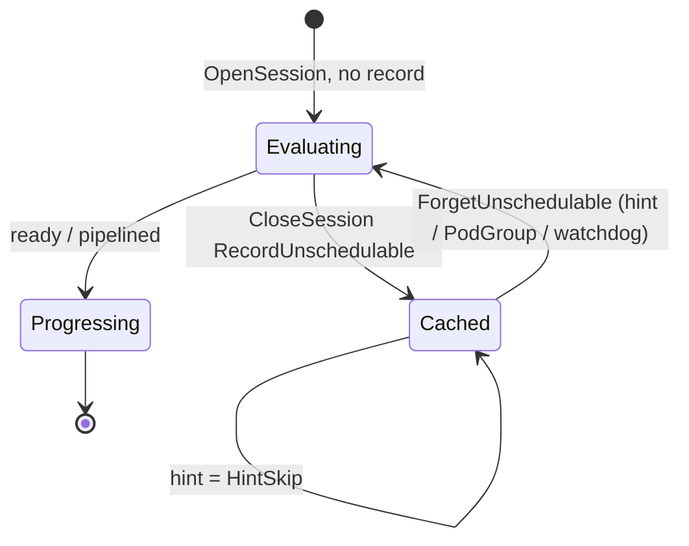
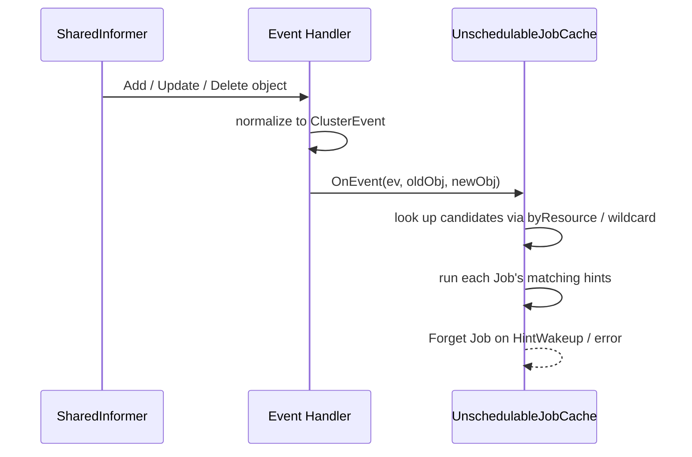
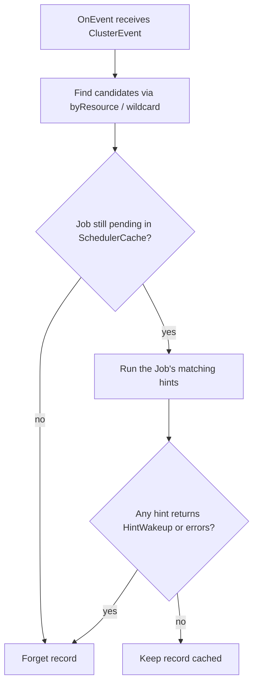
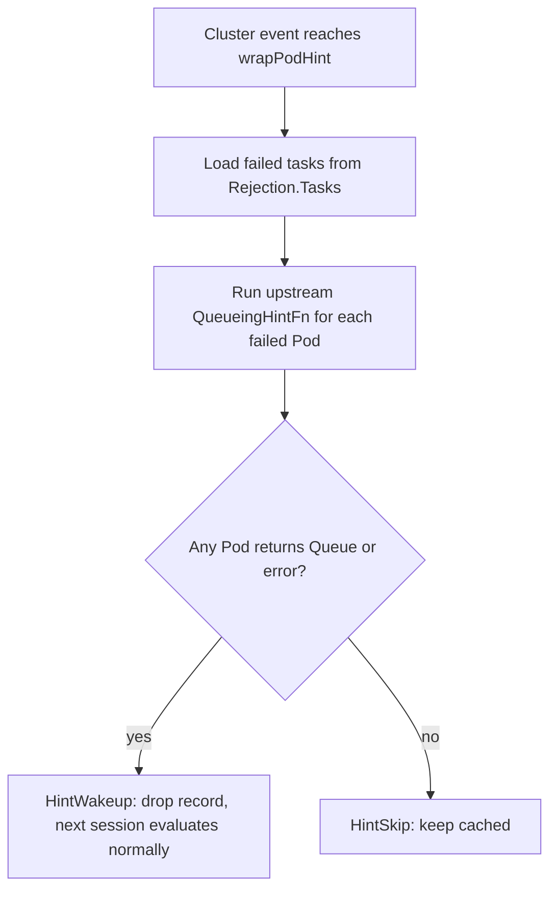

# Unschedulable Job Cache for Volcano Scheduler

<!-- toc -->
- [Summary](#summary)
- [Motivation](#motivation)
  - [Goals](#goals)
  - [Non-Goals](#non-goals)
- [Proposal](#proposal)
  - [User Stories](#user-stories)
  - [Architecture](#architecture)
- [Design Details](#design-details)
  - [1. Plugin Extension Point](#1-plugin-extension-point)
  - [2. Failure Recording](#2-failure-recording)
  - [3. UnschedulableJobCache](#3-unschedulablejobcache)
  - [4. Event Dispatch](#4-event-dispatch)
  - [5. Scheduler Action Changes](#5-scheduler-action-changes)
  - [6. kube-scheduler QueueingHint Adapter](#6-kube-scheduler-queueinghint-adapter)
  - [7. Initial Plugin Coverage](#7-initial-plugin-coverage)
- [Risks and Mitigations](#risks-and-mitigations)
- [Alternatives Considered](#alternatives-considered)
- [Test Plan](#test-plan)
- [Performance Validation](#performance-validation)
- [Related Issues](#related-issues)
<!-- /toc -->

## Summary

Volcano opens a new scheduling session every second. In each session, it re-runs the
full filter path for every pending Job, even when nothing has changed for that Job
since the previous session. In clusters with thousands of pending Pods, this repeated
work takes up most of the `allocate` action's time and delays newly submitted Jobs.

This proposal adds an event-driven retry mechanism. Each plugin declares which
cluster events could change its previous unschedulable decision. When a Job stays
unschedulable at the end of a session, Volcano records the plugins that rejected it
and later sessions derive enqueue, whole-Job, or task skips from those rejections.
When one of the declared events arrives, the record is dropped and the Job is
evaluated normally in the next session.

The first version caches a Job only when every recorded rejection has a registered
`HintProvider`; otherwise the whole Job follows the normal per-session path.

## Motivation

Volcano's scheduler runs a periodic loop. It opens a new session roughly every second.
Each session takes a snapshot of the cluster, iterates every pending Job, and runs the
enabled actions end-to-end. The failure reasons produced in a session are kept only
for that session and are discarded when the session closes.

As a result, a Job that failed because no node carries the required label is
re-evaluated against every node in the next session, and in every session after that,
until either the Job or the cluster changes. When thousands of Jobs are stuck on
conditions that have not changed, `allocate` spends most of its time producing the
same negative answers it produced a second ago. This increases the `allocate`
action's scheduling latency, and newly submitted Jobs that could be scheduled are
delayed as well.

The session loop itself is not the problem. Two things are missing around it. First,
each session needs a way to know that nothing relevant has changed for a Job, so the
retry can be skipped. Second, Volcano needs a way to notice when something relevant
does change, so the Job can be retried immediately.

### Goals

- Stop re-running the full filter path each session for Jobs whose blocking condition
  has not changed.
- Retry a blocked Job promptly when a cluster change happens that could make it
  schedulable, without waiting for a timeout.
- Give plugins a first-class way to declare which cluster events are relevant to their
  unschedulable decisions, so different rejection causes wake on different signals.
- Preserve fairness and ordering. Only the redundant filter work is skipped; a
  cached Job still counts as pending demand so DRF shares, queue capacity, and gang
  `minAvailable` are computed against the same workload as before.

### Non-Goals

- Persisting unschedulable state across scheduler restarts. Records live in memory and
  are rebuilt from the first post-restart session.
- Providing hint coverage for every plugin in the first release. Plugins without a
  hint fall back to per-session evaluation.

## Proposal

The design adds two pieces around Volcano's session loop. Plugins declare a set of
cluster events that may invalidate their previous rejection. The scheduler cache
keeps a per-Job record of which plugins blocked the Job in the last session, and
later sessions derive enqueue, whole-Job, or task skips until one of the subscribed events arrives.
When such an event arrives, the record is dropped and the Job is evaluated normally
in the next session.

### User Stories

- **Queue is temporarily full.** A queue reaches its resource limit and every Job in
  it fails the `capacity` check. Volcano stops retrying these Jobs each session. They
  wake up when another Job in the queue finishes or an operator raises the limit.

- **Job requires a node that does not exist yet.** A Job needs a GPU node label that
  no current node carries. Today Volcano gets the same negative answer from every
  node in every session. With the unschedulable-job cache, the Job is set aside after
  the first check and woken up when a new node is added or an existing node's labels
  change.

- **Gang Job is waiting for enough capacity.** A gang Job needs `minAvailable` tasks
  to fit at once, but the cluster cannot place enough of them. Volcano stops retrying
  the Job until capacity may have grown: a task from another Job completes, a Pod is
  deleted, or a new node joins. A `PodGroup` spec update wakes it as well.

### Architecture

kube-scheduler already avoids retrying unchanged unschedulable Pods with an
event-driven queueing-hint mechanism, which is a useful reference for this design.
Its scheduling queue keeps three buckets and moves Pods between them:


`activeQ` holds Pods ready to schedule, and the scheduler pops from it. When a Pod
fails its filters, it is moved to `unschedulablePods` together with the names of the
plugins that rejected it. Cluster events trigger the failed plugins' `QueueingHintFn`.
If a hint returns `Queue`, the Pod moves to `backoffQ` if it is still inside its
backoff window, or directly to `activeQ` if the backoff has already expired. If every
subscribed hint returns `QueueSkip`, the Pod stays in `unschedulablePods`. A periodic
watchdog also releases Pods that have been stuck there for too long.

Volcano applies the same idea to its session-based, Job-level scheduling. There are
no per-Pod queue buckets. Instead, a single `UnschedulableJobCache` lives beside the
scheduling loop, and is updated from three sources: the session itself, informer
handlers, and a background watchdog.


The scheduler session drives most of the interaction. `OpenSession` derives
`JobInfo.Skip` from cached rejections. `CloseSession` records unschedulable Jobs and
forgets records for Jobs that are ready or pipelined.

Informer handlers translate cluster changes into `ClusterEvent`s and call `OnEvent`.
The cache then runs each subscribed Job's hints and forgets records whose hint
returns `HintWakeup`. A background watchdog forgets records whose `RetryAfter` has
passed, which prevents a Job from staying cached forever if a hint is ever missed.

## Design Details

### 1. Plugin Extension Point

`HintProvider` is an optional interface that a plugin implements to declare the
cluster events that could invalidate its previous unschedulable decisions. Each
declaration is a `ClusterEventWithHint`, which is a `(ClusterEvent, JobHintFn)` pair.
`ClusterEvent` names the change to watch, and `JobHintFn` decides, for a given Job,
whether a particular occurrence of that event may make the Job schedulable. If
`JobHintFn` is `nil`, every occurrence of the event wakes Jobs blocked by this
plugin.

#### Types

The shared hint, event, rejection, and skip types live in `pkg/scheduler/api`, which
both `framework` and `cache` can import without creating a package cycle.

```go
// ClusterEvent identifies one category of cluster change a plugin subscribes to.
type ClusterEvent struct {
    // Resource is the object type whose change may affect scheduling: Node, Pod,
    // PVC/PV, StorageClass, CSINode, ResourceClaim, ResourceSlice, DeviceClass,
    // PodGroup, Queue, HyperNode, or NumaInfo.
    Resource fwk.EventResource

    // ActionType names the kind of change. Besides generic Add/Update/Delete,
    // node updates are split into label, taint, allocatable and condition
    // variants so a taint-only change does not wake Jobs blocked on labels.
    ActionType fwk.ActionType
}

// HintResult is the decision a JobHintFn returns for one Job on one event.
type HintResult int

const (
    HintSkip   HintResult = iota // event cannot unblock this Job; keep it cached.
    HintWakeup                   // event may unblock this Job; drop the record.
)

// JobHintFn is invoked when a subscribed cluster event fires for a Job that the
// plugin previously rejected. It answers one question: could this particular
// event make the Job schedulable this time?
//
//   @param job       the cached Job under evaluation.
//   @param rejection the plugin's own rejection from the previous session; for
//                    predicate sources it also carries the task IDs that failed
//                    (see §2), which lets per-task hints replay only those tasks.
//   @param oldObj    object state before the change; nil on Add events.
//   @param newObj    object state after the change; nil on Delete events.
//   @return HintResult  HintSkip to keep the record, HintWakeup to drop it and
//                       let the next session evaluate the Job normally.
//   @return error       a non-nil error is treated as HintWakeup by the caller,
//                       so a broken hint cannot keep a Job cached forever.
type JobHintFn func(
    job *JobInfo,
    rejection Rejection,
    oldObj, newObj any,
) (HintResult, error)

// ClusterEventWithHint pairs one cluster event a plugin cares about with the
// callback used to check whether that event may help a specific Job. A nil
// HintFn means every occurrence of Event wakes Jobs blocked by this plugin.
type ClusterEventWithHint struct {
    Event  ClusterEvent
    HintFn JobHintFn
}

// HintProvider lets a plugin declare the events that can change its previous
// unschedulable decisions.
type HintProvider interface {
    // EventsToRegister returns every (event, hint) pair this plugin subscribes
    // to. It is called once per registration; the result is stored verbatim.
    EventsToRegister(ctx context.Context) ([]ClusterEventWithHint, error)
}
```

#### Example

A `NodeAffinity` hint registered for `Node/UpdateNodeLabel` compares `oldObj` and
`newObj` node labels against the Job's node selector. It returns `HintWakeup`
only when the new labels may satisfy the selector, and `HintSkip` otherwise.

#### Registration

Plugins register during `OpenSession`:

```go
// AddHintProvider forwards a session-scoped plugin's HintProvider into the
// cache-scoped HintRegistry so it keeps working after the session tears down.
//
//   @param pluginName plugin identity later matched against Rejection.Plugin at
//                     RecordUnschedulable time; must be stable across sessions.
//   @param p          the HintProvider; typically the plugin itself when it
//                     also implements the interface.
func (ssn *Session) AddHintProvider(pluginName string, p HintProvider)
```

Plugin objects are session-scoped, but the informer handlers and
`UnschedulableJobCache` run at scheduler-cache scope and keep firing after the
session ends. To cross this lifetime gap, `AddHintProvider` copies the plugin's
`ClusterEventWithHint`s into a cache-owned `HintRegistry`. `HintRegistry` is defined
in `pkg/scheduler/cache/hint_registry.go` and owned by `SchedulerCache`:

```go
// pkg/scheduler/cache/hint_registry.go

type HintRegistry struct {
    mu             sync.RWMutex
    eventsByPlugin map[string][]ClusterEventWithHint
}

// Register calls p.EventsToRegister(context.TODO()) once. A successful non-empty
// result replaces the plugin entry; an error or empty result removes it.
//
//   @param name plugin name used as the map key; must match Rejection.Plugin so
//               RecordUnschedulable can look the hints up by rejecting plugin.
//   @param p    the HintProvider whose events are being registered.
func (r *HintRegistry) Register(name string, p HintProvider) { /* ... */ }
```

Overwriting matches `BinderRegistry`'s replacement behavior. `HintRegistry` and
`BinderRegistry` are kept as separate types instead of merged into one shared
registry, so that each extension point keeps its own registration signature, and the
cache still has a single place to hold every session-to-cache extension.

`HintRegistry` is the only bridge from session-scoped plugins to cache-scoped
dispatch. §3 covers how `RecordUnschedulable` reads from it at `CloseSession`, and §4 covers how
informer handlers reach the cache through it.

### 2. Failure Recording

The cache stores one `Rejection` per plugin and extension point that rejected a
Job. Repeated failures merge their task IDs. Different tasks can therefore
accumulate different predicate rejections, while `Allocatable` and
`JobEnqueueable` record the first rejecting plugin in their callback chain.

```go
// Rejection describes one plugin decision that made a Job unschedulable in a session.
type Rejection struct {
    Plugin string          // registered HintProvider name, e.g. "NodeAffinity".
    Source RejectionSource // extension point that emitted the rejection.
    Tasks  []TaskID        // failed task IDs; nil only for RejectionEnqueue.
    Queues []QueueID       // Job Queue followed by its known ancestors.
}

type RejectionSource string

const (
    RejectionPredicate   RejectionSource = "predicate"   // PredicateFn / PrePredicateFn
    RejectionAllocatable RejectionSource = "allocatable" // Allocatable
    RejectionEnqueue     RejectionSource = "enqueue"     // JobEnqueueable
)
```

Both `RejectionPredicate` and `RejectionAllocatable` carry `Tasks`, because
their extension points run per task and can fail for a subset of a Job's tasks.
A large-request task can fail queue capacity while a smaller task of the same
Job passes, and one task can fail predicates on every node while another task
of the same Job fits. Only `RejectionEnqueue` is Job-level: `JobEnqueueable`
returns one decision for the whole `PodGroup`, so no task list is stored.

`Plugin` is used to look up the plugin's registered hints when the record is
built, so the Job only subscribes to events from plugins that actually rejected
it. `Source` is kept on `Rejection` rather than on the Job, because a
`RejectionPredicate` and a `RejectionAllocatable` can both occur in one
`allocate` pass. For example, one task fails predicates on all nodes while
another passes predicates but exceeds queue quota. `RejectionEnqueue` does not
appear together with the others, since a Job that fails `JobEnqueueable` does
not reach `allocate` in that session.

#### Extension point coverage

| Extension point | Source | `Tasks` | Typical plugins |
|---|---|---|---|
| `PredicateFn` / `PrePredicateFn`, and `allocate`'s inline node-fit check | `RejectionPredicate` | yes | wrapped predicate plugin names, `predicates-resource-fit` |
| `Allocatable` | `RejectionAllocatable` | yes | `capacity`, `proportion` |
| `JobEnqueueable` | `RejectionEnqueue` | — | `capacity`, `proportion`, `overcommit` |

`allocate` runs a resource-fit check inline (`task.InitResreq` against
`node.FutureIdle`) before calling `PredicateFn`, so pure capacity shortfalls
never reach a real predicate plugin. Volcano attributes those failures to a
synthetic plugin name `predicates-resource-fit` and records them as
`RejectionPredicate` on the same footing as any other per-task predicate
failure. The synthetic plugin registers hints on capacity-changing events
(`Node/Add`, `Node/UpdateNodeAllocatable`, `Pod/Delete`) so the wake path
works the same way as other predicates.

#### Recording rejections

`AddRejection` records each extension-point failure immediately. `CloseSession`
deduplicates the accumulated rejections and drains them into the cache.

`gang.JobReadyFn` does not produce a rejection. If a gang shortfall is caused
by real per-task failures, those failures already surface as
`RejectionPredicate` or `RejectionAllocatable` on the specific tasks that
could not be placed, and §2's [Skip granularity](#skip-granularity) turns the
shortfall into either a task-subset or a whole-Job skip in the next session.
Gang's role stays session-internal: it decides whether the pipelined tasks
form a viable Job and rolls them back if not.

A Job whose rejection list is empty after this pass is not cached because no
instrumented extension point reported a stable rejection. Rejections from plugins
without hints are still recorded, but `RecordUnschedulable` rejects the complete set
and leaves the Job uncached (see
[Rejections from plugins without hints](#rejections-from-plugins-without-hints)).

#### Skip granularity

Rejections say which tasks failed which plugin; they do not say how much of
the Job should be skipped next session. That decision is derived at
`OpenSession` from the rejections plus the Job's gang topology, and stored on
`JobInfo.Skip`:

```go
// SkipDecision is computed once per pending Job at OpenSession from the
// cached rejections and the Job's gang topology. Each field names the piece
// of work an action should skip for this Job in this session.
type SkipDecision struct {
    // Enqueue skips enqueue's JobEnqueueable re-check for this Job.
    // Set when RejectionEnqueue was cached.
    Enqueue bool

    // Allocate skips the allocate and backfill actions entirely for this
    // Job (no tasks popped, no gang JobReadyFn call). Set when the Job
    // cannot reach its gang criterion after excluding the per-task
    // rejections.
    Allocate bool

    // Tasks lists task IDs that allocate and backfill should treat as
    // unschedulable this session. Consulted only when Allocate is false;
    // nil otherwise.
    Tasks map[TaskID]struct{}
}
```

For the two per-task sources (`RejectionPredicate`, `RejectionAllocatable`),
Volcano picks between two modes:

1. **Task-subset skip.** `Skip.Tasks` is populated from the union of
   `Rejection.Tasks`; `Skip.Allocate` stays false. `allocate` and `backfill`
   still pop the Job's other tasks and evaluate them normally, but any task
   in `Skip.Tasks` is treated as unschedulable this session (predicate and
   allocatable loops are skipped for it). This is the mode used when the Job
   can still reach its gang criterion after excluding the skipped tasks. For
   example, an elastic gang Job whose `minAvailable` is already met by
   running tasks, with only extras cached as failed.

2. **Whole-Job skip.** `Skip.Allocate` is true. No task of the Job is popped
   this session, and gang's `JobReadyFn` is never called. This is the mode
   used when excluding the skipped tasks makes some level of the gang
   hierarchy fall below its own threshold. For example, a gang with
   `minAvailable=8`, five tasks running, three tasks previously rejected on
   capacity, and nothing left to try.

`Skip.Enqueue` is orthogonal: it is set from `RejectionEnqueue` alone, and
since a Job that failed `JobEnqueueable` never reached `allocate` in the
previous session, it cannot coexist with per-task rejections in the same
record.

`ComputeSkip` follows Volcano's current flat gang model. It checks Job
`MinAvailable`, role `TaskMinAvailable` when configured, flat SubJob
`MinAvailable`/`MinSubJobs`, and tasks that have already progressed.

Either way the wake behavior is the same: any `HintWakeup` from the plugins
that produced the cached rejections drops the whole record, and the next
`OpenSession` recomputes `SkipDecision` from scratch. There is no partial
wake that lifts only some cached task-level skips.

#### How actions apply cached rejections

At `OpenSession`, Volcano fetches each pending Job's rejections from the
cache and derives `JobInfo.Skip` from them (see §5). Actions consult `Skip`
only. Each field names the piece of work to skip:

- **`enqueue`** skips its `JobEnqueueable` re-check when `Skip.Enqueue` is
  true. Only the `RejectionEnqueue` source sets this flag.
- **`allocate`** short-circuits the Job when `Skip.Allocate` is true: no task
  is popped and gang's `JobReadyFn` is not called. Otherwise, for each popped
  task, a lookup in `Skip.Tasks` decides whether to skip the predicate and
  allocatable loops for that task. Other tasks of the same Job continue
  normally, so elastic gang Jobs can still push past `minAvailable` when a
  new task becomes placeable.
- **`backfill`** reads `Skip` the same way `allocate` does.
- **`preempt`** and **`reclaim`** ignore `Skip`. They exist to free
  resources for Jobs the other actions could not place, so a cached Job must
  still be a preemption candidate.

#### Rejections from plugins without hints

A rejection is only useful if its plugin has a `HintProvider`. If the rejecting
plugin has no registered hints, there is no cluster event that could wake the
Job for that failure. The cache leaves such Jobs out entirely and lets them go
through the normal filter path every session, which matches today's behavior.

### 3. UnschedulableJobCache

`UnschedulableJobCache` lives on `SchedulerCache`. It records unschedulable Jobs by
`JobID`, together with the rejection list collected at `CloseSession` and the hint
callbacks copied from `HintRegistry`.

The normal retry lifecycle is:

1. `CloseSession` calls `RecordUnschedulable(job, rejections)` for Jobs that were
  evaluated and still failed.
2. The next `OpenSession` calls `GetCachedRejections(job)` for each pending Job.
3. If the call returns a non-nil slice, Volcano derives `JobInfo.Skip` from it (see
   §2's [Skip granularity](#skip-granularity)), and `enqueue`, `allocate` and
   `backfill` bypass either the whole Job, specific tasks, or the enqueue re-check
   accordingly.
4. A matching informer event calls `OnEvent`; if a hint says the Job may need retry,
   the cache calls `ForgetUnschedulable(job.UID)` and the next session evaluates it
   normally.
5. If no relevant event arrives before `RetryAfter`, a background watchdog goroutine
   forgets the record, and the next session evaluates the Job normally.

Recovery actions (`preempt` and `reclaim`) do not consult `GetCachedRejections`.
They scan pending Jobs from `ssn.Jobs` directly, because Volcano cannot know in
advance which Job becomes schedulable after victims are selected. Once they
pipeline a Job's tasks onto victims, that Job is making progress through
preemption. `CloseSession` drops any existing record instead of re-caching it
(see §5); `GetCachedRejections` itself remains a plain lookup.

A Job therefore moves between three states across sessions:



The three states are:

- **Evaluating** — no record (or the record is being bypassed); actions run predicates
  and resource fit for the Job normally.
- **Cached** — a record exists; `enqueue`/`allocate`/`backfill`
  apply the derived `Skip` (the enqueue re-check, the whole Job, or a subset of its
  tasks, depending on the record). `preempt`/`reclaim` still evaluate it (they ignore
  the cache).
- **Progressing** — the Job became ready or gained a pipelined task, so it holds no
  record and leaves the cache's scope.

A Job enters **Cached** only from `CloseSession → RecordUnschedulable`. It leaves
**Cached** back to **Evaluating** through three paths, all of which delete the record
so the next `OpenSession` finds none and evaluates the Job normally:

1. **Hint wake-up (event-driven).** An informer fires `OnEvent`; the cache runs the
  Job's subscribed hints. If any returns `HintWakeup`, the cache forgets the record.
   If every hint returns `HintSkip`, the record is kept and the Job stays **Cached**
   (the `Cached → Cached` self-loop). This is the primary path, since a real cluster
   change plausibly fixes the earlier rejection.
2. **PodGroup change (invalidation).** A spec update or delete forgets the record
   directly; status-only updates remain hint events.
3. **RetryAfter watchdog (safety net).** A background goroutine runs on a fixed
   interval and forgets any record whose `RetryAfter` has passed. It runs off the
   scheduling path, so it does not add scanning work to `OpenSession`, and it
   guarantees a Job is never cached forever when a hint is missed or an informer
   edge case drops an event.

#### Interface

```go
// UnschedulableCache stores Jobs rejected in previous scheduling sessions and
// exposes the operations needed by scheduler sessions.
type UnschedulableCache interface {
    // AddHintProvider registers a plugin's event subscriptions and hint callbacks.
    AddHintProvider(name string, p api.HintProvider)

    // RecordUnschedulable stores the plugin rejections observed for a Job in the
    // current session.
    RecordUnschedulable(job *api.JobInfo, rejections []api.Rejection)

    // GetCachedRejections returns the rejections that may be reused to skip work
    // for the Job in the current session.
    GetCachedRejections(job *api.JobInfo) []api.Rejection

    // ForgetUnschedulable removes the cached record for the Job.
    ForgetUnschedulable(jobID api.JobID)
}
```

`OnEvent` and `StartWatchdog` are methods on the concrete
`*UnschedulableJobCache`; informer dispatch and cache startup call them directly.

#### Cache state

The cache keeps one record per Job, plus a reverse index so `OnEvent` can find
the affected Jobs without scanning every record:

```go
// UnschedulableJobCache stores rejected Jobs and routes matching cluster events
// to their captured hint callbacks.
type UnschedulableJobCache struct {
    mu sync.RWMutex

    // records is the primary store: one entry per cached Job.
    records map[api.JobID]*unschedulableRecord

    // byResource narrows event dispatch to Jobs interested in a resource.
    // wildcard holds Jobs subscribed to fwk.WildCard as the resource.
    byResource map[fwk.EventResource]sets.Set[api.JobID]
    wildcard sets.Set[api.JobID]

    // registry provides the latest plugin hint declarations for new records.
    registry *HintRegistry

    // jobGetter returns a cloned JobInfo snapshot under the SchedulerCache lock,
    // or nil when the Job is gone.
    jobGetter func(api.JobID) *api.JobInfo

    // maxSkipDuration bounds how long a record can suppress retries.
    maxSkipDuration time.Duration
}

// unschedulableRecord is the cached state for one Job.
type unschedulableRecord struct {
    // jobID identifies the cached Job; rejections drive Skip derivation in the
    // next OpenSession.
    jobID      api.JobID
    rejections []api.Rejection

    // lastFailedAt and retryAfter define the watchdog retry window.
    lastFailedAt time.Time
    retryAfter   time.Time

    // subscriptions and resources are snapshots, not references to the registry.
    subscriptions []hintSubscription
    resources     sets.Set[fwk.EventResource]
}

// hintSubscription pairs a plugin name with its hint callback, plus the plugin's
// own Rejection so the callback can inspect the exact decision it made in the
// previous session.
type hintSubscription struct {
    plugin    string
    event     api.ClusterEvent
    rejection api.Rejection
    hintFn    api.JobHintFn
}
```

`subscriptions` holds the same `(event, hintFn)` pairs a plugin declares through
`ClusterEventWithHint` (§1), narrowed to the plugins that rejected this Job and
indexed by resource for fast candidate lookup. A nil `HintFn` wakes only after its
event matches; it is unrelated to the resource wildcard. `RecordUnschedulable`
builds it by looking each rejection's plugin up in the cache's global
`HintRegistry` and copying the matching entries.

It is a **snapshot** rather than a live reference to `HintRegistry`. A Job
cached in an earlier session must keep waking the same way it was recorded,
even if a plugin re-registers different events later. Copying at record time
also keeps the cache working after the session that produced the hints is torn
down.

#### Cache updates

| Call site | Cache call | Meaning |
|---|---|---|
| `CloseSession`, evaluated Job still pending | `RecordUnschedulable(job, rejections)` | Store or replace the record and rebuild event subscriptions. |
| `OpenSession`, pending Job | `GetCachedRejections(job)` | Return the previous session's rejections, or nil to evaluate the Job normally. |
| `CloseSession`, Job became ready or gained a pipelined task | `ForgetUnschedulable(job.UID)` | Remove the record. |
| PodGroup spec update/delete informer | `ForgetUnschedulable(jobID)` | Job spec/lifecycle changed; evaluate it again. |
| Subscribed cluster event (informer) | `OnEvent(ev, oldObj, newObj)` | Run matching hints and wake Jobs that may need retry. |
| Watchdog goroutine, `now >= RetryAfter` | `ForgetUnschedulable(jobID)` | Off-path cleanup of stale records so a Job is never cached forever. |

`GetCachedRejections(job)` is a map lookup by Job ID. Progress is reconciled at
`CloseSession`, and expiry is handled by the watchdog.

There is no per-Job timer and no exponential backoff. A single background
goroutine runs on a fixed interval, scans the records, and forgets any
whose `RetryAfter` has passed. Keeping expiry off the scheduling path means
`OpenSession` and `GetCachedRejections` only read a record. Events remain the
normal wake-up path, and the timestamp is a safety net for missed hints or
informer edge cases.

#### Per-session overhead

For a Job with no cached record, `GetCachedRejections` is a single map
lookup under a read lock, so the `OpenSession` pass adds constant time per
pending Job. For a cached Job, `ComputeSkip` checks gang thresholds without
touching the cluster snapshot, which is much cheaper than the per-node predicate
loop the skip avoids.

#### Invalidation

A record is removed or bypassed by these triggers:

| Trigger | Effect |
|---|---|
| A subscribed cluster event whose hint returns `HintWakeup` or errors | `ForgetUnschedulable` (via `OnEvent`) |
| `PodGroup` spec update or delete | `ForgetUnschedulable` (from the informer handler) |
| `now >= RetryAfter` | the watchdog calls `ForgetUnschedulable`; the next session re-evaluates the Job |

`RecordUnschedulable` sets retry timing like this:

```
LastFailedAt = now
RetryAfter   = now + maxSkipDuration // configurable; defaults to 5m
```

`OnEvent` is described in §4 together with the informer dispatch path.

### 4. Event Dispatch


The dispatch layer connects cluster events to `UnschedulableJobCache`. Plugins
declare which events they care about through `HintRegistry` (§1). Scheduler-cache
informer handlers are installed when the cache is constructed and deliver supported
events through `OnEvent`.

#### Subscribed event set

`OnEvent` finds candidate records by resource and then matches the action on each
subscription. Node and Pod updates use kube-scheduler's classified actions. A Pod
transitioning to a terminal phase is treated as `Pod/Delete` because it releases
its node resources.

#### Handler registration

Volcano dispatches into `UnschedulableJobCache` beside the existing cache-update
handlers on supported informers. Each handler
normalizes the informer callback into a `ClusterEvent` and calls
`UnschedulableJobCache.OnEvent(ev, oldObj, newObj)`. PodGroup spec updates and
deletes invalidate the Job directly, while status updates are delivered to hints.

#### Delivery

`OnEvent` uses the `byResource` / `wildcard` index (§3) to find candidate records
subscribed to the event, runs each Job's matching hints, and forgets a Job as
soon as one hint returns `HintWakeup`. A hint that returns an error is treated
as `HintWakeup` too, so a broken hint can never keep a Job cached forever. Jobs
whose hints all return `HintSkip` stay cached until another event fires or the
`RetryAfter` watchdog (§3) lets them retry.

The cache lock is held only while copying candidate IDs and immutable subscription
snapshots. `JobHintFn` callbacks run after the lock is released, so plugin code cannot
block cache reads/writes or create lock-order cycles. Delete handlers unwrap
`cache.DeletedFinalStateUnknown` before dispatching the concrete object to hints.



`OnEvent` decides per record:



Any subscribed plugin can wake the Job. Waking only lifts the cached skip. The
next scheduling session still runs the normal Volcano checks before the Job can
be placed.

### 5. Scheduler Action Changes

Two hooks in the session lifecycle wire the cache into the scheduler. `OpenSession`
derives each pending Job's `Skip` decision from the cache, and `CloseSession`
writes updated records back. §2 describes what the actions do with `Skip`; this
section covers the two hooks and how `CloseSession` reconciles the cache with what
the session actually did.

#### Tagging pending Jobs

`OpenSession` builds the session as usual. Once plugins have registered, Volcano
calls `GetCachedRejections` for every pending Job. If the call returns a non-nil
slice, `ComputeSkip` (§2) turns it into a `SkipDecision` that is stored on
`JobInfo`:

```go
type JobInfo struct {
    // existing fields omitted

    // Skip is derived from cached rejections and the Job's gang constraints.
    // enqueue reads Skip.Enqueue; allocate and
    // backfill read Skip.Allocate and Skip.Tasks. Zero value means the
    // Job is evaluated normally this session. See §2's Skip granularity.
    Skip SkipDecision
}
```

The raw `[]Rejection` slice stays on the cache record. Actions never need it,
and duplicating it on `JobInfo` would add pointer traffic without a reader.

Skipped Jobs stay in `ssn.Jobs` so plugin accounting still sees pending demand.
Whole-Job skips may be omitted from action-local queues; `Skip` only gates the
expensive retry work.

#### Reconciling the cache at `CloseSession`

Each pending Job's record is updated to match what actually happened to it:

- If the Job is ready, or `preempt`/`reclaim` pipelined any task onto
  victims, it is making progress, so any record is dropped (or never written).
- If the Job was skipped and never re-evaluated, its record is left untouched, still
  waiting for an event or the watchdog.
- If the Job was actually evaluated and still produced rejections, the record is written
  or replaced with those fresh rejections.

A pipelined Job is deliberately kept out of the cache. Its victims are still being
evicted, so the next `allocate` may keep rejecting those tasks until their resources
are freed. Caching the Job as unschedulable would suppress the retries that let the
preemption finish.

### 6. kube-scheduler QueueingHint Adapter

Most of the value in the first release comes from reusing kube-scheduler's
existing `QueueingHintFn`s for its filter plugins. Volcano's `predicates`
plugin already wraps those upstream plugins, so the adapter only has to expose
their hints and turn each per-Pod answer into a per-Job answer.

#### Exposed upstream hints

The following upstream plugins implement `fwk.EnqueueExtensions` and expose
their hint list through `EventsToRegister(ctx) ([]fwk.ClusterEventWithHint, error)`:

- `nodeaffinity`, `nodeports`
- `tainttoleration`
- `interpodaffinity`, `podtopologyspread`
- `nodevolumelimits.CSILimits`, `volumezone`, `volumebinding.VolumeBinding`
- `dynamicresources.DynamicResources`

Both the return type and its `QueueingHintFn` field are exported, so Volcano
can invoke the upstream hints directly without reimplementing them. Volcano's
`predicates` plugin publishes one `ClusterEventWithHint` per upstream event and
uses the upstream plugin name (for example, `NodeAffinity`) as its stable identity.
`RecordUnschedulable` uses that name to copy only the hints for filters that actually rejected the Job.

#### From per-Pod to per-Job

The upstream `QueueingHintFn` is Pod-level. It answers "could this event make
this one Pod schedulable?":

```go
func(logger klog.Logger, pod *v1.Pod, oldObj, newObj any) (fwk.QueueingHint, error)
```

Volcano's `JobHintFn` asks the same question for a whole Job. `wrapPodHint`
turns the per-Pod callback into a per-Job one. `Rejection.Tasks` (§2) records
exactly the task IDs that failed this filter in the previous session, so the
wrapper runs the upstream hint only for those Pods — other tasks passed the
filter and cannot be why the Job is blocked on it.

The wrapper returns `HintWakeup` as soon as one failed task's upstream hint
returns `Queue`. Waking on a single Pod is safe:

- `HintWakeup` does not place anything. It asks Volcano to run the normal
  evaluation again, where full predicates re-run for every task. A useless
  wake costs one session's evaluation and nothing more.
- Wakes are whole-record. Even though `RejectionPredicate` carries a `Tasks`
  list, one Pod turning schedulable drops the whole record, and the next
  session re-evaluates every task from scratch. There is no partial wake that
  lifts only some of the cached task-level skips.
- For a gang Job, a single task becoming placeable can be the marginal task
  that finally satisfies `minAvailable`, so one Pod's improvement must be
  able to unblock the Job.

A missed wake is the more expensive failure — the Job stays cached until the
watchdog — so any upstream hint that errors is also treated as `HintWakeup`.



### 7. Initial Plugin Coverage

Coverage lands in tiers so the first release focuses on the plugins that
drive the most redundant work today. The kube-scheduler upstream already
ships hint logic for the wrapped predicate plugins, so the predicate tier is
almost entirely adapter code and lands in P0. Native queue plugins are also
P0 because `capacity`/`proportion` are the most common source of blocked
Jobs. Everything else follows as its rejection path is wired up.

**P0 — first release**

| Plugin | Category | Event source | Notes |
|---|---|---|---|
| `NodeAffinity`, `NodePorts` | NodeAffinity | adapter | `Node/Add`, `Node/UpdateNodeLabel` |
| `TaintToleration`, `NodeUnschedulable` | Taint | adapter | `Node/Add`, `Node/UpdateNodeTaint` |
| `InterPodAffinity`, `PodTopologySpread` | PodTopology | adapter | `Pod/Add`, `Pod/Delete`, `Node/UpdateNodeLabel` |
| `NodeVolumeLimits`, `VolumeZone`, `VolumeBinding` | Storage | adapter | PVC/PV/StorageClass/CSINode events |
| `DynamicResources` | Device | adapter | ResourceClaim/DeviceClass/Node allocatable events |
| `predicates-resource-fit` | Resource | native (synthetic) | §2 synthetic name for `allocate`'s inline node-fit check; `Node/Add`, `Node/UpdateNodeAllocatable`, `Pod/Delete` |
| `capacity`, `proportion` | Queue | native | Queue, PodGroup completion/deletion, Pod deletion |

**P1 — follow-up**

| Plugin | Category | Event source | Notes |
|---|---|---|---|
| `overcommit` | Queue | native | Queue, PodGroup completion/deletion |
| `numaaware` | NUMA | native | NumaInfo, Node add |
| `deviceshare` | Device | native | Node allocatable, PodGroup deletion |
| `resource-strategy-fit` | Resource | native | Node add/allocatable, Pod deletion |

**P2 — later**

| Plugin | Category | Event source | Notes |
|---|---|---|---|
| `network-topology-aware` | HyperNode | native | HyperNode, node label events |

**No `HintProvider` (fallback)**

`extender`, and any other plugin that does not implement `HintProvider`, keep
today's behavior: Jobs they reject are not cached and go through the normal
filter path every session.

## Risks and Mitigations

| Risk | Mitigation |
|---|---|
| A hint misses a relevant event, keeping a Job cached too long. | Fail open on hint errors; the `RetryAfter` watchdog forgets the record; rejections from plugins without a `HintProvider` are not cached at all (§7). |
| Stale plugin registrations after a re-register. | `RecordUnschedulable` snapshots the hints at cache-write time; later registrations only apply to new records, and old records are bounded by the watchdog. |
| Fairness drift from skipping Jobs. | Cached Jobs stay in `ssn.Jobs`; DRF, capacity, proportion and gang accounting see the full pending demand (§5). |
| Hot `Pod` event path spending time on unrelated Jobs. | `byResource` / `wildcard` index dispatches only to records subscribed to the event; hints for others never run. |
| Preemption progress suppressed by the cache. | Jobs with pipelined tasks are excluded from the cache (§3, §5), so `preempt`/`reclaim` retries are never skipped. |

## Alternatives Considered

- **All-plugins-must-return-`HintWakeup` policy.** Rejected. Needs per-plugin wake state on each record, and one missed hint leaves the Job stuck until the watchdog.
- **Drop unschedulable Jobs from `ssn.Jobs`.** Rejected. DRF, capacity and proportion need to see pending demand or fairness drifts.
- **Persist records in PodGroup status or annotations.** Rejected. Adds API-server writes on every rejection and races with user updates. Records live in memory and rebuild from the first post-restart session.
- **Reimplement kube-scheduler hints in Volcano.** Rejected. The upstream callback API is public and already captures plugin-specific logic; wrapping it costs adapter code once.
- **Task-granularity cache records.** Rejected as the cache key, though task-level
  detail is still kept inside each Job record. Volcano schedules and gates at
  Job/PodGroup granularity, so `GetCachedRejections`, gang thresholds and the action
  loops all decide per Job. A per-task record would have to be rolled up to that
  same Job-level answer, which the §6 OR already produces. A Job's tasks are also
  typically homogeneous and fail the same filter for the same reason, so per-task
  records would store many near-duplicate entries and scale with total pending Pods
  instead of pending PodGroups. Task-level precision matters only when replaying the
  upstream per-Pod hint, and `Rejection.Tasks` inside the Job record already provides
  it.

## Test Plan

**Unit tests**

Standard package-level unit tests cover the core logic: `HintRegistry` lifecycle
and re-registration; rejection recording at each extension point (`PredicateFn`,
`Allocatable`, `JobEnqueueable`, plus the synthetic `predicates-resource-fit`);
`UnschedulableJobCache` operations (`RecordUnschedulable`, `GetCachedRejections`,
`ForgetUnschedulable`, `OnEvent`, watchdog expiry, `byResource` / `wildcard`
dispatch, hint-error fail-open); `ComputeSkip` against Job, role, and flat SubJob
thresholds; and the
`predicates` adapter's per-Pod-to-per-Job aggregation.

**Benchmarks**

Performance tests compare the cache enabled and disabled under a schedulable Job
stream, with both homogeneous and mixed pending backlogs. They record useful Job
throughput, scheduling latency, session time, predicate calls, scheduler CPU, and
RSS. The workloads and results are described in Performance Validation below.

**End-to-end**

- **Wake on a matching cluster event.** A Job blocked on a node label is
  cached after the first session; adding a node with the matching label
  drops the record and places the Job in the next session.
- **Gang whole-Job skip.** A gang Job whose `minAvailable` is unreachable in
  the current cluster is cached; no task is popped for it until a `Pod/Delete`
  frees enough capacity, at which point the record wakes and the Job is
  placed.
- **Task-subset skip.** An elastic gang Job whose `minAvailable` is already met
  by running tasks has extra tasks rejected on capacity; later sessions skip
  only those cached tasks and keep evaluating the Job's other tasks normally.
- **Preemption is not suppressed.** A cached Job is chosen as a preemption
  target; `preempt` selects victims, `allocate` pipelines the Job's tasks, and
  the record is dropped instead of refreshed.
- **Watchdog safety net.** A cached Job whose subscribed events never fire is
  re-evaluated after the configured maximum skip duration.

## Performance Validation

Batch clusters often keep Jobs pending for reasons that cannot change in the next
scheduling session: a gang does not have enough GPUs, a Queue has exhausted its
quota, or no Node satisfies a placement constraint. Re-running the same filters
once per second does not help those Jobs, but it does compete with newly submitted
work. The cache trades memory and event processing for fewer repeated scheduling
attempts, so the validation covers both sides of that trade: it must reduce work
when a backlog exists, remain cheap when it does not, and retry promptly when the
cluster really changes.

The A/B cases below changed only the feature gate. Cluster-level cases were run
three times and report the median. The test cluster had 100 KWOK Nodes with 32 CPUs
and 256 GiB of memory each, a one-second scheduling period, and scheduler/client
QPS and burst of 5000/10000.

### Normal scheduling without a pending backlog

A healthy cluster may have no long-lived unschedulable work at all. The cache must
keep its overhead small in that common case. This scenario submitted schedulable
four-Pod Jobs at 100 Jobs/s for at least 15 seconds without creating any blocked
Job. There were no cache skips or wakeups in either run.

| Metric | Cache off | Cache on | Change |
|---|---:|---:|---:|
| Job throughput | 71.05 Jobs/s | 71.35 Jobs/s | +0.4% |
| Job scheduling latency P95 | 4 s | 4 s | no change |
| Scheduler CPU | 18.27 s | 18.89 s | +3.4% |
| Average session | 1947.39 ms | 1965.61 ms | +0.9% |
| Predicate calls | 4,481 | 4,416 | -1.5% |

Throughput and latency stayed effectively unchanged. Scheduler CPU was 3.4%
higher in these runs when the cache had nothing to skip.

### Long-lived pending Jobs competing with new work

The main production use case is a queue containing training or batch Jobs that
remain unschedulable for minutes while smaller Jobs continue to arrive. To show
how that pressure scales, one test used single-Pod Jobs that each requested 100
CPUs, more than any Node could provide, and varied the backlog from 1,000 to 5,000
Jobs. The same schedulable four-Pod stream used above ran behind the backlog.

| Blocked Jobs | Metric | Cache off | Cache on | Change |
|---:|---|---:|---:|---:|
| 1,000 | Job throughput | 54.10 Jobs/s | 75.01 Jobs/s | +38.7% |
| 1,000 | P95 latency | 7 s | 4 s | -42.9% |
| 1,000 | Average session | 3213.45 ms | 2160.34 ms | -32.8% |
| 5,000 | Job throughput | 21.61 Jobs/s | 71.96 Jobs/s | 3.33x |
| 5,000 | P95 latency | 12 s | 5 s | -58.3% |
| 5,000 | Average session | 5466.08 ms | 2159.42 ms | -60.5% |

Without the cache, useful throughput collapsed as the backlog grew because every
session revisited every impossible Job. With the cache, throughput stayed close to
the no-backlog result. At 1,000 blocked Jobs, scheduler CPU fell by 14.5% and
predicate calls by 35.4%; at 5,000 they fell by 29.1% and 61.6%. Scheduler RSS
increased by about 86 MiB and 380 MiB respectively, making the
space-for-throughput trade explicit.

A separate test used a more realistic gang shape. It kept 50 high-priority Jobs
pending, each with 20 tasks: 15 tasks that fit, five Resource Fit failures, and
`minAvailable=16`. While those Jobs remained at the head of the queue, schedulable
lower-priority Jobs with `replicas/minAvailable=4/4` arrived at 100 Jobs/s.

| Metric | Cache off | Cache on | Change |
|---|---:|---:|---:|
| Job throughput | 64.55 Jobs/s | 78.10 Jobs/s | +21.0% |
| Job scheduling latency P95 | 7 s | 4 s | -42.9% |
| Scheduler CPU | 25.88 s | 19.46 s | -24.8% |
| Predicate calls | 7,256 | 4,852 | -33.1% |

This is the user-visible reason for the feature: avoiding unchanged work creates
room for Jobs that the cluster can actually run, rather than merely shortening an
otherwise empty session.

### Cluster changes and noisy events

Pending state eventually becomes stale: Pods finish, Nodes join the cluster, or a
Queue receives more quota. The cache must react to those changes without treating
every informer event as useful. The E2E suite covers both sides. A Job cached on a
missing Node label was scheduled after a matching Node update, and a Resource
Fit-blocked Job was scheduled after the only CPU-consuming Pod was deleted. Queue
capacity and task-quota cases similarly recovered after their matching updates.
The focused Resource Fit case passed five consecutive runs; its one-minute bound
is well below the default five-minute watchdog, so recovery did not depend on the
periodic safety retry.

For the opposite extreme, 1,000 Jobs requested more CPU than any Node could ever
provide while 50 unrelated Pods/s were deleted for 30 seconds. The Resource Fit
index selected no candidate (`K=0`) and produced no false wakeup.

| Metric | Cache off | Cache on | Change |
|---|---:|---:|---:|
| Scheduler CPU / 30 s | 42.75 s | 10.27 s | -76.0% |
| Average session | 909.38 ms | 29.40 ms | -96.8% |
| Predicate calls | 16,000 | 0 | -100% |
| False Pod wakeups | 0 | 0 | none |

The secondary-index microbenchmark explains why event churn remains cheap. With
5,000 cached Jobs, an event selecting 1% of the bucket took 7.87 µs instead of
986.7 µs for full-bucket delivery, a 125x difference. At 10% it was 10.8x faster;
at 100% it was 0.4% slower. Provider-specific keys are therefore useful only when
they exclude a meaningful part of the bucket, while the generic full-bucket path
remains the correctness fallback.

### Mixed reasons for pending Jobs

Production queues are not uniformly blocked by Resource Fit. The final scenario
used 1,000 pending Jobs split evenly among Resource Fit, Node Affinity,
Inter-Pod Affinity, and Queue rejection, then submitted the same schedulable
four-Pod stream. Only Resource Fit used the provider-specific secondary index;
the other reasons exercised the generic cache and fallback delivery paths.

| Metric | Cache off | Cache on | Change |
|---|---:|---:|---:|
| Job throughput | 62.68 Jobs/s | 71.64 Jobs/s | +14.3% |
| Job scheduling latency P95 | 6 s | 5 s | -16.7% |
| Scheduler CPU | 23.28 s | 22.53 s | -3.2% |
| Average session | 2518.80 ms | 1812.42 ms | -28.0% |
| Predicate calls | 6,547 | 4,429 | -32.4% |

The mixed backlog still improved useful throughput by 14.3% and reduced predicate
calls by 32.4%. Taken together, the scenarios show that the cache is nearly
neutral in a healthy queue, increasingly valuable as a pending backlog grows,
responsive to relevant changes, and still useful when rejection reasons are
heterogeneous.

## Related Issues

- [#5551 Reduce repeated scheduling attempts for unchanged unschedulable jobs](https://github.com/volcano-sh/volcano/issues/5551)
- [#5494 [Umbrella] Track Volcano performance and scalability work](https://github.com/volcano-sh/volcano/issues/5494)
- [#5537 Explore signature-based batching for homogeneous gang workloads](https://github.com/volcano-sh/volcano/issues/5537)
- Upstream: [KEP-4247 QueueingHint](https://kep.k8s.io/4247)
