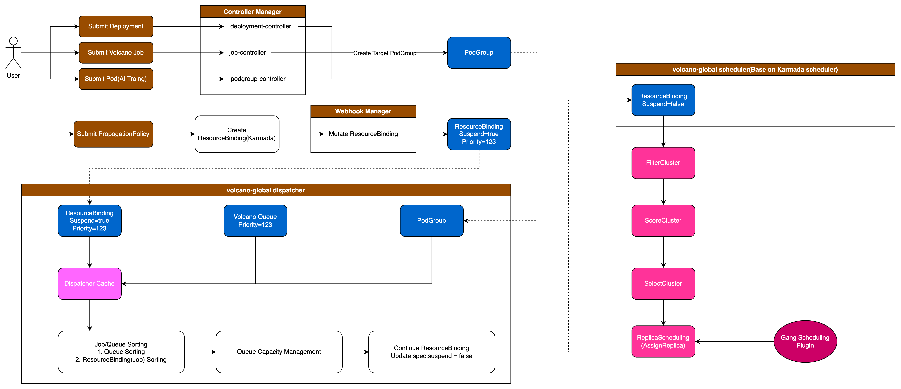

# Volcano Global Supports Queue Capacity Management

@Vacant2333 2024/9/22

## Introduction

Target issue: [OSPP 2024: Volcano Support Multi-Cloud AI Job Scheduling(queue capacity management)](https://github.com/volcano-sh/volcano/issues/3731)

With the rapid development of large AI models, a single K8s cluster is increasingly unable to meet the needs of
large model AI job training due to resource and performance bottlenecks. More and more users are using
multiple clusters to manage and run AI jobs. Volcano is developing Supports task scheduling of multi-cluster AI jobs,
which involves multi-cluster job management, multi-tenant task fair scheduling, queue management and
other series of requirements. The multi-cluster orchestration system [Karmada](https://karmada.io/) has gradually become an industry standard.
Volcano needs to build AI job scheduling capabilities in multi-cluster scenarios based on Karmada's existing capabilities,
and make up for the lack of queue management and other capabilities in Karmada scheduling to solve AI jobs in multi-cluster scenarios.
Task scheduling, queue management, and **multi-tenant quota management** issues.

This proposal targets the queue capacity management capability.

### Goals

- Support queue capacity management

## Proposal

### Background

Currently, the design goal of `volcano-global` is to implement dispatch capabilities in a manner similar to `Kueue`.
When we create a `ResourceBinding` (a CRD in Karmada,
used to describe the operation of 'resource distribution to worker clusters'),
we suspend it similar to a Job resource.
Then, it is handed over to our Dispatcher (Controller) to implement capabilities such as queuing,
sorting, and capacity management.

Currently, the Dispatcher can only handle queue and task sorting.

We need to expand the extensibility of the Dispatcher on this basis, to implement capacity management and multi-tenant
required capabilities such as **allocatable** (determining whether a task can be submitted), **overused**
(judging whether it exceeds deserve before each task dispatch), and other support points that the Dispatcher should extend.

### Capacity Plugin

My implementation plan is to provide capacity management capabilities in the **Dispatcher** through the form of plugins.
For example, job sorting capabilities in the **Dispatcher** are implemented through the **Priority** plugin.
I will name this plugin **Capacity**,
and it will provide the necessary functionality for capacity management by implementing the following **Func**.

#### Enqueueable

#### Allocatable

#### QueueOrder

#### Overused

