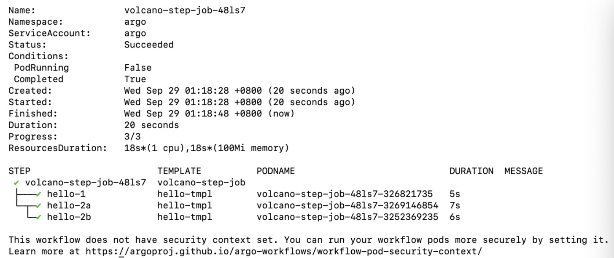
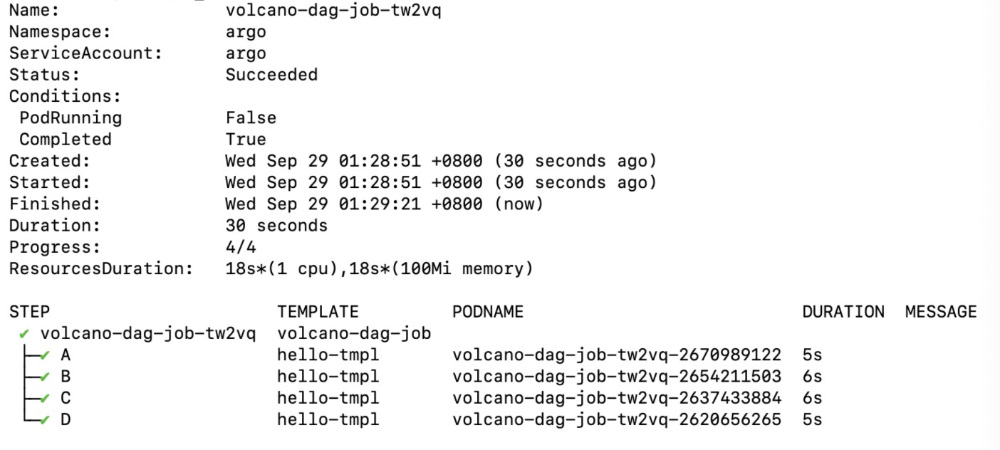

### 一、 Argo Workflows功能调研

Argo Workflows简称Argo， 是一个容器原生的工作流/流水线引擎，Argo工作流以CRD形式实现。它除了定义要执行的工作流，还会存储工作流程的状态。

Argo工作流的每一个步骤都是一个容器。多步骤的工作流建模为任务的序列，或者基于dag来捕获任务之间的依赖。其并行能力让计算密集型任务，例如机器学习、数据处理，可以在有限的时间内完成。Argo工作流可以用来运行CI/CD流水线。

Argo的templates主要分为两类，用来定义Argo的工作流特征：

- 定义具体的工作流

  - Container（是最常用的模版类型，调度一个container,模版规范和k8s的容器规范相同）
  - Script（作为container的另一种包装形式，其定义方法与container相同，只是增加了source字段用于自定义脚本）
  - Resource（用于直接在k8s集群上执行集群资源操作，可以get, create,apply,delete,replace,patch集群资源。**目前volcano 就是主要利用argo里面的resource template来创建 Volcano Job**）
  - Suspend（用于暂定一段时间，也可以手动恢复）

- 调用其他模版提供并行机制

  - Steps（通过一系列的步骤来定义任务，结构是 “list of lites”，外部列表顺序执行，内部列表并行执行），其中也支持条件语句与循环语句。
  - Dag（主要用于定义任务的依赖关系，可以设置开始特定任务之前，必须完成其他任务，没有依赖关系的任务将立即执行）

  **注：目前volcano支持的多task的job，有一些线性依赖就选用step工作流，多任务的前后依赖关系则用dag工作流。**

以volcano github官网上volcano/example/integrations/argo/10-job-step.yaml与volcano/example/integrations/argo/10-job-step.yaml/20-job-DAG.yaml为例，提交这两个Workflow，在控制台上查看其执行状态为：





接下来是argo官方提供的更多样例运行，以充分感知argo作为工作流引擎的功能特点。


##### 1.Parameters参数

argo支持为工作流中的节点提供参数，官网提供了如下的样例。如果工作流yaml文件包含输入参数，可以利用argo -p 给参数赋值。

```
apiVersion: argoproj.io/v1alpha1
kind: Workflow
metadata:
  generateName: hello-world-parameters-
spec:
  #  调用 whalesay
  entrypoint: whalesay
  #  定义参数message  值"hello world"
  arguments:
    parameters:
    - name: message
      value: hello world

  templates:
  - name: whalesay
    inputs:
      parameters:
      - name: message       # parameter declaration
    container:
      # run cowsay with that message input parameter as args
      image: docker/whalesay
      command: [cowsay]
      args: ["{{inputs.parameters.message}}"]

```


##### 2.Steps步骤

在这个例子中，我们能够看到argo最常见的使用方法，也是volcano的example关于argo给出的用法。使用step步骤可以创建多步骤工作流，可以在工作流规范中定义多个模板，并且创建嵌套工作流。

```
apiVersion: argoproj.io/v1alpha1
kind: Workflow
metadata:
  generateName: steps-
spec:
  entrypoint: hello-hello-hello
  #两个包含容器的模板：hello-hello-hello and whalesay
  templates:
  - name: hello-hello-hello
    # 这个模板中包含很多步骤，每个步骤运行一个容器
    # 步骤按照排列顺序，从上往下，同一个数组内的步骤，是并行执行
    steps:
    - - name: hello1           
        template: whalesay
        arguments:
          parameters:
          - name: message
            value: "hello1"
    - - name: hello2a          
        template: whalesay
        arguments:
          parameters:
          - name: message
            value: "hello2a"
      - name: hello2b          
        template: whalesay
        arguments:
          parameters:
          - name: message
            value: "hello2b"
  - name: whalesay
    inputs:
      parameters:
      - name: message
    container:
      image: docker/whalesay
      command: [cowsay]
      args: ["{{inputs.parameters.message}}"]

```

##### 3.DAG

DAG(有向无环图)是step工作流定义的一种替代方法。DAG可以通过指定每个任务的依赖关系，将工作流定义为一个DAG。对于复杂的工作流，这可以更简单地维护，并在运行任务时允许最大的并行性。在下面的工作流中，步骤A首先运行，因为它没有依赖关系。一旦A完成，步骤B和C将并行运行。最后，一旦B和C完成，就可以运行步骤D。这个用法在volcano的example给出了类似的例子。

```
apiVersion: argoproj.io/v1alpha1
kind: Workflow
metadata:
  generateName: dag-diamond-
spec:
  entrypoint: diamond
  templates:
  - name: echo
    inputs:
      parameters:
      - name: message
    container:
      image: alpine:3.7
      command: [echo, "{{inputs.parameters.message}}"]
  - name: diamond
    dag:
      tasks:
      - name: A
        template: echo
        arguments:
          parameters: [{name: message, value: A}]
      - name: B
        dependencies: [A]
        template: echo
        arguments:
          parameters: [{name: message, value: B}]
      - name: C
        dependencies: [A]
        template: echo
        arguments:
          parameters: [{name: message, value: C}]
      - name: D
        dependencies: [B, C]
        template: echo
        arguments:
          parameters: [{name: message, value: D}]
```

DAG有一个内置的快速失败结束特性，一旦检测到一个DAG节点失败，它就会停止调度新步骤。然后，在DAG自身失败之前，它会等待所有DAG节点完成。FailFast标志默认为true，如果设置为false，它将允许DAG运行DAG的所有分支直到完成(成功或失败)，而不考虑DAG中分支的失败结果。

##### 4.Artifacts工件

argo的output和input输出目录或文件到下一步骤，有部分场景需要使用output把目录或者文件传递到下一个步骤。

argo提供了如下两种方式：

- 参数方式parameter
- 工件方式artifacts

各自适用于不同的场景，参数方式是把某个文本的内容读取出来传递给下一步骤。工件方式可以传递文件本身或者文件目录。

工件方式需要有一个中转文件的地方，所以需要给argo配置一个存储引擎。

目前argo支持三种类型的存储：aws的s3，Google Cloud Storage，MinIO，在测试中采用了[MinIO的部署](https://github.com/argoproj/argo/blob/master/docs/configure-artifact-repository.md)。

在运行工作流时，生成或使用工件的步骤是非常常见的。通常，一个步骤的输出工件可以用作后续步骤的输入工件。工件示例的yaml文件如下。

```
apiVersion: argoproj.io/v1alpha1
kind: Workflow
metadata:
  generateName: artifact-passing-
spec:
  entrypoint: artifact-example
  templates:
  - name: artifact-example
    steps:
    - - name: generate-artifact
        template: whalesay
    - - name: consume-artifact
        template: print-message
        arguments:
          artifacts:
          # bind message to the hello-art artifact
          # generated by the generate-artifact step
          - name: message
            from: "{{steps.generate-artifact.outputs.artifacts.hello-art}}"

  - name: whalesay
    container:
      image: docker/whalesay:latest
      command: [sh, -c]
      args: ["cowsay hello world | tee /tmp/hello_world.txt"]
    outputs:
      artifacts:
      # generate hello-art artifact from /tmp/hello_world.txt
      # artifacts can be directories as well as files
      - name: hello-art
        path: /tmp/hello_world.txt

  - name: print-message
    inputs:
      artifacts:
      # unpack the message input artifact
      # and put it at /tmp/message
      - name: message
        path: /tmp/message
    container:
      image: alpine:latest
      command: [sh, -c]
      args: ["cat /tmp/message"]
```

##### 5.loops循环

在编写workflow的一些场景中，会用到迭代一组输入。argo中支持loops循环结构的workflow模版定义。

```
apiVersion: argoproj.io/v1alpha1
kind: Workflow
metadata:
  generateName: loops-param-arg-
spec:
  entrypoint: loop-param-arg-example
  arguments:
    parameters:
    - name: os-list                                     # a list of items
      value: |
        [
          { "image": "debian", "tag": "9.1" },
          { "image": "debian", "tag": "8.9" },
          { "image": "alpine", "tag": "3.6" },
          { "image": "ubuntu", "tag": "17.10" }
        ]

  templates:
  - name: loop-param-arg-example
    inputs:
      parameters:
      - name: os-list
    steps:
    - - name: test-linux
        template: cat-os-release
        arguments:
          parameters:
          - name: image
            value: "{{item.image}}"
          - name: tag
            value: "{{item.tag}}"
        withParam: "{{inputs.parameters.os-list}}"      # parameter specifies the list to iterate over

  # This template is the same as in the previous example
  - name: cat-os-release
    inputs:
      parameters:
      - name: image
      - name: tag
    container:
      image: "{{inputs.parameters.image}}:{{inputs.parameters.tag}}"
      command: [cat]
      args: [/etc/os-release]
```

##### 6.条件语句

Argo工作流支持根据条件去执行工作流中的某个步骤，下面的yaml使用条件模版给出了抛硬币的流程。

```
apiVersion: argoproj.io/v1alpha1
kind: Workflow
metadata:
  generateName: coinflip-
spec:
  entrypoint: coinflip
  templates:
  - name: coinflip
    steps:
    # flip a coin
    - - name: flip-coin
        template: flip-coin
    # evaluate the result in parallel
    - - name: heads
        template: heads                 # call heads template if "heads"
        when: "{{steps.flip-coin.outputs.result}} == heads"
      - name: tails
        template: tails                 # call tails template if "tails"
        when: "{{steps.flip-coin.outputs.result}} == tails"

  # Return heads or tails based on a random number
  - name: flip-coin
    script:
      image: python:alpine3.6
      command: [python]
      source: |
        import random
        result = "heads" if random.randint(0,1) == 0 else "tails"
        print(result)

  - name: heads
    container:
      image: alpine:3.6
      command: [sh, -c]
      args: ["echo \"it was heads\""]

  - name: tails
    container:
      image: alpine:3.6
      command: [sh, -c]
      args: ["echo \"it was tails\""]

```

##### 7.Output Parameters

类似于工件方式artifacts，argo提供了另外一种保存workflow中间任务产生数据的方式。

```
apiVersion: argoproj.io/v1alpha1
kind: Workflow
metadata:
  generateName: output-parameter-
spec:
  entrypoint: output-parameter
  templates:
  - name: output-parameter
    steps:
    - - name: generate-parameter
        template: whalesay
    - - name: consume-parameter
        template: print-message
        arguments:
          parameters:
          # Pass the hello-param output from the generate-parameter step as the message input to print-message
          #DAG模板调用参数-{{tasks.generate-parameter.outputs.parameter .hello-param}}。
          - name: message
            value: "{{steps.generate-parameter.outputs.parameters.hello-param}}"

  - name: whalesay
    container:
      image: docker/whalesay:latest
      command: [sh, -c]
      args: ["echo -n hello world > /tmp/hello_world.txt"]  # generate the content of hello_world.txt
    outputs:
      parameters:
      - name: hello-param		# name of output parameter
        valueFrom:
          path: /tmp/hello_world.txt	# set the value of hello-param to the contents of this hello-world.txt

  - name: print-message
    inputs:
      parameters:
      - name: message
    container:
      image: docker/whalesay:latest
      command: [cowsay]
      args: ["{{inputs.parameters.message}}"]
```

##### 8.Retrying Failed or Errored Steps

argo提供了工作流工作异常的处理机制，具体来说工作流yaml文件中提供一个`retryStrategy`字段来描述失败或者错误的工作流情况，包括如下三个字段：

- `limit`最大的重试次数
- `retryPolicy`重试策略，有`Always`、`OnFailure`(default)、`OnError`
- `backoff`指定重试时间

```
# This example demonstrates the use of retry back offs
apiVersion: argoproj.io/v1alpha1
kind: Workflow
metadata:
  generateName: retry-backoff-
spec:
  entrypoint: retry-backoff
  templates:
  - name: retry-backoff
    retryStrategy:
      limit: 10
      retryPolicy: "Always"
      backoff:
        duration: "1"      # Must be a string. Default unit is seconds. Could also be a Duration, e.g.: "2m", "6h", "1d"
        factor: 2
        maxDuration: "1m"  # Must be a string. Default unit is seconds. Could also be a Duration, e.g.: "2m", "6h", "1d"
    container:
      image: python:alpine3.6
      command: ["python", -c]
      # fail with a 66% probability
      args: ["import random; import sys; exit_code = random.choice([0, 1, 1]); sys.exit(exit_code)"]
```

##### 9.递归

argo的workflow模版支持递归地相互调用。还是以抛硬币为例，直到出现正面停止工作流。多次运行会发现每次的生成的workflow的结构是不相同的。

```
apiVersion: argoproj.io/v1alpha1
kind: Workflow
metadata:
  generateName: coinflip-recursive-
spec:
  entrypoint: coinflip
  templates:
  - name: coinflip
    steps:
    # flip a coin
    - - name: flip-coin
        template: flip-coin
    # evaluate the result in parallel
    - - name: heads
        template: heads                 # call heads template if "heads"
        when: "{{steps.flip-coin.outputs.result}} == heads"
      - name: tails                     # keep flipping coins if "tails"
        template: coinflip
        when: "{{steps.flip-coin.outputs.result}} == tails"
  - name: flip-coin
    script:
      image: python:alpine3.6
      command: [python]
      source: |
        import random
        result = "heads" if random.randint(0,1) == 0 else "tails"
        print(result)
  - name: heads
    container:
      image: alpine:3.6
      command: [sh, -c]
      args: ["echo \"it was heads\""]

```

##### 10.退出处理

退出处理程序是始终在工作流结束时执行的模板，无论成功或失败，可以作为workflow工作状态监控的重要指标。具体可以分为如下四种情况：

- 在工作流运行后进行清理
- 发送工作流状态通知
- 发布通过/失败状态到webhook结果 (e.g. GitHub build result)
- 重新提交或提交另一个工作流

```
apiVersion: argoproj.io/v1alpha1
kind: Workflow
metadata:
  generateName: exit-handlers-
spec:
  entrypoint: intentional-fail
  onExit: exit-handler                  # invoke exit-hander template at end of the workflow
  templates:
  # primary workflow template
  - name: intentional-fail
    container:
      image: alpine:latest
      command: [sh, -c]
      args: ["echo intentional failure; exit 1"]

  # Exit handler templates
  # After the completion of the entrypoint template, the status of the
  # workflow is made available in the global variable {{workflow.status}}.
  # {{workflow.status}} will be one of: Succeeded, Failed, Error
  - name: exit-handler
    steps:
    - - name: notify
        template: send-email
      - name: celebrate
        template: celebrate
        when: "{{workflow.status}} == Succeeded"
      - name: cry
        template: cry
        when: "{{workflow.status}} != Succeeded"
  - name: send-email
    container:
      image: alpine:latest
      command: [sh, -c]
      args: ["echo send e-mail: {{workflow.name}} {{workflow.status}}"]
  - name: celebrate
    container:
      image: alpine:latest
      command: [sh, -c]
      args: ["echo hooray!"]
  - name: cry
    container:
      image: alpine:latest
      command: [sh, -c]
      args: ["echo boohoo!"]
```

##### 11.Timeout

argo workflow可以为工作流设置超时时间，使用`activeDeadlineSeconds`字段。这在资源紧张的基础平台中，对于调度的高效性具有重要意义。

```
# To enforce a timeout for a container template, specify a value for activeDeadlineSeconds.
apiVersion: argoproj.io/v1alpha1
kind: Workflow
metadata:
  generateName: timeouts-
spec:
  entrypoint: sleep
  templates:
  - name: sleep
    container:
      image: alpine:latest
      command: [sh, -c]
      args: ["echo sleeping for 1m; sleep 60; echo done"]
    activeDeadlineSeconds: 10           # terminate container template after 10 seconds

```


### 二、 最新版本Argo新特性

在2021.08.20 最新发布的Argo Workflows V3.2新增了几个特性，其中比较典型的有：

##### 1.HTTP Template

HTTP  template类似于指定DAG，steps，container。HTTP template是一种可以执行HTTP请求的template。之前可能需要启动一个pod来发出HTTP请求，引入HTTP template以后将工作流与外部系统集成，不再需要为额外专门启动一个pod。

同时，v3.2引入了`Agent`体系结构，在单个pod中执行多个HTTP模板，提高了性能和资源利用率。`WorkflowTaskSet` CRD 用于workflow 主控制器和`Agent`之间的数据交换。

详细如下：

```yaml
apiVersion: argoproj.io/v1alpha1
kind: Workflow
metadata:
  generateName: http-template-
spec:
  entrypoint: main
  templates:
    - name: main
      steps:
        - - name: good
            template: http
            arguments:
              parameters: [{name: url, value: "https://raw.githubusercontent.com/argoproj/argo-workflows/4e450e250168e6b4d51a126b784e90b11a0162bc/pkg/apis/workflow/v1alpha1/generated.swagger.json"}]
    - name: http
      inputs:
        parameters:
          - name: url
      http:
       # url: http://dummy.restapiexample.com/api/v1/employees
       url: "{{inputs.parameters.url}}"
```

##### 2.Inline Template

可以在dag和steps中内联其他模版，但是只能内联一次，并且在DAG中内联DAG是无效的。

```yaml
apiVersion: argoproj.io/v1alpha1
kind: Workflow
metadata:
  generateName: dag-inline-
spec:
  entrypoint: main
  templates:
    - name: main
      dag:
        tasks:
          - name: a
            inline:
              container:
                image: argoproj/argosay:v2
```

##### 3.Conditional Based Retry Strategy

v3.2增强了现有的RetryStrategy以支持基于条件的RetryStrategy。如果条件满足，将触发重试。

```yaml
apiVersion: argoproj.io/v1alpha1
kind: Workflow
metadata:
  generateName: retry-script-
spec:
  entrypoint: main
  templates:
    - name: main
      steps:
        - - name: safe-to-retry
            template: safe-to-retry
        - - name: retry
            template: retry-script
            arguments:
              parameters:
                - name: safe-to-retry
                  value: "{{steps.safe-to-retry.outputs.result}}"

    - name: safe-to-retry
       script:
         image: python:alpine3.6
         command: ["python"]
         source: |
           print("true")

    - name: retry-script
       inputs:
         parameters:
             - name: safe-to-retry
       retryStrategy:
         limit: "3"
         # Only continue retrying if the last exit code is greater than 1 and the input parameter is true
         expression: "asInt(lastRetry.exitCode) > 1 && {{inputs.parameters.safe-to-retry}} == true"
       script:
         image: python:alpine3.6
         command: ["python"]
         # Exit 1 with 50% probability and 2 with 50%
        source: |
          import random;
          import sys;
          exit_code = random.choice([1, 2]);
          sys.exit(exit_code)
```


### 三、 volcano可以借鉴的功能

volcano当前给出的样例支持step和DAg的工作流模版。相对于argo还有很多可以补全的功能特性。

##### 1.volcano可以借鉴 Argo中的Workflow中允许使用变量

在Argo的Workflow中是允许使用变量的，比如变量还可以进行一些函数运算，主要有：

- filter：过滤
- asInt：转换为Int
- asFloat：转换为Float
- string：转换为String
- toJson：转换为Json	

在高性能计算场景下，如动画渲染、基因计算、气象计算等场景，使用并行计算框架MPI，主从线程之间有着明确的分工流程，并且涉及到大量的科学计算，此特性可以考虑融入。

##### 2.argo的制品库Artifact

argo为workflow中间数据的存储提供了制品和输出参数两种方式，在volcano的机器学习作业的场景下，涉及到频繁地ps与worker之间的信息交互，如果传输的数量很大，阻塞的通信方式可能会影响任务的性能，因此可以考虑使用中间件的异步通信。此时可以融入Argo的artifacts。

##### 3.argo新增的HTTP Template and Agent

pod之间的消息传递是不可避免的，在使用到基于HTTP的网络传输中，可以考虑融入Argo的HTTP template，在单个pod中执行多个HTTP模板，提高性能和资源利用率。

##### 4.Retrying Failed or Errored Steps和调度的融合

argo提供关于workflow异常执行后的重试次数、重试策略、重试时间等，与调度器的相关参数息息相关。volcano可以集成相关的功能，对workflow的调度提供更加全面的调度。

##### 5.Timeouts与调度的融合

argo提供workflow有关超时处理的机制，与调度器相关参数息息相关。

##### 6.循环、条件、递归结构的支持

支持多种形式的workflow模版，不仅仅限于简单的step和DAG的workflow模版，尽可能全面的满足用户需求。
