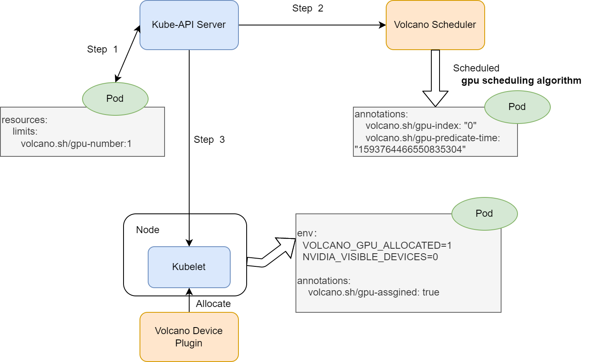

# GPU Number User guide

## Environment setup

### Install volcano


#### 1. Install from source

Refer to [Install Guide](../../installer/README.md) to install volcano.

After installed, update the scheduler configuration:

```shell script
kubectl edit cm -n volcano-system volcano-scheduler-configmap
```

```yaml
kind: ConfigMap
apiVersion: v1
metadata:
  name: volcano-scheduler-configmap
  namespace: volcano-system
data:
  volcano-scheduler.conf: |
    actions: "enqueue, allocate, backfill"
    tiers:
    - plugins:
      - name: priority
      - name: gang
      - name: conformance
    - plugins:
      - name: drf
      - name: predicates
        arguments:
          predicate.GPUNumberEnable: true # enable gpu number
      - name: proportion
      - name: nodeorder
      - name: binpack
```

#### 2. Install from release package.

Same as above, after installed, update the scheduler configuration in `volcano-scheduler-configmap` configmap.

### Install Volcano device plugin

Please refer to [volcano device plugin](https://github.com/volcano-sh/devices/blob/master/README.md#quick-start)

* Remember to config volcano device plugin to support gpu-number, users need to config volcano device plugin --gpu-strategy=number. For more information [volcano device plugin configuration](https://github.com/volcano-sh/devices/blob/master/doc/config.md)

### Verify environment is ready

Check the node status, it is ok  `volcano.sh/gpu-number` is included in the allocatable resources. 

```shell script
$ kubectl get node {node name} -oyaml
...
Capacity:
  attachable-volumes-gce-pd:  127
  cpu:                        2
  ephemeral-storage:          98868448Ki
  hugepages-1Gi:              0
  hugepages-2Mi:              0
  memory:                     7632596Ki
  pods:                       110
  volcano.sh/gpu-memory:      0
  volcano.sh/gpu-number:      1
Allocatable:
  attachable-volumes-gce-pd:  127
  cpu:                        1930m
  ephemeral-storage:          47093746742
  hugepages-1Gi:              0
  hugepages-2Mi:              0
  memory:                     5752532Ki
  pods:                       110
  volcano.sh/gpu-memory:      0
  volcano.sh/gpu-number:      1
```

### Running Jobs With Multiple GPU Cards

Jobs can have multiple exclusive NVIDIA GPUs cards via defining container level resource requirements `volcano.sh/gpu-number`:
```shell script
$ cat <<EOF | kubectl apply -f -
apiVersion: v1
kind: Pod
metadata:
  name: gpu-pod1
spec:
  containers:
    - name: cuda-container
      image: nvidia/cuda:9.0-devel
      command: ["sleep"]
      args: ["100000"]
      resources:
        limits:
          volcano.sh/gpu-number: 1 # requesting 1 gpu cards
EOF
```

If the above pods claim multiple gpu cards, you can see each of them has exclusive gpu cards:

```shell script
$ kubectl exec -ti  gpu-pod1 env
...
NVIDIA_VISIBLE_DEVICES=0
VOLCANO_GPU_ALLOCATED=1
...
```
### Understanding How Multiple GPU Cards Requirement Works 

The main architecture is similar as the previous, but the gpu-index results of each pod will be a list of gpu cards index. 



1. create a pod with `volcano.sh/gpu-number` resource request,

2. volcano scheduler predicates and allocate gpu cards to the pod. Add the below annotation

```yaml
annotations:
  volcano.sh/gpu-index: “0”
  volcano.sh/predicate-time: “1593764466550835304”
```

3. kubelet watches the pod bound to itself, and calls allocate API to set env before running the container.

```yaml
env:
  NVIDIA_VISIBLE_DEVICES: “0” # GPU card index
  VOLCANO_GPU_ALLOCATED: “1” # GPU number allocated
```