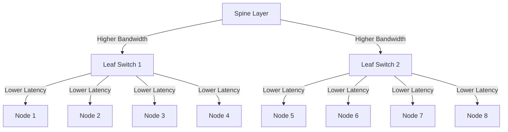

# Volcano Network Topology-Aware Scheduling Guide

## 1. Network Topology Challenges and Solutions

### 1.1 Challenges in RDMA Network Architectures

Modern data centers often employ RDMA networks (e.g., InfiniBand, RoCE) with **Fat Tree** or **Clos** architectures, featuring multi-layer switching hierarchies:



This hierarchical architecture introduces the following scheduling challenges:
- **Performance Variance**: Nodes under the same Leaf switch experience higher bandwidth and lower latency; jobs communicating across more switches may face network congestion.
- **Resource Fragmentation**: Without BinPack considerations, fragmented hierarchical resources can degrade cluster network performance.
- **Topology Constraints**: AI/ML training jobs require specific network topologies to meet communication requirements.

### 1.2 Volcano's Solution

Volcano provides **Network Topology-Aware Scheduling** capabilities:
- **HyperNode CRD**: Describes network topology hierarchies.
- **Topology Constraints**: Specifies network topology requirements within Jobs.
- **Intelligent Scheduling**: Prioritizes scheduling jobs within optimal topology domains to prevent performance degradation.

## 2. Network Topology Labeling and Management

### 2.1 Manual HyperNode Creation

Use the `HyperNode` CRD to describe network topology:

```yaml
apiVersion: topology.volcano.sh/v1alpha1
kind: HyperNode
metadata:
  name: leaf-switch-1
spec:
  tier: "1"  # Lower tier values indicate higher performance
  members:
  - type: Node
    selector:
      labelMatch:
        matchLabels:
          leaf: leaf-1
---
apiVersion: topology.volcano.sh/v1alpha1
kind: HyperNode
metadata:
  name: spine-switch-1
spec:
  tier: "2"  # Higher tier (lower performance)
  members:
  - type: HyperNode
    selector:
      exactMatch:
        name: leaf-switch-1
  - type: HyperNode
    selector:
      exactMatch:
        name: leaf-switch-2
```

### 2.2 Automated Topology Discovery

Volcano provides topology generation tools supporting multiple discovery methods:

- **InfiniBand**: Offers the `ibnetdiscover` tool for automatic IB network topology discovery. See: https://github.com/volcano-sh/volcano/pull/4286/files
- **RoCE**: Currently lacks a dedicated solution; may require collecting all LLDP information from each node.

## 3. Job Topology Constraint Configuration

### 3.1 Volcano Job Topology Constraints

Specify network topology requirements in Volcano Jobs:

```yaml
apiVersion: batch.volcano.sh/v1alpha1
kind: Job
metadata:
  name: distributed-training-job
spec:
  minAvailable: 3
  schedulerName: volcano
  networkTopology:
    mode: hard  # Hard constraint: topology requirements must be met
    highestTierAllowed: 1  # Highest allowed tier (lower numerical value indicates better performance)
  tasks:
  - replicas: 1
    name: master
    template:
      spec:
        containers:
        - name: master
          image: training-image:latest
          resources:
            requests:
              cpu: 4
              memory: 16Gi
              nvidia.com/gpu: 1
  - replicas: 2
    name: worker
    template:
      spec:
        containers:
        - name: worker
          image: training-image:latest
          resources:
            requests:
              cpu: 8
              memory: 32Gi
              nvidia.com/gpu: 4
```

## 4. Scheduler Configuration and Optimization

### 4.1 Key Scheduler Parameters

Configure the following parameters to ensure proper network topology-aware scheduling:

```yaml
# volcano-scheduler deployment configuration
apiVersion: apps/v1
kind: Deployment
metadata:
  name: volcano-scheduler
spec:
  template:
    spec:
      containers:
      - name: scheduler
        image: volcano-scheduler:latest
        command:
        - /vc-scheduler
        - --percentage-nodes-to-find=100  # Critical: must evaluate all nodes to guarantee optimal topology
```

### 4.2 Network Topology Plugin Configuration

Enable and optimize the network topology plugin in the scheduler configuration:

```yaml
apiVersion: v1
kind: ConfigMap
metadata:
  name: volcano-scheduler-config
data:
  volcano-scheduler.conf: |
    actions: "allocate, backfill"
    tiers:
    - plugins:
      - name: network-topology-aware  # Enable network topology plugin
        arguments:
          weight: 20                  # Plugin weight (impacts scheduling decisions)
          binpack.cpu: 1              # CPU resource weight
          binpack.memory: 2           # Memory resource weight
          binpack.resources: nvidia.com/gpu  # Custom resources
          binpack.resources.nvidia.com/gpu: 10  # GPU weight (higher)
```

Through the above configurations and usage guidelines, users can fully leverage Volcano's network topology-aware scheduling capabilities to optimize the performance and resource utilization of distributed workloads in complex network environments.