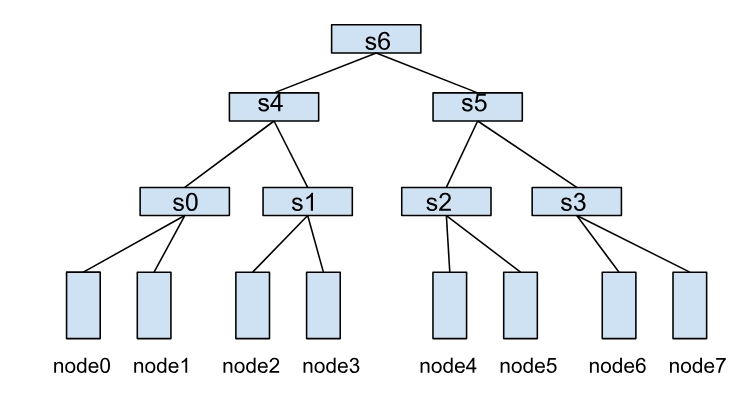
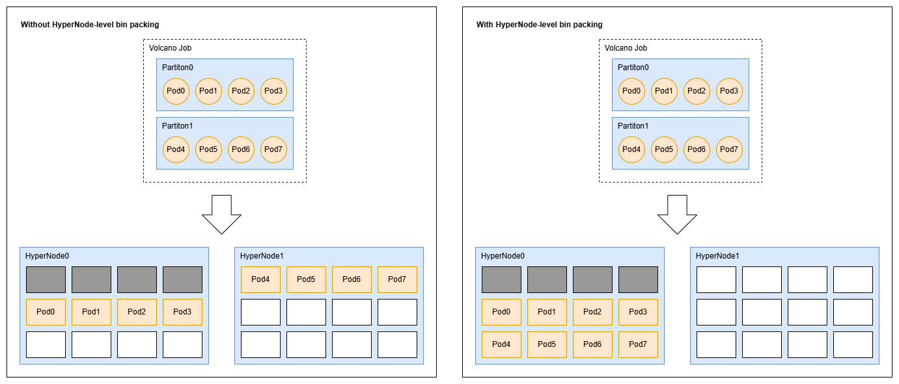
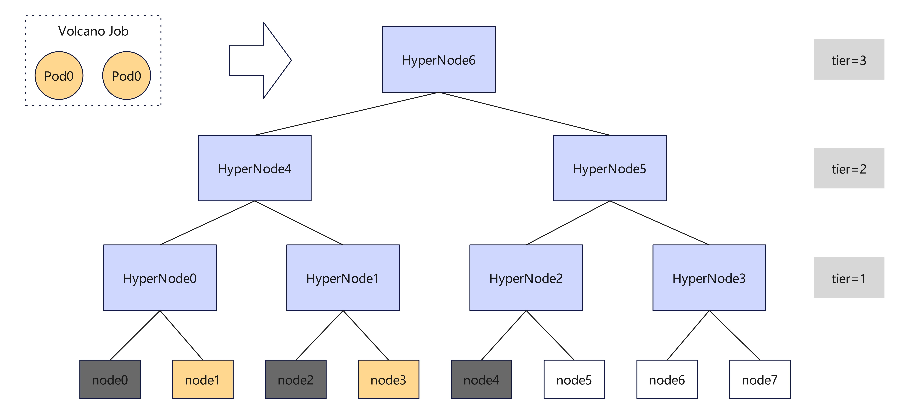

# Network Topology Aware Scheduling User Guide

## 1 Background

In the context of AI large model training, Model Parallelism divides the model across multiple nodes, requiring frequent and substantial data exchange between these nodes during training. At this point, the network transmission performance between nodes often becomes the bottleneck of training, significantly affecting training efficiency. Data centers have diverse network types (such as IB, RoCE, NVSwitch, etc.), and the network topology is complex, typically involving multiple layers of switches. The fewer switches between two nodes, the lower the communication latency and the higher the throughput. Therefore, users want to schedule workloads to the best performance domain with the highest throughput and lowest latency, minimizing cross-switch communication to accelerate data exchange and improve training efficiency.

To address this, Volcano proposed the **Network Topology Aware Scheduling** strategy, which uses a unified network topology API and intelligent scheduling policies to solve the network communication performance issues in large-scale data center AI training tasks.

## 2 Features

### 2.1 Unified Network Topology API: Accurately Expressing Network Topology

To shield the differences in data center network types, Volcano defines a new CRD **HyperNode** to represent the network topology, providing a standardized API interface. Compared to the traditional method of using node labels to represent network topology, HyperNode has the following advantages:

- **Unified Semantics**: HyperNode provides a standardized way to describe network topology, avoiding the semantic inconsistency issues of the label method.
- **Hierarchical Structure**: HyperNode supports a tree-like hierarchical structure, allowing for more precise representation of the actual network topology.
- **Easy Management**: Cluster administrators can manually create HyperNodes or use network topology auto-discovery tools to maintain HyperNodes.

A HyperNode represents a network topology performance domain, typically mapped to a switch or tor. Multiple HyperNodes are connected hierarchically to form a tree structure. For example, the following diagram shows a network topology composed of multiple HyperNodes:



In this structure, the communication efficiency between nodes depends on the HyperNode hierarchy span between them. For example:

- node0 and node1 belong to s0, achieving the highest communication efficiency.
- node1 and node2 need to cross two layers of HyperNodes (s0→s4→s1), resulting in lower communication efficiency.
- node0 and node4 need to cross three layers of HyperNodes (s0→s4→s6), resulting in the worst communication efficiency.

### 2.2 HyperNode Auto Discovery: Simplify Network Topology Management

To further reduce the management burden of network topology information, Volcano provides the HyperNode auto-discovery feature. This feature automatically discovers network topology structures within clusters and creates, updates, or deletes corresponding HyperNode Custom Resources (CRs) based on the discovery results.

The auto-discovery feature offers the following key benefits:

- **Automated Management**: Automatically discovers and maintains HyperNode information from various data sources (such as UFM, RoCE, or node labels), eliminating the need for manual maintenance.
- **Real-time Updates**: Periodically synchronizes network topology changes to ensure HyperNode information remains current with the actual network state.
- **Extensible Architecture**: Supports pluggable Discoverer components, allowing users to develop custom discovery logic for their specific network management tools.

Through this automated discovery mechanism, users can focus on job scheduling configuration without worrying about the complexities of HyperNode creation and maintenance, significantly simplifying the deployment and management of network topology-aware scheduling.

### 2.3 Network Topology Constraints: Improve Network Communication Efficiency

In Volcano Jobs, the `NetworkTopology` field can be configured to describe the network topology constraints during job deployment. The specific constraint configuration is as follows:

- `mode`: Supports `hard` and `soft` modes.
  - `hard`: Hard constraint, tasks within the job must be deployed within the same HyperNode.
  - `soft`: Soft constraint, tasks are deployed within the same HyperNode as much as possible.
- `highestTierAllowed`: Used with hard mode, indicating the highest tier of HyperNode allowed for job deployment. This field is not required when mode is soft.

For example, the following configuration means the job can only be deployed within HyperNodes of tier 2 or lower, such as s4 and s5, and their child nodes s0, s1, s2, s3. Otherwise, the job will remain in the Pending state:

```yaml
spec:
  networkTopology:
    mode: hard
    highestTierAllowed: 2
```

By configuring this scheduling constraint, users can precisely control the network topology constraints of the job, ensuring that the job runs in the best performance domain that meets the conditions, thereby significantly improving training efficiency.

### 2.4 SubGroup Affinity Policy: Fine-grained Control of Scheduling Constraints for Distributed Jobs

In large model training scenarios, the entire training task requires enormous resources, which typically cannot be deployed within a single network performance domain. It's necessary to split the training task into pipeline parallelism (PP) or data parallelism (DP), allowing parallel tasks to be deployed across network performance domains.

To address this, Volcano provides the SubGroup Affinity Policy. In a Volcano Job, the `partitionPolicy` field can be configured to partition Pods within a Job, and network topology constraints can be configured for each partition.

During scheduling, each partition will follow its own network topology constraints, thereby meeting the network communication performance requirements of each parallel task partition.

In addition, each partition must follow the Gang scheduling constraints. That is, a partition is allowed to be scheduled only when all pods within it meet the scheduling conditions.

For example, the following configuration indicates that the entire job is only allowed to be scheduled to HyperNodes at Tier 2 or below. And within the job, the 8 Pods are divided into 2 partitions, and each partition can only be scheduled to HyperNodes at Tier 1.

```yaml
spec:
  networkTopology:
    mode: hard
    highestTierAllowed: 2
  tasks:
    - name: "task1"
      replica: 8
      partitionPolicy:
        totalPartitions: 2
        partitionSize: 4
        networkTopology:
          mode: hard
          highestTierAllowed: 1
      template:
      # pod template
```

### 2.5 HyperNode-Level Bin Packing: Improve Resource Utilization for Network Topology Performance Domain

When scheduling workloads with network topology constraints, the scheduler will prioritize scheduling them to HyperNodes with higher current resource utilization to improve resource utilization in the network performance domain.

As shown in the diagram below, suppose there are two Tier 1 HyperNodes in the cluster, where HyperNode0 already has some resources occupied by other tasks. A user issues a Volcano Job, dividing it into two partitions, each configured with `highestTierAllowed=1`.



- Without HyperNode-level bin packing, the scheduling result might be that partition 0 is scheduled to HyperNode0, and partition 1 is scheduled to HyperNode1.
- With HyperNode-Level bin packing, both partition 0 and 1 will be prioritized for scheduling to HyperNode0. In this case, HyperNode1 can be used as a fully idle HyperNode for other tasks.

Furthermore, for workloads without network topology constraints, the scheduler will prioritize scheduling them to nodes with higher hypernode-level resource utilization (where each tier of hypernodes will be considered), in order to reduce the hypernode-level resource fragmentation.

For example, as shown in the figure below, there is a cluster consisting of 8 nodes and 7 hypernodes. Currently, the resources of node0, node2 and node4 are occupied by existing tasks, while those of the other nodes are idle. Then, at this point, a user submits a volcano job with two independent pods to this cluster.



- Without HyperNode-level bin packing, the scheduler may assign these two pods to node1 and node6, or node3 and node7, making the hypernode-level resource fragmentation more severe.
- With HyperNode-level bin packing, the scheduler will prefer to assign them to node1 and node3, leaving node5, node6 and node7 together for other larger network-topology-constrained workloads.

## 3 User Guide

### 3.1 Installing Volcano

Refer to [Install Guide](../../installer/README.md) to install Volcano.

After installed, update the scheduler configuration:

```shell
kubectl edit cm -n volcano-system volcano-scheduler-configmap
```

```yaml
kind: ConfigMap
apiVersion: v1
metadata:
  name: volcano-scheduler-configmap
  namespace: volcano-system
data:
  volcano-scheduler.conf: |
    actions: "enqueue, allocate, backfill"
    tiers:
    - plugins:
      - name: priority
      - name: gang
      - name: conformance
    - plugins:
      - name: drf
      - name: predicates
      - name: proportion
      - name: nodeorder
      - name: binpack
      - name: network-topology-aware # Add it to enable network-topology-aware plugin
        arguments:
          weight: 10
          hypernode.binpack.cpu: 5                                     # HyperNode-level bin packing weight for CPU
          hypernode.binpack.memory: 1                                  # HyperNode-Level bin packing weight for memory
          hypernode.binpack.resources: nvidia.com/gpu, example.com/foo # Custom resource names to be considered by the bin packing strategy
          hypernode.binpack.resources.nvidia.com/gpu: 2                # HyperNode-Level bin packing weight for "nvidia.com/gpu" resources
          hypernode.binpack.resources.example.com/foo: 3               # HyperNode-Level bin packing weight for "example.com/foo" resources
          hypernode.binpack.normal-pod.enable: true                    # Whether or not to enable HyperNode-level bin packing for normal pods
          hypernode.binpack.normal-pod.fading: 0.8                     # Parameter to control the weights of hypernodes of different tiers, i.e., the weights of hypernodes of tier `i` are math.Pow(fading, i-1) 
```

### 3.2 Building Network Topology

#### 3.2.1 Build via HyperNode Auto-Discovery (Recommended)

Refers to [How to Use HyperNode Auto Discovery](./how_to_use_hypernode_auto_discovery.md)

#### 3.2.2 Build Manually

You can build Network Topology by creating HyperNode CRs manually. Refer to the definition of CRD `hypernodes.topology.volcano.sh` for more details.

### 3.3 Deploy Workloads Using Network Topology Aware Scheduling

Based on the following network topology, this chapter will demonstrate how workloads can be deployed using Network Topology Aware Scheduling.


#### 3.3.1 Deploying Using Volcano Job With Network Topology Constraints Configured

1. Create a Volcano job where each Pod requests the full CPU resources of one node. Example follows:
   ```yaml
   apiVersion: batch.volcano.sh/v1alpha1
   kind: Job
   metadata:
     name: network-topology-job
     namespace: default
   spec:
     schedulerName: volcano
     minAvailable: 4
     networkTopology:
       mode: hard
       highestTierAllowed: 1
     tasks:
       - name: t0
         replicas: 8
         template:
           spec:
             containers:
               - name: c0
                 image: nginx:latest
                 resources:
                   requests:
                     cpu: "4"
                   limits:
                     cpu: "4"
   ```
2. The scheduling result is as follows:
   ```shell
   $ kubectl get pod -owide
   NAME                        READY   STATUS    RESTARTS   AGE   IP             NODE
   network-topology-job-t0-0   1/1     Running   0          5s    192.168.0.10   node4
   network-topology-job-t0-1   1/1     Running   0          5s    192.168.0.11   node5
   network-topology-job-t0-2   1/1     Running   0          5s    192.168.0.12   node6
   network-topology-job-t0-3   1/1     Running   0          5s    192.168.0.13   node7
   network-topology-job-t0-4   0/1     Pending   0          5s    <none>         <none>
   network-topology-job-t0-5   0/1     Pending   0          5s    <none>         <none>
   network-topology-job-t0-6   0/1     Pending   0          5s    <none>         <none>
   network-topology-job-t0-7   0/1     Pending   0          5s    <none>         <none>
   ```
   In this example, Pods within the Job cannot be scheduled across Tier 1 HyperNodes. The Job is scheduled to
   HyperNode1, which only has 4 nodes (Node4~Node7), so only 4 Pods are running.

#### 3.3.2 Deploying Using Volcano Job With Network Topology Constraints And SubGroup Affinity Policy Configured

1. Create a Volcano job where each Pod requests the full CPU resources of one node; and configure a SubGroup Affinity Policy to divide the 8 Pods within the Job into 2 partitions. Example follows:
   ```yaml
   apiVersion: batch.volcano.sh/v1alpha1
   kind: Job
   metadata:
     name: network-topology-job
     namespace: default
   spec:
     schedulerName: volcano
     minAvailable: 4
     networkTopology:
       mode: hard
       highestTierAllowed: 2
     tasks:
       - name: t0
         replicas: 8
         partitionPolicy:
           totalPartitions: 2
           partitionSize: 4
           networkTopology:
             mode: hard
             highestTierAllowed: 1
         template:
           spec:
             containers:
               - name: c0
                 image: nginx:latest
                 resources:
                   requests:
                     cpu: "4"
                   limits:
                     cpu: "4"
   ```
2. The scheduling result is as follows:
   ```shell
   $ kubectl get pod -owide
   NAME                        READY   STATUS    RESTARTS   AGE   IP             NODE
   network-topology-job-t0-0   1/1     Running   0          5s    192.168.0.10   node2
   network-topology-job-t0-1   1/1     Running   0          5s    192.168.0.11   node3
   network-topology-job-t0-2   1/1     Running   0          5s    192.168.0.12   node1
   network-topology-job-t0-3   1/1     Running   0          5s    192.168.0.13   node0
   network-topology-job-t0-4   1/1     Running   0          5s    192.168.0.14   node4
   network-topology-job-t0-5   1/1     Running   0          5s    192.168.0.15   node5
   network-topology-job-t0-6   1/1     Running   0          5s    192.168.0.16   node6
   network-topology-job-t0-7   1/1     Running   0          5s    192.168.0.17   node7
   ```
   In this example, the entire Job is scheduled to HyperNode2 (Node0~Node7). The first partition (Pod0~Pod3) is scheduled to HyperNode0 (Node0~Node3), the second partitions (Pod4~Pod7) is scheduled to HyperNode1 (Node4~Node7), and each partition satisfies its own network topology constraints.

#### 3.3.3 Deploying Using Volcano Job Without Network Topology Constraints

1. Create a Volcano job with two independent pods, where each Pod requests the full CPU resources of one node. Example follows:
   ```yaml
   apiVersion: batch.volcano.sh/v1alpha1
   kind: Job
   metadata:
     name: network-topology-job
     namespace: default
   spec:
     schedulerName: volcano
     minAvailable: 2
     tasks:
       - name: t0
         replicas: 2
         template:
           spec:
             containers:
               - name: c0
                 image: nginx:latest
                 resources:
                   requests:
                     cpu: "4"
                   limits:
                     cpu: "4"
   ```
2. The scheduling result is as follows:
   ```shell
   $ kubectl get pod -owide
   NAME                        READY   STATUS    RESTARTS   AGE   IP             NODE
   network-topology-job-t0-0   1/1     Running   0          5s    192.168.0.10   node0
   network-topology-job-t0-1   1/1     Running   0          5s    192.168.0.11   node1
   ```
   Since the resources are all idle, the first pod, i.e., network-topology-job-t0-0, will be scheduled to any node. It is node0 in this example. Then, the second pod, i.e., network-topology-job-t0-1, must be scheduled to node1, node2 or node3. It is node1 in this example. This is because the resource utilization of HyperNode0 is currently higher than HyperNode1.