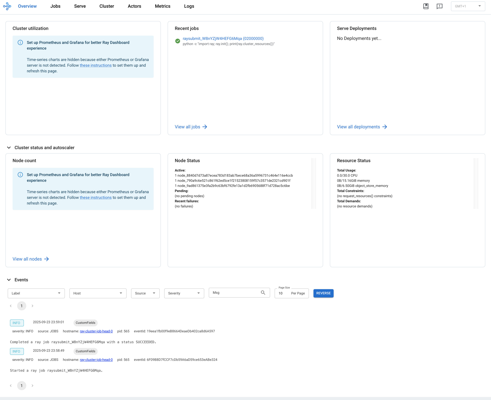

# Ray Plugin User Guide

## Introduction

**Ray plugin** is designed to optimize the user experience when deploying a ray cluster, it not only allows users to write less yaml, but also supports users to deploy a ray cluster.

## How the Ray Plugin Works

The Ray Plugin will do three things:

* Configure the commands of head and worker nodes in a ray cluster.
* Open three ports used by ray head node. (GCS, Ray dashboard and Client server)
* Create a service mapped to the ray head node container ports. (ex, submit a ray job, Access a ray dashboard and client server)

> *Note*
> - This plugin is based on the ray cli (Command Line Interface) and this guide use the [official ray docker image](https://hub.docker.com/r/rayproject/ray).
> - **svc plugin is necessary** when you use the ray plugin.

## Parameters of the Ray Plugin

### Arguments

| ID  | Name             | Type   | Default Value | Required | Description                             | Example                  |
| --- | ---------------- | ------ | ------------- | -------- | --------------------------------------- | ------------------------ |
| 1   | head             | string | head          | No       | Name of Head Task in Volcano Job        | --head=head              |
| 2   | worker           | string | worker        | No       | Name of Worker Task in Volcano Job      | --worker=worker          |
| 3   | headContainer    | string | head          | No       | Name of Main Container in a head task   | --headContainer=head     |
| 4   | workerContainer  | string | worker        | No       | Name of Main Container in a worker task | --workerContainer=worker |
| 5   | port             | string | 6379          | No       | The port to open for the GCS            | --port=6379              |
| 6   | dashboardPort    | string | 8265          | No       | The port to open for the Ray dashboard  | --dashboardPort=8265     |
| 7   | clientServerPort | string | 10001         | No       | The port to open for the client server  | --clientServerPort=10001 |

## Examples
> This guide is based on the instructions provided in the [RayCluster Quick Start.](https://docs.ray.io/en/master/cluster/kubernetes/getting-started/raycluster-quick-start.html#step-4-run-an-application-on-a-raycluster)

First, create a Ray cluster using the YAML manifest shown below.
- For more details about Ray clusters, see the [Ray Cluster Key Concepts documentation](https://docs.ray.io/en/latest/cluster/key-concepts.html).
- For more details about How to compose a ray cluster, see the [Launching an On-Premise Cluster](https://docs.ray.io/en/latest/cluster/vms/user-guides/launching-clusters/on-premises.html#on-prem).
```yaml
apiVersion: batch.volcano.sh/v1alpha1
kind: Job
metadata:
  name: ray-cluster-job
spec:
  minAvailable: 3
  schedulerName: volcano
  plugins:
    ray: []
    svc: []
  policies:
    - event: PodEvicted
      action: RestartJob
  queue: default
  tasks:
    - replicas: 1
      name: head
      template:
        spec:
          containers:
            - name: head
              image: rayproject/ray:latest-py311-cpu
              resources: {}
          restartPolicy: OnFailure
    - replicas: 2
      name: worker
      template:
        spec:
          containers:
            - name: worker
              image: rayproject/ray:latest-py311-cpu
              resources: {}
          restartPolicy: OnFailure 

```

Once applied, a Ray cluster consisting of a `head node` and one or more `worker nodes` will be provisioned.

```sh
kubectl get pod
```

```sh
NAME                       READY   STATUS    RESTARTS   AGE
ray-cluster-job-head-0     1/1     Running   0          106s
ray-cluster-job-worker-0   1/1     Running   0          106s
ray-cluster-job-worker-1   1/1     Running   0          106s
```

Along with the cluster, a `ray-cluster-job-head-svc` [Kubernetes service](https://kubernetes.io/docs/concepts/services-networking/service/) resource is also created.
(`ray-cluster-job` `service` is created by `svc` plugin.)
```sh
kubectl get service 
```

```bash
NAME                       TYPE        CLUSTER-IP     EXTERNAL-IP   PORT(S)                       AGE
ray-cluster-job            ClusterIP   None           <none>        <none>                        3s
ray-cluster-job-head-svc   ClusterIP   10.96.184.65   <none>        6379/TCP,8265/TCP,10001/TCP   3s
```

Now that the service name is available, use port-forwarding to access the Ray Dashboard port which is 8265 by default.

```sh
# Execute this in a separate shell.
kubectl port-forward service/ray-cluster-job-head-svc 8265:8265 > /dev/null &
```

Now that the Dashboard port is accessible, submit jobs to the RayCluster:
```sh
# The following job's logs will show the Ray cluster's total resource capacity, including 2 CPUs.
ray job submit --address http://localhost:8265 -- python -c "import ray; ray.init(); print(ray.cluster_resources())"
```

```sh
Job submission server address: http://localhost:8265

-------------------------------------------------------
Job 'raysubmit_W8nYZjW4HEFG6Mqa' submitted successfully
-------------------------------------------------------

Next steps
  Query the logs of the job:
    ray job logs raysubmit_W8nYZjW4HEFG6Mqa
  Query the status of the job:
    ray job status raysubmit_W8nYZjW4HEFG6Mqa
  Request the job to be stopped:
    ray job stop raysubmit_W8nYZjW4HEFG6Mqa

Tailing logs until the job exits (disable with --no-wait):
2025-09-23 14:58:49,442	INFO job_manager.py:531 -- Runtime env is setting up.
2025-09-23 14:59:00,106	INFO worker.py:1630 -- Using address 10.244.2.42:6379 set in the environment variable RAY_ADDRESS
2025-09-23 14:59:00,144	INFO worker.py:1771 -- Connecting to existing Ray cluster at address: 10.244.2.42:6379...
2025-09-23 14:59:00,161	INFO worker.py:1942 -- Connected to Ray cluster. View the dashboard at http://10.244.2.42:8265 
{'memory': 16277940225.0, 'node:10.244.4.41': 1.0, 'object_store_memory': 6976260095.0, 'CPU': 30.0, 'node:10.244.3.42': 1.0, 'node:10.244.2.42': 1.0, 'node:__internal_head__': 1.0}

------------------------------------------
Job 'raysubmit_W8nYZjW4HEFG6Mqa' succeeded
------------------------------------------

```

Visit `${YOUR_IP}:8265` in your browser for the Dashboard. For example, `127.0.0.1:8265`. See the job you submitted the above in the Recent jobs pane as shown below.

