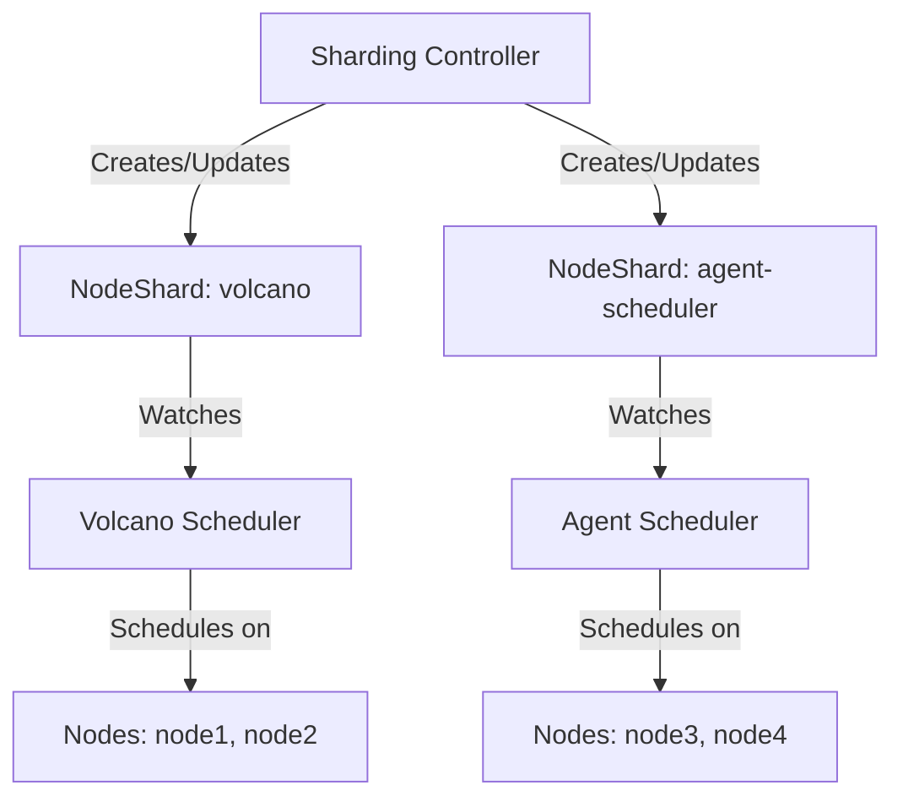

# How to Use the Sharding Controller

## Introduction

The Volcano Sharding Controller enables dynamic node partitioning across multiple schedulers, allowing different scheduler instances to work on different subsets of cluster nodes. This feature is particularly valuable for:

- **Mixed Workload Types**: Running specialized schedulers for different workload types (e.g., Agentic AI workloads alongside traditional batch jobs)
- **Large-Scale Clusters**: Eliminating single-scheduler bottlenecks by distributing scheduling work across multiple scheduler instances
- **Resource Optimization**: Dynamically assigning nodes based on resource utilization patterns
- **Workload Isolation**: Preventing scheduling conflicts between different workload types

### Architecture Overview

The sharding system consists of three main components:

1. **Sharding Controller**: Monitors cluster state and dynamically assigns nodes to shards based on resource utilization and configured policies
2. **NodeShard CRD**: Custom resource that defines which nodes belong to each shard
3. **Shard Coordinator** (in each scheduler): Synchronizes shard information and coordinates with other schedulers to avoid conflicts



## Prerequisites

- Volcano v1.14 or later
- Kubernetes 1.23 or later
- NodeShard CRD installed (included in Volcano installation)

## Quick Start

### 1. Enable Sharding in Scheduler

Configure your Volcano scheduler to use sharding by adding the following flags:

```bash
--scheduler-sharding-mode=soft \
--scheduler-sharding-name=volcano
```

**Sharding Modes:**
- `none` (default): No sharding, scheduler works with all cluster nodes
- `soft`: Scheduler prefers nodes in its shard but can use others if needed
- `hard`: Scheduler only uses nodes in its shard (strict isolation)

### 2. Create a NodeShard

Create a NodeShard resource to define which nodes belong to your scheduler:

```yaml
apiVersion: shard.volcano.sh/v1alpha1
kind: NodeShard
metadata:
  name: volcano
spec:
  nodesDesired:
    - node1
    - node2
    - node3
```

Apply the NodeShard:

```bash
kubectl apply -f nodeshard.yaml
```

### 3. Verify Shard Status

Check the NodeShard status to see which nodes are in use:

```bash
kubectl get nodeshards volcano -o yaml
```

Expected output:

```yaml
apiVersion: shard.volcano.sh/v1alpha1
kind: NodeShard
metadata:
  name: volcano
spec:
  nodesDesired:
    - node1
    - node2
    - node3
status:
  nodesInUse:
    - node1
    - node2
  nodesToAdd:
    - node3
  nodesToRemove: []
  lastUpdateTime: "2026-01-15T16:00:00Z"
```

## NodeShard CRD Reference

### Spec Fields

| Field | Type | Description | Required |
|-------|------|-------------|----------|
| `nodesDesired` | []string | List of node names that should be assigned to this shard | Yes |

### Status Fields

| Field | Type | Description |
|-------|------|-------------|
| `nodesInUse` | []string | Nodes currently being used by the scheduler |
| `nodesToAdd` | []string | Nodes preparing to be added (waiting for other schedulers to release them) |
| `nodesToRemove` | []string | Nodes preparing to be removed (still in use but should be released) |
| `lastUpdateTime` | string | Timestamp of the last status update |

### Status Field Semantics

- **nodesInUse**: The actual nodes currently in the scheduler's cache and available for scheduling
- **nodesToAdd**: Nodes from `nodesDesired` that are currently used by other schedulers and cannot be added immediately
- **nodesToRemove**: Nodes in `nodesInUse` that are no longer in `nodesDesired` but haven't been released yet

## Configuration

### Scheduler Configuration Flags

Add these flags to your scheduler deployment:

```yaml
apiVersion: apps/v1
kind: Deployment
metadata:
  name: volcano-scheduler
  namespace: volcano-system
spec:
  template:
    spec:
      containers:
      - name: volcano-scheduler
        image: volcanosh/vc-scheduler:latest
        args:
        - --scheduler-sharding-mode=soft
        - --scheduler-sharding-name=volcano
        - --logtostderr
        - --scheduler-conf=/volcano.scheduler/volcano-scheduler.conf
        - -v=3
```

### Sharding Mode Comparison

| Mode | Behavior | Use Case | Conflict Handling |
|------|----------|----------|-------------------|
| `none` | No sharding, uses all nodes | Single scheduler deployment | N/A |
| `soft` | Prefers shard nodes, can use others | Mixed workloads with fallback | Kubelet handles conflicts |
| `hard` | Only uses shard nodes | Strict workload isolation | No conflicts possible |

**Recommendation**: Start with `soft` mode for flexibility, move to `hard` mode for strict isolation if needed.

## Deployment Scenarios

### Scenario 1: Single Scheduler with Sharding

Basic setup with one scheduler using a subset of nodes:

```yaml
apiVersion: shard.volcano.sh/v1alpha1
kind: NodeShard
metadata:
  name: volcano
spec:
  nodesDesired:
    - node1
    - node2
    - node3
```

Scheduler configuration:
```bash
--scheduler-sharding-mode=soft
--scheduler-sharding-name=volcano
```

### Scenario 2: Multiple Schedulers with Dynamic Sharding

Deploy two schedulers handling different workload types:

**Volcano Scheduler** (for batch workloads):
```yaml
apiVersion: shard.volcano.sh/v1alpha1
kind: NodeShard
metadata:
  name: volcano
spec:
  nodesDesired:
    - batch-node-1
    - batch-node-2
    - batch-node-3
---
apiVersion: apps/v1
kind: Deployment
metadata:
  name: volcano-scheduler
  namespace: volcano-system
spec:
  template:
    spec:
      containers:
      - name: volcano-scheduler
        args:
        - --scheduler-sharding-mode=hard
        - --scheduler-sharding-name=volcano
```

**Agent Scheduler** (for Agentic AI workloads):
```yaml
apiVersion: shard.volcano.sh/v1alpha1
kind: NodeShard
metadata:
  name: agent-scheduler
spec:
  nodesDesired:
    - agent-node-1
    - agent-node-2
    - agent-node-3
---
apiVersion: apps/v1
kind: Deployment
metadata:
  name: agent-scheduler
  namespace: volcano-system
spec:
  template:
    spec:
      containers:
      - name: agent-scheduler
        args:
        - --scheduler-sharding-mode=hard
        - --scheduler-sharding-name=agent-scheduler
```

### Scenario 3: Sharding Controller with Dynamic Assignment

When using the Sharding Controller, nodes are automatically assigned based on resource utilization:

**Sharding Controller Configuration**:
```yaml
scheduler-configs:
- name: agent-scheduler
  type: agent
  cpu-utilization-min: 0.7
  cpu-utilization-max: 1.0
  prefer-warmup-nodes: true
  min-nodes: 1
  max-nodes: 100
- name: volcano-scheduler
  type: volcano
  cpu-utilization-min: 0.0
  cpu-utilization-max: 0.69
  prefer-warmup-nodes: false
  min-nodes: 1
  max-nodes: 100
```

The controller will:
- Assign high-utilization nodes (70-100% CPU) to the agent scheduler
- Assign low-utilization nodes (0-69% CPU) to the Volcano scheduler
- Dynamically update NodeShards as utilization changes

## Best Practices

### 1. Choosing the Right Sharding Mode

- **Use `none`** when running a single scheduler
- **Use `soft`** when you want flexibility and can tolerate occasional conflicts
- **Use `hard`** when strict workload isolation is required

### 2. Node Selection Strategy

- Group nodes by workload type (e.g., GPU nodes for AI, CPU nodes for batch)
- Consider node labels and taints when defining shards
- Ensure each shard has sufficient capacity for its workload type

### 3. Monitoring Shard Assignments

Monitor NodeShard status regularly:

```bash
# List all NodeShards
kubectl get nodeshards

# Watch NodeShard changes
kubectl get nodeshards -w

# Get detailed status
kubectl describe nodeshard volcano
```

### 4. Handling Node Changes

When nodes are added or removed from the cluster:

1. The Sharding Controller automatically updates NodeShards (if enabled)
2. Manual updates: Edit the NodeShard spec to add/remove nodes
3. Schedulers will sync changes within their next scheduling cycle

### 5. Performance Tuning

For large clusters:
- Use `hard` mode to eliminate scheduling conflicts
- Distribute nodes evenly across shards
- Monitor scheduler metrics to identify bottlenecks

## Troubleshooting

### Pods Not Scheduling to Expected Nodes

**Symptom**: Pods are scheduled to nodes outside the expected shard.

**Possible Causes**:
1. Sharding mode is `soft` and shard nodes don't meet pod requirements
2. NodeShard not properly configured
3. Scheduler not reading the correct NodeShard

**Solutions**:
```bash
# Check scheduler configuration
kubectl logs -n volcano-system deployment/volcano-scheduler | grep sharding

# Verify NodeShard exists and is correct
kubectl get nodeshard volcano -o yaml

# Check if scheduler is using hard mode
# In deployment: --scheduler-sharding-mode=hard
```

### NodeShard Status Not Updating

**Symptom**: `nodesInUse` field doesn't reflect actual node usage.

**Possible Causes**:
1. Scheduler session is running (Volcano scheduler only updates after session close)
2. Network issues preventing status updates
3. Scheduler doesn't have permissions to update NodeShard

**Solutions**:
```bash
# Check scheduler logs for errors
kubectl logs -n volcano-system deployment/volcano-scheduler

# Verify RBAC permissions
kubectl auth can-i update nodeshards --as=system:serviceaccount:volcano-system:volcano-scheduler

# Wait for next scheduling cycle or restart scheduler
kubectl rollout restart deployment/volcano-scheduler -n volcano-system
```

### Scheduling Conflicts Between Schedulers

**Symptom**: Multiple schedulers trying to bind pods to the same node.

**Possible Causes**:
1. Using `soft` mode with overlapping node preferences
2. NodeShards have overlapping `nodesDesired`
3. Scheduler not properly syncing shard information

**Solutions**:
```bash
# Switch to hard mode for strict isolation
--scheduler-sharding-mode=hard

# Ensure NodeShards don't overlap
kubectl get nodeshards -o yaml | grep nodesDesired

# Verify shard coordinator is working
kubectl logs -n volcano-system deployment/volcano-scheduler | grep "shard.*coordinator"
```

### High Scheduling Latency

**Symptom**: Pods take longer to schedule after enabling sharding.

**Possible Causes**:
1. Shard has insufficient nodes for workload
2. Frequent NodeShard updates causing cache invalidation
3. Scheduler waiting for nodes to be released from other shards

**Solutions**:
- Increase shard size by adding more nodes to `nodesDesired`
- Use `soft` mode to allow fallback to other nodes
- Reduce NodeShard update frequency in Sharding Controller configuration

## Advanced Topics

### Warmup Nodes

Mark nodes as "warmup" nodes for specialized workloads:

```bash
kubectl label node agent-node-1 node.volcano.sh/warmup=true
```

The Sharding Controller can prioritize warmup nodes for specific schedulers (e.g., agent scheduler for Agentic AI workloads).

### Custom Shard Names

Use custom shard names for better organization:

```bash
--scheduler-sharding-name=ml-training-scheduler
```

Then create a matching NodeShard:

```yaml
apiVersion: shard.volcano.sh/v1alpha1
kind: NodeShard
metadata:
  name: ml-training-scheduler
spec:
  nodesDesired:
    - gpu-node-1
    - gpu-node-2
```

### Integration with Node Selectors

Combine sharding with node selectors for fine-grained control:

```yaml
apiVersion: v1
kind: Pod
metadata:
  name: my-pod
spec:
  schedulerName: volcano
  nodeSelector:
    workload-type: batch
  containers:
  - name: app
    image: myapp:latest
```

The scheduler will only consider nodes in its shard that also match the node selector.

## FAQ

**Q: Can I change sharding mode without restarting the scheduler?**  
A: No, sharding mode is a startup flag and requires a scheduler restart to change.

**Q: What happens if a NodeShard is deleted?**  
A: The scheduler will fall back to using all cluster nodes (equivalent to `none` mode) until a new NodeShard is created.

**Q: Can multiple schedulers share the same NodeShard?**  
A: No, each scheduler should have its own NodeShard. Sharing would cause conflicts.

**Q: How does sharding affect scheduling latency?**  
A: `hard` mode may slightly increase latency if the shard is small. `soft` mode has minimal impact as it can fall back to other nodes.

**Q: Can I manually update `nodesInUse` in the status?**  
A: No, the status is managed by the scheduler's shard coordinator. Manual changes will be overwritten.

## Next Steps

- Review the [Sharding Controller Design Document](../design/sharding_controller.md) for technical details
- Explore [Agent Scheduler Documentation](../design/agent-scheduler.md) for Agentic AI workload scheduling
- Check out [example configurations](../../example/sharding/) for common deployment scenarios
- Learn about [scheduler configuration](how_to_configure_scheduler.md) for additional tuning options

## References

- [NodeShard CRD Definition](../../config/crd/volcano/bases/shard.volcano.sh_nodeshards.yaml)
- [Volcano Architecture](https://volcano.sh/en/docs/architecture/)
- [Kubernetes Custom Resources](https://kubernetes.io/docs/concepts/extend-kubernetes/api-extension/custom-resources/)
