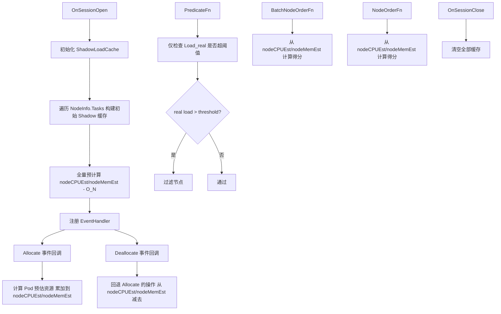
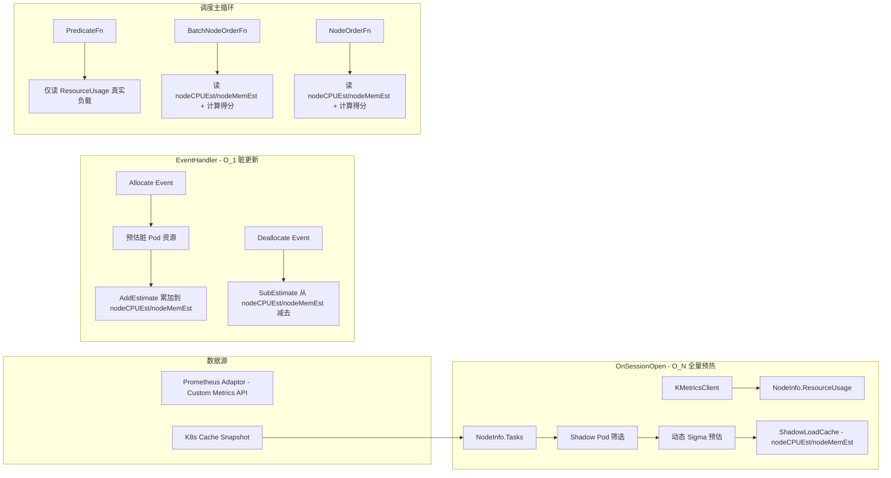

# Volcano 批量负载感知调度功能实现计划

## 1. 功能概述

在现有 `usage` 插件的基础上，增强负载感知调度能力，引入以下核心功能：

1. **资源预估模型**：基于动态 Sigma 策略，对已调度但监控尚不可见的 Pod 进行资源预估
2. **Shadow Pod 追踪器（ShadowLoadCache）**：Session 级别的虚拟负载缓存，记录每个节点的预估 CPU/MEM 负载
3. **预计算得分缓存**：OnSessionOpen 时全量预热 nodeCPUEst/nodeMemEst，EventHandler 脏节点增量更新，调度主循环从缓存计算得分
4. **BatchNodeOrderFn**：基于预计算缓存，将打分复杂度从 O(M×N) 降维到 O(N+M)
5. **异常降级**：Prometheus 宕机时自动降级

## 2. 性能优化核心：预计算得分缓存范式

### 2.1 问题分析

原生 `NodeOrderFn` 在大规模集群中的性能瓶颈：

- 对每个待调度 Pod，遍历每个候选节点调用一次打分函数
- 时间复杂度：O(M × N)（M=Pod 数量，N=Node 数量）
- 5000 节点 × 2000 Pod = **10,000,000 次** 调用，每次含 Sigmoid 等高开销运算

### 2.2 核心洞察：节点得分在 Session 内"准静态"

一个节点的负载得分仅取决于：
- `Load_real`（Prometheus 采集的固定值，Session 内不变）
- `Load_shadow`（预估值，仅在 Allocate/Deallocate 时变化）

**只要节点没有被新分配 Pod（没有触发 Allocate 事件），得分绝对不变，与当前正在调度的 Pod 无关。**

### 2.3 三步降维打击

| 阶段 | 操作 | 复杂度 | 频率 |
|------|------|--------|------|
| OnSessionOpen | 全量预计算所有节点 nodeCPUEst/nodeMemEst | O(N) | 每 Session 一次 |
| EventHandler Allocate | 更新脏节点 nodeCPUEst/nodeMemEst | O(1) | 每次分配一次 |
| BatchNodeOrderFn | 从 nodeCPUEst/nodeMemEst 计算得分 | O(N) 遍历但 O(1) 单次 | 每个 Pod 一次 |

**总复杂度**：O(N + M)，相比原来的 O(M × N) 实现降维打击。

## 3. 架构总览



## 4. 文件结构设计

```
pkg/scheduler/plugins/usage/
├── usage.go              # 主插件文件 - 需修改
├── shadow_cache.go       # 新增 - ShadowLoadCache 实现
├── estimator.go          # 新增 - 动态 Sigma 资源预估模型
├── usage_test.go         # 已有 - 需扩展
├── shadow_cache_test.go  # 新增 - ShadowLoadCache 测试
├── estimator_test.go     # 新增 - 预估模型测试
```

## 5. 详细实现计划

### 5.1 ShadowLoadCache 数据结构

**文件**: `pkg/scheduler/plugins/usage/shadow_cache.go`

```go
// ShadowLoadCache 是 Session 级别的预估负载缓存
// 记录每个节点上 Shadow Pod 的预估 CPU/MEM 总量
type ShadowLoadCache struct {
    mu sync.RWMutex

    // key: NodeName, value: 该节点上所有 Shadow Pod 的预估 CPU 总量（milliCPU 绝对值）
    nodeCPUEst map[string]float64

    // key: NodeName, value: 该节点上所有 Shadow Pod 的预估 Memory 总量（bytes 绝对值）
    nodeMemEst map[string]float64

    // key: NodeName, value: 该节点上 BestEffort Pod 的数量
    BestEffortCounts map[string]int
}
```

关键方法：

```go
// --- 构造与清理 ---
func NewShadowLoadCache() *ShadowLoadCache
func (c *ShadowLoadCache) Reset()
func (c *ShadowLoadCache) IsClean() bool

// --- 写操作（写锁）---
// AddEstimate 累加一个 Pod 的预估资源到节点
func (c *ShadowLoadCache) AddEstimate(nodeName string, cpuMillis, memBytes float64, isBestEffort bool)
// SubEstimate 从节点减去一个 Pod 的预估资源（Deallocate 回退）
func (c *ShadowLoadCache) SubEstimate(nodeName string, cpuMillis, memBytes float64, isBestEffort bool)

// --- 读操作（读锁）---
// GetNodeEst 获取节点的预估 CPU/MEM 负载
func (c *ShadowLoadCache) GetNodeEst(nodeName string) (cpuEst, memEst float64)
// GetBestEffortCount 获取节点的 BestEffort Pod 计数
func (c *ShadowLoadCache) GetBestEffortCount(nodeName string) int
```

### 5.2 动态 Sigma 资源预估模型

**文件**: `pkg/scheduler/plugins/usage/estimator.go`

```go
// EstimatorConfig 预估模型配置
type EstimatorConfig struct {
    SigmaBase   float64  // 基础风险底线，默认 0.15
    Threshold   float64  // 警戒水位线，默认 0.5
    Sensitivity float64  // 灵敏度 k，默认 12.0
    BERatio     float64  // BestEffort 默认资源比例，默认 0.1
    BEPenalty   float64  // BestEffort 密度惩罚系数，默认 1.2
}

// CalcDynamicSigma 计算动态风险系数
// sigma = sigma_base + (1 - sigma_base) / (1 + exp(-k * (U_node - Threshold)))
func CalcDynamicSigma(config *EstimatorConfig, nodeUtilization float64) float64

// EstimatePodResource 统一估算 Pod 的单维度资源占用（CPU 或 MEM）
// 有 Request/Limit: Request + (Limit - Request) * sigma_dynamic
// BestEffort: nodeCap * ratio * beta^n
// 参数 request/limit 为该维度的 Pod 资源请求/限制绝对值
// 参数 nodeCap 为该维度的节点容量绝对值
// 参数 nodeComp 为该维度的节点综合利用率（0.0-1.0）
// 参数 bestEffortCount 为该节点上已有的 BestEffort Pod 数量
// 参数 isBestEffort 标识当前 Pod 是否为 BestEffort
func EstimatePodResource(config *EstimatorConfig, request, limit, nodeCap, nodeComp float64,
    bestEffortCount int, isBestEffort bool) float64

// CalcCompositeUtilization 分维度计算综合利用率（CPU 维度或 MEM 维度）
// U_r = (realLoadPercent/100 * capacity + shadowEstAbs) / capacity，截断上限 1.0
// 参数 realLoadPercent 为百分比（0-100），shadowEstAbs 为绝对值，capacity 为节点容量绝对值
func CalcCompositeUtilization(realLoadPercent float64, shadowEstAbs, capacity float64) float64

// CalcNodeScore 从综合利用率计算节点得分
// score = ((1 - cpuComp) * cpuWeight + (1 - memComp) * memWeight) / (cpuWeight + memWeight) * MaxNodeScore
// 注意：usageWeight 是插件在调度器整体打分中的权重，由框架层处理，不在此函数中乘入
// cpuWeight/memWeight 读取自 usagePlugin 的 cpuWeight/memoryWeight 配置
func CalcNodeScore(cpuComp, memComp float64, cpuWeight, memWeight int) float64
```

**动态 Sigma 公式**：
$$\sigma_{dynamic} = \sigma_{base} + \frac{1 - \sigma_{base}}{1 + e^{-k(U_{node} - Threshold)}}$$

**有 Request/Limit Pod 预估**：
$$Usage_{est} = Request + (Limit - Request) \times \sigma_{dynamic}$$

**BestEffort Pod 预估**：
$$Usage_{est} = NodeCap \times ratio \times \beta^n$$

**综合利用率**：
$$U_r = \frac{MetricsLoad_r + \sum ShadowEst_{r,pod}}{Capacity_r}$$
注意：如果结果 > 1.0，截断为 1.0。

**节点打分公式**：
$$Score = \frac{(1 - cpuComp) \times cpuWeight + (1 - memComp) \times memWeight}{cpuWeight + memWeight} \times MaxNodeScore$$
注意：`usageWeight` 是插件在调度器整体打分中的权重，由框架层自动处理，不在此公式中乘入。`cpuWeight`/`memWeight` 读取自 `usagePlugin` 的 `cpuWeight`/`memoryWeight` 配置。

### 5.3 扩展 usage 插件配置参数

**文件**: `pkg/scheduler/plugins/usage/usage.go`

扩展 `usagePlugin` 结构体：

```go
type usagePlugin struct {
    // === 现有字段保持不变 ===
    pluginArguments framework.Arguments
    usageWeight     int
    cpuWeight       int
    memoryWeight    int
    usageType       string
    cpuThresholds   float64
    memThresholds   float64
    period          string

    // === 新增字段 ===
    estimatorConfig *EstimatorConfig   // 预估模型配置
    shadowCache     *ShadowLoadCache   // Session 级预估负载缓存
    metricsInterval time.Duration      // 监控数据采集时延窗口（从 configmap metrics.interval 获取）
}
```

新增配置项从 `arguments` 中解析：
- `dynamic.sigma_base`: 默认 0.15
- `dynamic.threshold`: 默认 0.5
- `dynamic.sensitivity`: 默认 12.0
- `be_default_ratio`: 默认 0.1
- `be_penalty_factor`: 默认 1.2

### 5.4 OnSessionOpen 全量预热

这是性能优化的第一步：在 Session 开启时，一次性完成所有 O(N) 的高开销计算。

```
OnSessionOpen 流程：

1. 检查 ShadowLoadCache 是否干净（IsClean），不干净则 Reset
2. 初始化新的 ShadowLoadCache
3. 从 scheduler configmap 获取 metrics.interval 作为监控时延窗口
4. 遍历 ssn.Nodes 中所有节点：
   a. 遍历该节点的 Tasks：
      - 判断是否需要加入 ShadowCache（shouldAddToShadowCache）
      - 对需要加入的 Pod：
        * 先读普罗上报的真实利用率（realCPU/realMem）
        * 计算当前节点综合利用率 cpuComp/memComp（用于 Sigmoid）
        * 调用 EstimatePodResource 分别计算 CPU/MEM 预估值
        * 调用 shadowCache.AddEstimate 累加到 nodeCPUEst/nodeMemEst
5. 注册 EventHandler（见 5.5）
6. 注册 PredicateFn / NodeOrderFn / BatchNodeOrderFn
```

Shadow Pod 判断逻辑：
```go
func shouldAddToShadowCache(task *api.TaskInfo, metricsDelay time.Duration) bool {
    // 只看已分配节点的 Pod
    if task.NodeName == "" {
        return false
    }
    switch task.Status {
    case api.Pending:
        // 已分配节点但仍 Pending - 说明前一个 Session 做出的调度决策
        return true
    case api.Running:
        // 运行时间小于监控时延窗口 - 监控还没采到
        if task.Pod.Status.StartTime == nil {
            return true
        }
        return time.Since(task.Pod.Status.StartTime.Time) < metricsDelay
    default:
        // Succeeded, Failed, Unknown, Binding, Bound - 不加入
        return false
    }
}
```

### 5.5 EventHandler 脏节点增量更新

这是性能优化的第二步：当 Pod 被分配到节点时，**只更新受影响的那一个节点**。

```go
ssn.AddEventHandler(&framework.EventHandler{
    AllocateFunc: func(event *framework.Event) {
        task := event.Task
        nodeName := task.NodeName
        node, ok := ssn.Nodes[nodeName]
        if !ok {
            return
        }

        // Step 1: 读取普罗上报的真实利用率 + 当前 Shadow 预估值，计算综合利用率
        cpuEst, memEst := up.shadowCache.GetNodeEst(nodeName)
        realCPU := getRealCPUPercent(node, up.period)
        realMem := getRealMemPercent(node, up.period)
        cpuComp := CalcCompositeUtilization(realCPU, cpuEst, node.Capacity.MilliCPU)
        memComp := CalcCompositeUtilization(realMem, memEst, node.Capacity.Memory)

        // Step 2: 计算 Pod 预估资源（统一调用 EstimatePodResource，分 CPU/MEM 维度）
        bestEffortCount := up.shadowCache.GetBestEffortCount(nodeName)
        cpuReq, cpuLim := getPodCPURequestLimit(task.Pod)
        memReq, memLim := getPodMemRequestLimit(task.Pod)
        estCPU := EstimatePodResource(up.estimatorConfig, cpuReq, cpuLim,
            node.Capacity.MilliCPU, cpuComp, bestEffortCount, task.BestEffort)
        estMem := EstimatePodResource(up.estimatorConfig, memReq, memLim,
            node.Capacity.Memory, memComp, bestEffortCount, task.BestEffort)

        // Step 3: 累加到 ShadowCache
        up.shadowCache.AddEstimate(nodeName, estCPU, estMem, task.BestEffort)
    },

    DeallocateFunc: func(event *framework.Event) {
        task := event.Task
        nodeName := task.NodeName
        node, ok := ssn.Nodes[nodeName]
        if !ok {
            return
        }

        // 回退 Allocate 的操作：重新计算该 Pod 的预估值并减去
        cpuEst, memEst := up.shadowCache.GetNodeEst(nodeName)
        realCPU := getRealCPUPercent(node, up.period)
        realMem := getRealMemPercent(node, up.period)
        cpuComp := CalcCompositeUtilization(realCPU, cpuEst, node.Capacity.MilliCPU)
        memComp := CalcCompositeUtilization(realMem, memEst, node.Capacity.Memory)

        bestEffortCount := up.shadowCache.GetBestEffortCount(nodeName)
        cpuReq, cpuLim := getPodCPURequestLimit(task.Pod)
        memReq, memLim := getPodMemRequestLimit(task.Pod)
        estCPU := EstimatePodResource(up.estimatorConfig, cpuReq, cpuLim,
            node.Capacity.MilliCPU, cpuComp, bestEffortCount, task.BestEffort)
        estMem := EstimatePodResource(up.estimatorConfig, memReq, memLim,
            node.Capacity.Memory, memComp, bestEffortCount, task.BestEffort)

        // 从 ShadowCache 减去
        up.shadowCache.SubEstimate(nodeName, estCPU, estMem, task.BestEffort)
    },
})
```

### 5.6 PredicateFn — 仅检查真实负载

Predicate 阶段**只使用 Prometheus 上报的真实节点负载**，不使用 Shadow 预估值。

```go
predicateFn := func(task *api.TaskInfo, node *api.NodeInfo) error {
    // 降级检查：监控不可用时放行
    if !up.isMetricsAvailable(node) {
        return nil
    }

    // 仅检查真实负载是否超阈值
    realCPU := node.ResourceUsage.CPUUsageAvg[up.period]
    realMem := node.ResourceUsage.MEMUsageAvg[up.period]

    if realCPU > up.cpuThresholds {
        // CPU 真实负载超阈值，过滤
        return api.NewFitErrWithStatus(task, node, ...)
    }
    if realMem > up.memThresholds {
        // Memory 真实负载超阈值，过滤
        return api.NewFitErrWithStatus(task, node, ...)
    }
    return nil
}
```

### 5.7 BatchNodeOrderFn — 从缓存计算得分

BatchNodeOrderFn 从 `nodeCPUEst` / `nodeMemEst` 计算综合利用率，再计算得分。由于 nodeCPUEst/nodeMemEst 已在 OnSessionOpen 和 EventHandler 中维护好，此处只需简单的浮点运算。

```go
batchNodeOrderFn := func(task *api.TaskInfo, nodes []*api.NodeInfo) (map[string]float64, error) {
    scores := make(map[string]float64, len(nodes))
    for _, node := range nodes {
        if !up.isMetricsAvailable(node) {
            scores[node.Name] = 0
            continue
        }
        // 从缓存读取预估值
        cpuEst, memEst := up.shadowCache.GetNodeEst(node.Name)
        // 分维度计算综合利用率
        realCPU := getRealCPUPercent(node, up.period)
        realMem := getRealMemPercent(node, up.period)
        cpuComp := CalcCompositeUtilization(realCPU, cpuEst, node.Capacity.MilliCPU)
        memComp := CalcCompositeUtilization(realMem, memEst, node.Capacity.Memory)
        // 计算得分（cpuWeight/memWeight 读自 usagePlugin 配置）
        scores[node.Name] = CalcNodeScore(cpuComp, memComp,
            up.cpuWeight, up.memoryWeight)
    }
    return scores, nil
}

ssn.AddBatchNodeOrderFn(up.Name(), batchNodeOrderFn)
```

### 5.8 NodeOrderFn — 兼容保留，同样从缓存计算

```go
nodeOrderFn := func(task *api.TaskInfo, node *api.NodeInfo) (float64, error) {
    if !up.isMetricsAvailable(node) {
        return 0, nil
    }
    cpuEst, memEst := up.shadowCache.GetNodeEst(node.Name)
    realCPU := getRealCPUPercent(node, up.period)
    realMem := getRealMemPercent(node, up.period)
    cpuComp := CalcCompositeUtilization(realCPU, cpuEst, node.Capacity.MilliCPU)
    memComp := CalcCompositeUtilization(realMem, memEst, node.Capacity.Memory)
    return CalcNodeScore(cpuComp, memComp, up.cpuWeight, up.memoryWeight), nil
}

ssn.AddNodeOrderFn(up.Name(), nodeOrderFn)
```

### 5.9 Prometheus 宕机降级

沿用原有 usage 插件中的降级检测逻辑：

```go
// isMetricsAvailable 沿用原有 usage 插件的实现逻辑
// 检查 period 是否为空 + MetricsTime 是否在 MetricsActiveTime 内
func (up *usagePlugin) isMetricsAvailable(node *api.NodeInfo) bool {
    now := time.Now()
    if up.period == "" || now.Sub(node.ResourceUsage.MetricsTime) > MetricsActiveTime {
        return false
    }
    return true
}
```

降级行为：
- **PredicateFn**：对所有节点放行（不过滤）
- **NodeOrderFn / BatchNodeOrderFn**：返回 0 分（不影响其他插件打分）

### 5.10 OnSessionClose 缓存清理

```go
func (up *usagePlugin) OnSessionClose(ssn *framework.Session) {
    if up.shadowCache != nil {
        up.shadowCache.Reset()
    }
}
```

## 6. 完整数据流图



## 7. ConfigMap 配置示例

```yaml
actions: "enqueue, allocate, backfill"
tiers:
- plugins:
  - name: usage
    enablePredicate: true
    arguments:
      usage.weight: 5
      cpu.weight: 1
      memory.weight: 1
      thresholds:
        cpu: 80
        mem: 80
      # --- 动态 Sigma 策略参数 ---
      dynamic.sigma_base: 0.15
      dynamic.threshold: 0.5
      dynamic.sensitivity: 12.0
      # --- BestEffort Pod 处理 ---
      be_default_ratio: 0.1
      be_penalty_factor: 1.2
metrics:
  type: prometheus_adaptor
  interval: 30s
```

注意：`prometheus_adaptor` 类型使用 Kubernetes Custom Metrics API（通过 `k8s.io/metrics/pkg/client/custom_metrics`），不需要额外的 address 配置。调度器通过 rest.Config 直接访问 API Server 的 custom metrics 端点。

## 8. 并发安全设计

| 操作阶段 | 锁类型 | 说明 |
|---------|--------|------|
| OnSessionOpen 初始化 + 全量预热 | 无需锁 | 单线程，Session 尚未开放给 Action |
| EventHandler.AllocateFunc | 写锁 Lock | AddEstimate 累加预估值 |
| EventHandler.DeallocateFunc | 写锁 Lock | SubEstimate 减去预估值 |
| PredicateFn | 无需锁 | 仅读 NodeInfo.ResourceUsage（不访问 ShadowCache） |
| NodeOrderFn | 读锁 RLock | 读取 nodeCPUEst/nodeMemEst |
| BatchNodeOrderFn | 读锁 RLock | 批量读取 nodeCPUEst/nodeMemEst |
| OnSessionClose 清理 | 无需锁 | 单线程，Session 已关闭 |

## 9. 异常场景处理

| 场景 | 处理方式 |
|------|---------|
| Prometheus Adaptor 宕机 | MetricsTime 为零值 → PredicateFn 全放行，打分为 0 |
| 监控数据超过 5 分钟未更新 | 同上处理 |
| 节点在 Session 中途消失 | EventHandler 检查 node 是否存在，不存在则跳过 |
| BestEffort Pod 堆积 | 指数惩罚公式 beta^n 自动抑制 |
| ShadowCache 未正确清理 | OnSessionOpen 首先执行 IsClean 检查 + Reset |
| Deallocate 回退 | SubEstimate 精确减去 Allocate 时累加的值 |

## 10. 实现顺序

### 第一阶段：基础设施（无外部依赖）
1. `estimator.go` — 纯数学函数：CalcDynamicSigma、EstimatePodResource（统一 CPU/MEM 预估）、CalcCompositeUtilization（分维度）、CalcNodeScore
2. `shadow_cache.go` — 纯数据结构：ShadowLoadCache + 并发安全的 AddEstimate/SubEstimate/GetNodeEst

### 第二阶段：插件集成
3. `usage.go` 配置扩展 — 解析新增配置参数（dynamic.sigma_base/threshold/sensitivity, be_default_ratio/be_penalty_factor）
4. `usage.go` OnSessionOpen — 全量预热（遍历 Tasks → shouldAddToShadowCache → 读真实利用率 → EstimatePodResource → AddEstimate）
5. `usage.go` EventHandler — Allocate 累加 / Deallocate 回退
6. `usage.go` PredicateFn — 仅检查真实负载 > 阈值
7. `usage.go` BatchNodeOrderFn — 从 nodeCPUEst/nodeMemEst 计算综合利用率 → 计算得分
8. `usage.go` NodeOrderFn — 同 BatchNodeOrderFn 逻辑
9. `usage.go` 降级逻辑 — isMetricsAvailable 检查
10. `usage.go` OnSessionClose — Reset 缓存

### 第三阶段：测试
11. `estimator_test.go` — Sigma 公式、Pod 预估、综合利用率、得分计算
12. `shadow_cache_test.go` — AddEstimate/SubEstimate/GetNodeEst、并发安全、BestEffortCounts
13. `usage_test.go` 扩展 — PredicateFn、NodeOrderFn、BatchNodeOrderFn、降级、EventHandler 集成测试

## 11. 与 Volcano 官方范式的对齐

本方案遵循 Volcano 官方核心插件的"Session 状态机 + 事件驱动更新"范式：

| 范式步骤 | 官方插件示例 | 本方案对应 |
|---------|------------|----------|
| 结构体定义 Session 级 Cache | binpack 的权重缓存 | ShadowLoadCache（nodeCPUEst/nodeMemEst/BestEffortCounts） |
| OnSessionOpen 全量预热 | proportion 的 share 预计算 | 全量预计算所有节点的预估负载 |
| EventHandler 增量脏更新 | gang 的 Job 状态追踪 | Allocate 累加 / Deallocate 回退 |
| BatchNodeOrderFn 消费 | nodeorder 的批量打分 | 从缓存读取 + 简单浮点运算得分 |
